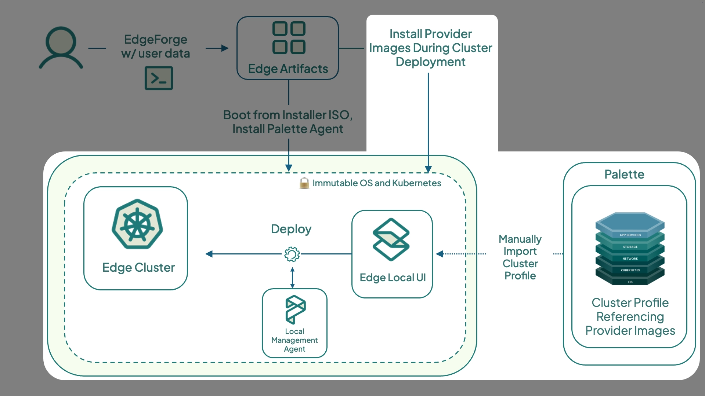
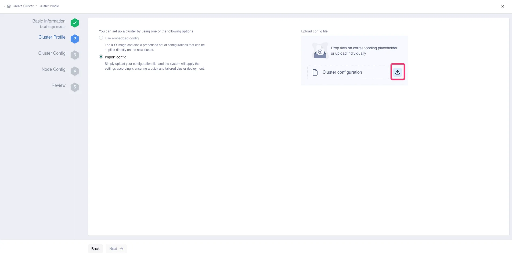
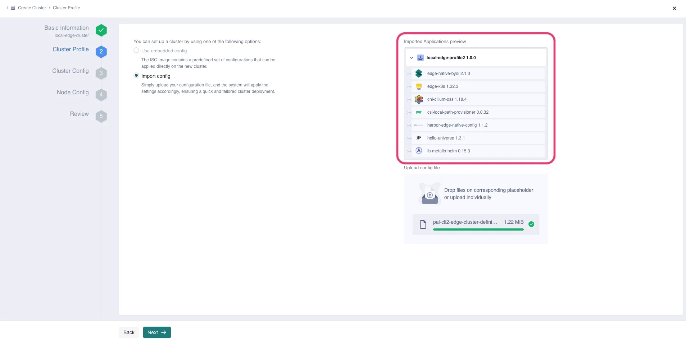
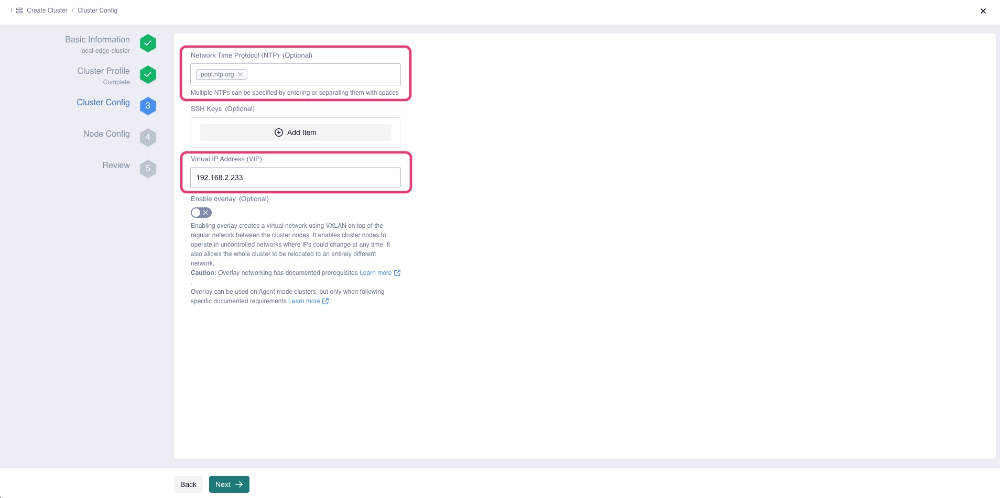
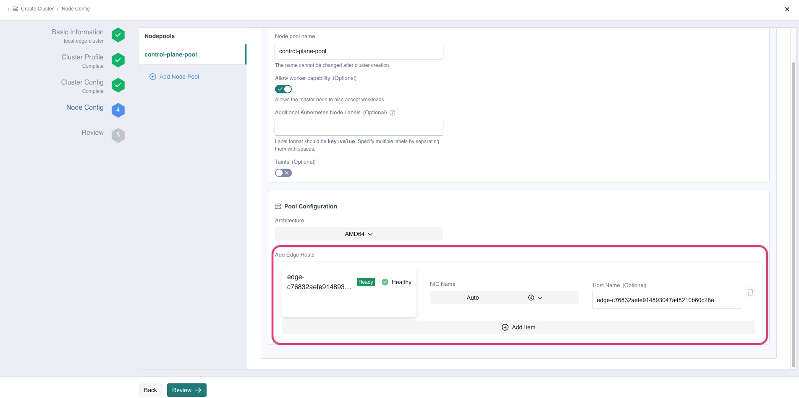
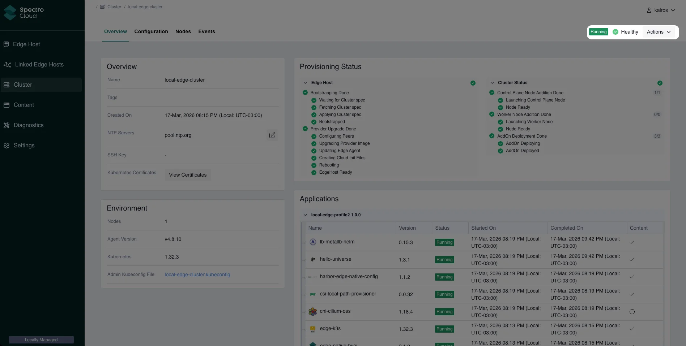
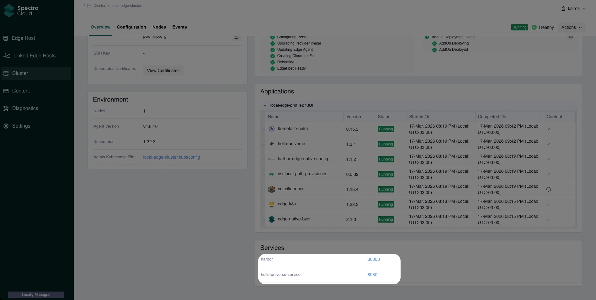
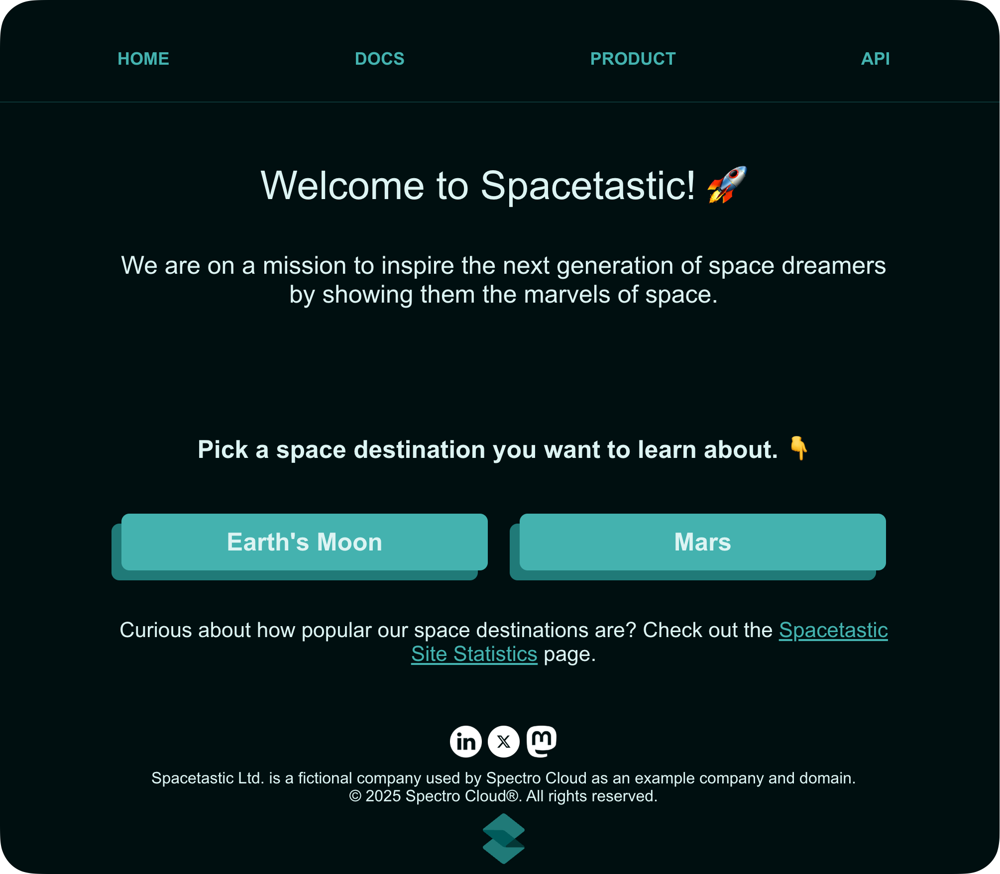
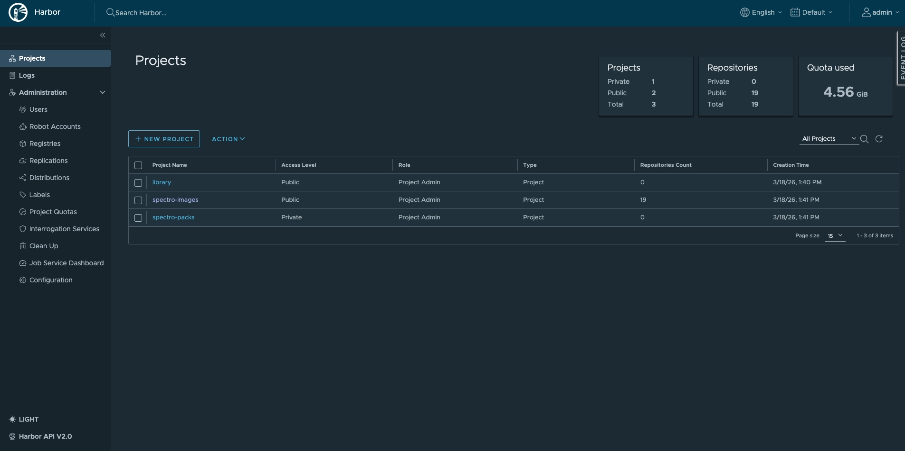
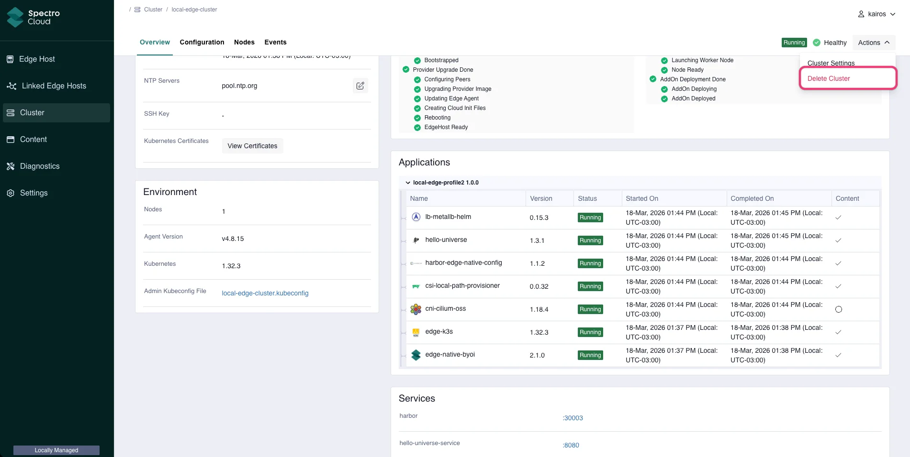

This is the final tutorial in the Local Palette Edge Management series. It teaches you how to deploy an Edge Kubernetes
cluster to a locally managed Edge device using the provider images, Edge host, cluster profile, and cluster definition
created in the previous tutorials.

You will learn how to select the desired cluster definition, assign the registered Edge host to the cluster, and verify
the deployment was successful by accessing the demo application included in the cluster profile,
[Hello Universe](https://github.com/spectrocloud/hello-universe).



## Prerequisites

- You have completed the [Build Edge Artifacts](./build-edge-artifacts.md) tutorial and pushed the provider images to a
  registry.
- You have completed the [Prepare Edge Host](./prepare-edge-host.md) tutorial and have a registered Edge host in
  Palette.
- You have completed the [Create Edge Cluster Profile](./edge-cluster-profile.md) tutorial and have an Edge cluster
  profile created in Palette.
- You have completed the [Build Cluster Definition](./build-cluster-definition.md) tutorial and have a cluster
  definition downloaded and accessible.
- You have a DHCP-enabled network with one available IP address on the same network as the Edge host. You will use this
  IP as the cluster's Virtual IP (VIP) address.

## Deploy Edge Cluster

Log in to Local UI (`https://<ip-of-edge:5080`) with the username and password you defined in the
[Prepare User Data](./prepare-user-data.md) tutorial.

From the left main menu, select **Cluster**, then click **Create Cluster**.

Enter `local-edge-cluster` in the **Cluster name** field, and click **Next** to proceed.

On the **Cluster Profile** page, click the upload button to browse and upload the cluster definition TGZ file.



Verify that the **Imported Applications preview** matches the list of packs selected when completing the
[Edge Cluster Profile](./edge-cluster-profile.md) tutorial.



Click **Next** to proceed.

:::tip

We recommend enabling the overlay network configuration when using DHCP-enabled networks to ensure stable IP addresses
for the cluster. However, for education purposes, this tutorial does not use the overlay network. For production use or
detailed configuration instructions, refer to the
[Enable Overlay Network](../../../../clusters/edge/networking/vxlan-overlay.md) guide.

:::

On the **Cluster Config** page, enter the **Virtual IP Address (VIP)** value . The following image displays the
**Cluster Config** page with the **Network Time Protocol (NTP)** and **Virtual IP Address** values provided.



:::tip

You can use the [nmap](https://nmap.org/book/man.html) tool to scan your network and check which IP addresses are in
use. Issue the following command in your terminal, replacing the example CIDR `192.168.0.0/24` with your network's CIDR.

    ```bash
    sudo nmap -sn 192.168.0.0/24
    ```

The output displays the IP addresses that are currently in use on your network.

:::

Optionally, you can also select an SSH key to access the cluster's nodes and specify a Network Time Protocol (NTP)
Optionally, you can also select the **SSH keys** to access the cluster's nodes and specify the **Network Time Protocol
(NTP)** server list.

Click **Next** to continue.

In the **Node Config** section, provide the following details for the control plane pool. This tutorial deploys a
single-node Edge cluster with no worker pool.

| **Field**                                   | **Value**                                                                                                                       |
| ------------------------------------------- | ------------------------------------------------------------------------------------------------------------------------------- |
| **Node pool name**                          | `control-plane-pool`                                                                                                            |
| **Allow worker capability**                 | Yes                                                                                                                             |
| **Additional Labels (Optional)**            | None                                                                                                                            |
| **Taints (Optional)**                       | None                                                                                                                            |
| **Pool Configuration** > **Add Edge Hosts** | Select the Edge host configured in the [Prepare Edge Host](./prepare-edge-host.md) tutorial to become the node of your cluster. |

The following image shows the Edge host selection in the control plane pool.



Optionally, you can specify which Network Interface Card (NIC) to use for the Edge device by selecting **Auto** under
**NIC Name** and choosing the NIC.

Next, select **Remove** to delete the worker pool and click **Review** to proceed with the deployment.

The **Review** section allows you to review the cluster configuration. If everything looks correct, select **Deploy
Cluster**.

After you create the cluster, the Palette Edge host agent pulls the provider images you built in the
[Build Edge Artifacts](./build-edge-artifacts.md) tutorial and starts the installation process.

The cluster deployment may take 15 to 30 minutes, depending on the host and cluster configuration. The Edge Host will
also reboot multiple times, which will require you to log in and refresh the screen to display the latest info.

You can track the installation progress in Edge Local UI. From the left menu, select **Cluster** to monitor the process
on the Overview page. The **Events** tab provides detailed logs.

## Validate

Log in to the Local UI, and select **Cluster** to open its **Overview** tab.

Confirm that your cluster displays a **Running** status and is listed as **Healthy**.



When the Hello Universe application is deployed and ready for network traffic, the Edge Local UI exposes the service URL
in the **Services** section. Click the URL on port **:8080** to access the application's landing page.



Welcome to the Spacetastic astronomy education platform. Feel free to explore the pages to learn more about space. The
statistics page offers information on visitor counts for your deployed cluster.



When the Harbor application is deployed and ready for network traffic, the Edge Local UI exposes the service URL in the
**Services** section. Click the URL on port **:30003** to access the application's landing page. You can log in to
Harbor using the user `admin` and the password you set in the [Create Edge Profile](./edge-cluster-profile.md).



## Clean Up

You have successfully provisioned an Edge cluster with a three-tier demo application and Harbor registry. Use the
following steps to remove the resources created during this tutorial series.

### Cluster and Cluster Profile

To remove the Edge cluster, log in to Edge Local UI and select **Cluster** from the left main menu. Select **Delete
Cluster** from the **Actions** drop-down.



Select **Confirm** on the confirmation window. This process may take several minutes to complete and will reboot the
Edge device multiple times.

Once complete, log in to the Edge Local UI to verify the cluster and cluster profile are removed by navigating to
**Cluster** from the left main menu.

### Edge Host

<Tabs groupId="host">

<TabItem label="VM Host" value="VM Host">

If you used a VirtualBox VM as the Edge host, open the **VirtualBox** application on your host machine to delete the VM.

Right-click the `edge-vm` VM and select **Stop**. Then, click **Power Off** to turn the machine off.

Next, right-click the VM again and select **Remove**. Select **Delete the virtual machine and virtual hard disks** to
delete the VM and its hard disk, and click **Remove**.

</TabItem>

<TabItem label="Bare Metal Host" value="Bare Metal Host">

If you used a physical device as the Edge host, you can reset it to its post-initial setup state. This removes all
workloads, content, and cluster definitions from the Edge host.

To reset the Edge host, SSH into it and issue the following command.

```shell
grub2-editenv /oem/grubenv set next_entry=statereset
```

Next, reboot the host.

```shell
sudo reboot
```

Refer to [Reset Host via Terminal](../../../../clusters/edge/cluster-management/reset-host.md) for more information
about Edge host resetting.

</TabItem>

</Tabs>

### Edge Artifacts

Open a terminal window on the machine you used to build the artifacts in the
[Build Edge Artifacts](./build-edge-artifacts.md) tutorial and navigate to the `CanvOS` repository.

Delete the Edge Installer ISO image and its checksum by issuing the following commands.

```bash
rm build/palette-local-edge-installer.iso
rm build/palette-local-edge-installer.iso.sha256
```

Next, delete the provider images both locally and from the registry where you pushed them. Issue the following command
to delete them locally, replacing `<registry-name>` with the name of your registry.

```bash
docker rmi <registry-name>/ubuntu:k3s-1.32.3-v4.8.8-local-edge
docker rmi <registry-name>/ubuntu:k3s-1.32.3-v4.8.8-local-edge_linux_amd64
```

## Wrap-up

In this tutorial, you learned how to deploy a single-node Edge cluster along with a demo application, using the Edge
host, cluster profile, and artifacts prepared in earlier tutorials from this series. This deployment completes the Local
Palette Edge Getting Started tutorial series.

We encourage you to check out the [Additional Capabilities](../../additional-capabilities/additional-capabilities.md)
section to explore other Palette functionalities, and the [Edge](../../../../clusters/edge/edge.md) documentation
section to learn more about Palette Edge.

## 🧑‍🚀 Catch up with Spacetastic

After going through the steps in the tutorial, Kai is confident in locally managed Palette Edge's capabilities.

> "What have you found out, Kai?" says Meera walking over to Kai's desk.
>
> "It was surprisingly simple to deploy and connect these Edge devices remotely, even if they are not managed directly
> by Palette," says Kai with a enthusiastic nod. "In fact, it feels no different than when we deployed our clusters to
> the Cloud. Even our security is covered through their pack updates and scanning capabilities. Relying on this kind of
> tooling is invaluable to security-conscious engineers like us."

"Excellent! These capabilities will be a great for expanding our existing systems at Spacetastic," says Meera with a big
grin.

"I'm so glad that we found a platform that can support everyone!" says Kai. "There is so much more to explore though. I
will keep reading through the Getting Started section and find out what additional capabilities Palette provides."

"Good thinking, Kai," says Meera, nodding. "We should maximize all of Palette's features now that we have implemented it
in production. We've got big ideas and goals on our company roadmap, so let's find out how Palette can help us deliver
them."
