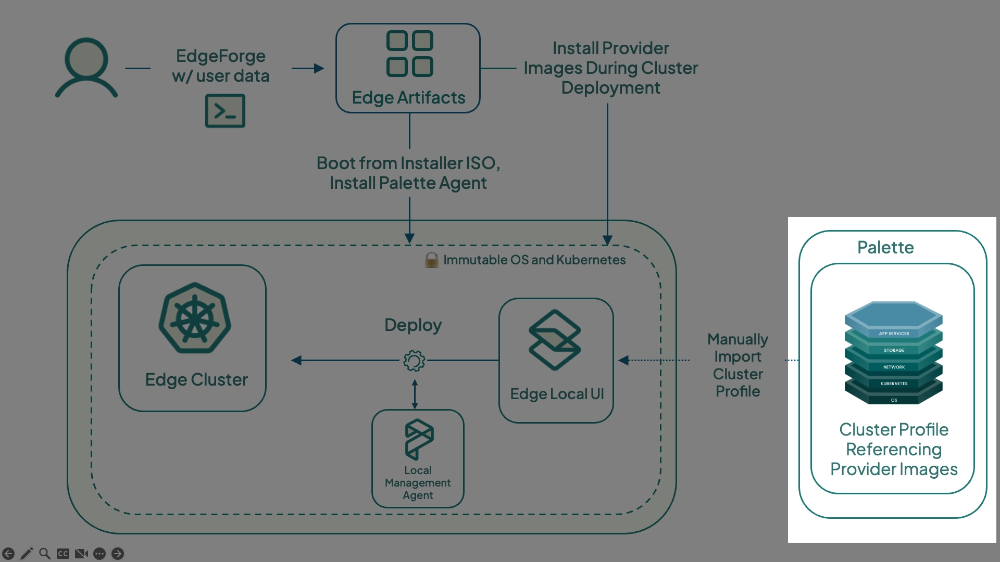
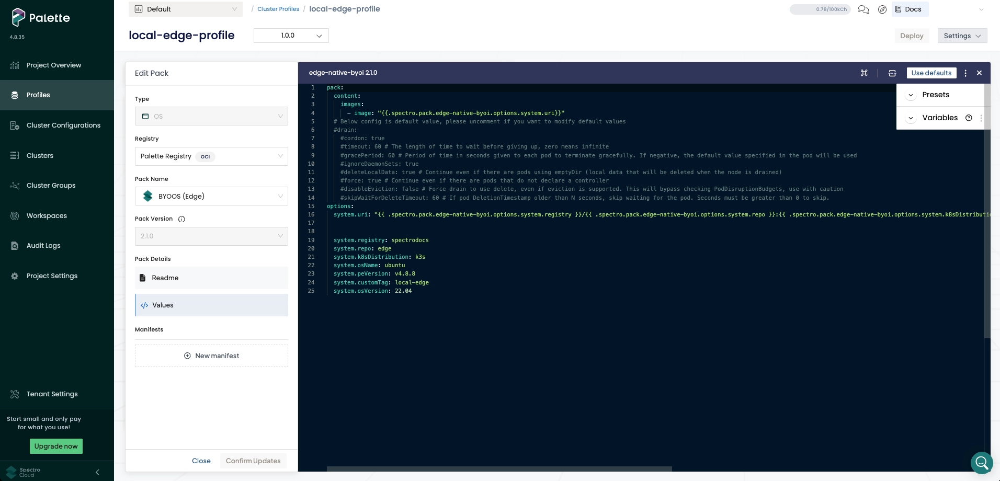
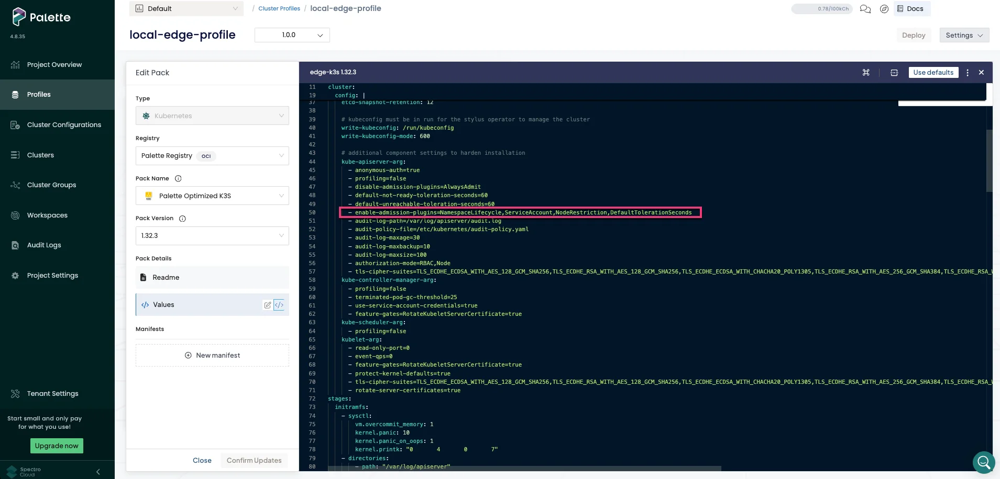
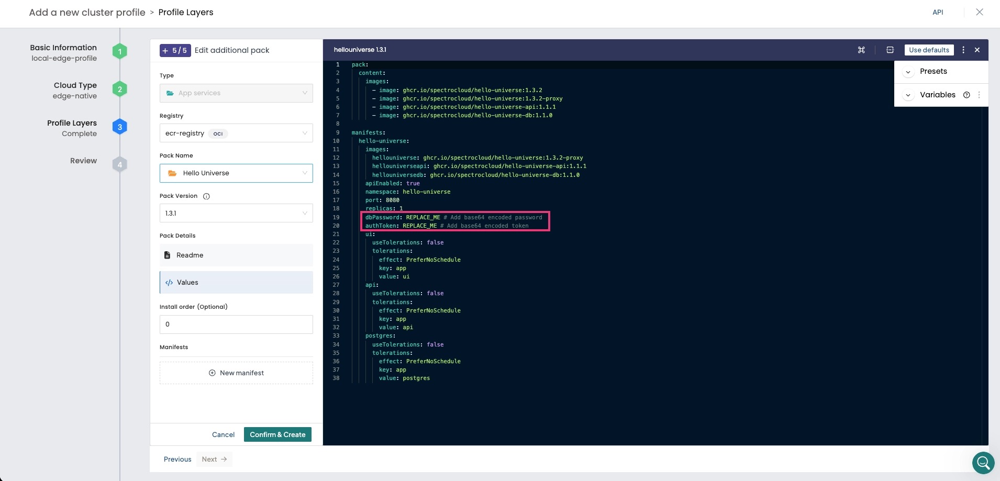
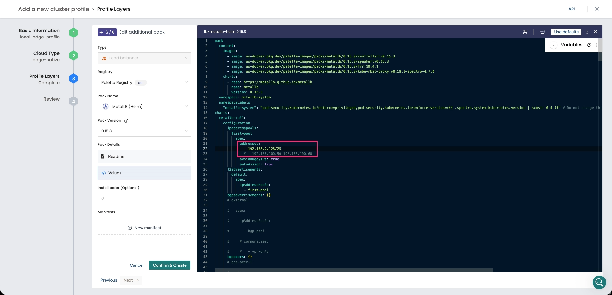

[Cluster profiles](../../../../profiles/profiles.md) are declarative, full-stack models that Palette uses to provision,
scale, and maintain Kubernetes clusters. They are composed of layers, which can be Kubernetes manifests, Helm charts, or
packs. [Packs](../../../../registries-and-packs/registries-and-packs.md) are a collection of files and configurations
deployed to a cluster to provide core infrastructure functionality or customize the cluster's behavior through add-on
integrations.



This tutorial teaches you how to create an Edge native cluster profile that includes the core infrastructure layers and
a demo application that you can access on your browser. You will learn about cluster profile layers and how to reference
the provider images that you built in the [Build Edge Artifacts](./build-edge-artifacts.md) tutorial. After creating the
cluster profile, you will proceed to the next tutorial, where you will use the installer ISO to bootstrap the Edge
installation on your host and use it as a node for deploying your first Edge cluster.

For this tutorial, you will build a cluster profile that has the following packs.

| **Pack Name**             | **Version** | **Registry**               |
| ------------------------- | ----------- | -------------------------- |
| BYOS Edge OS              | 2.1.0       | Palette Registry           |
| Palette Optimized K3s     | 1.32.3      | Palette Registry           |
| Cilium                    | 1.18.4      | Palette Registry           |
| Local Path Provisioner    | 0.0.32      | Palette Registry           |
| Harbor Edge Native Config | 1.1.2       | Palette Registry           |
| Hello Universe            | 1.3.1       | Palette Community Registry |
| MetalLB (Helm)            | 0.15.3      | Palette Registry           |

## Prerequisites

- You have completed the steps in the [Build Edge Artifacts](./build-edge-artifacts.md) tutorial, including building the
  installer ISO and provider image, and pushing the provider image to a registry.
- A [Palette account](https://www.spectrocloud.com/get-started).
- One available IP address on the same network as the Edge host for a Virtual IP (VIP).

## Create Cluster Profile

Log in to [Palette](https://console.spectrocloud.com/) and select **Profiles** from the left main menu. Click **Add
Cluster Profile** to create your cluster profile.

Follow the wizard to create a new profile. In the **Basic Information** section, assign `local-edge-profile` as the
name, and provide a brief profile description. Set the type as **Full** and add the tag `env:edge`. You may leave the
version empty, but note that the version defaults to `1.0.0` if not specified. Click **Next** to continue.

The **Cloud Type** section allows you to choose the infrastructure provider for the cluster. Select **Edge Native** and
click **Next**.

The **Profile Layers** section defines the packs that compose the profile.

Add the **BYOS Edge OS** pack to the OS layer. This pack enables you to use the custom image you built in the
[Build Edge Artifacts](./build-edge-artifacts.md) tutorial as the operating system for the cluster nodes.

| **Pack Name** | **Version** | **Registry**     | **Layer**        |
| ------------- | ----------- | ---------------- | ---------------- |
| BYOS Edge OS  | 2.1.0       | Palette Registry | Operating System |

Under **Pack Details**, select **Values** to open the YAML editor. Replace the default layer manifest with the custom
manifest generated in the [Build Edge Artifacts](./build-edge-artifacts.md) tutorial. This makes the cluster pull the
provider images from the image registry specified in the [Build Edge Artifacts](./build-edge-artifacts.md) tutorial
during deployment.

Alternatively, if you no longer have access to the manifest, you can manually fill in the `options.system.uri` parameter
with the address of the provider image you pushed to the registry. For example, the address used in this tutorial is
`spectrocloud/ubuntu:k3s-1.32.3-v4.8.8-local-edge`.

The following image displays the OS layer with the custom manifest and registry credentials.



Click **Next Layer** to continue. Add the following Kubernetes layer to your cluster profile. Ensure the Kubernetes
version matches the version used in the provider images.

| **Pack Name**         | **Version** | **Registry**     | **Layer**  |
| --------------------- | ----------- | ---------------- | ---------- |
| Palette Optimized K3s | 1.32.3      | Palette Registry | Kubernetes |

Under **Pack Details**, select **Values** and remove `AlwaysPullImages` value from `cluster.config.kube-apiserver-arg`
setting `enable-admission-plugins`. This value is not supported for locally managed clusters.

Additionally, if needed, replace the predefined `cluster-cidr` and `service-cidr` IP CIDRs if they overlap with the host
network. For example, you can set `cluster-cidr` to `"100.64.0.0/18"` and `service-cidr` to `"100.64.64.0/18"`. This
prevents any routing conflicts in the internal pod networking.



Click **Next Layer** to add the network layer. This tutorial uses Cilium as the example network layer.

| **Pack Name** | **Version** | **Registry**     | **Layer** |
| ------------- | ----------- | ---------------- | --------- |
| Cilium        | 1.18.4      | Palette Registry | Network   |

Click **Confirm** once you have completed adding all core layers.

Next, click **Add New Pack** to include the add-on layers. Search for `Local Path` and add the following pack to your
cluster profile. The Local Path Provisioner is needed to configure local storage.

| **Pack Name**          | **Version** | **Registry**     | **Layer** |
| ---------------------- | ----------- | ---------------- | --------- |
| Local Path Provisioner | 0.0.32      | Palette Registry | Storage   |

Click **Confirm & Create**.

Next, click **Add New Pack** to include the add-on layers. Search for `Harbor` and add the following pack to your
cluster profile. Harbor is required to manage local registries for locally managed Edge clusters.

| **Pack Name**              | **Version** | **Registry**     | **Layer** |
| -------------------------- | ----------- | ---------------- | --------- |
| Harbor Edge Native Config. | 1.1.2       | Palette Registry | Registry  |

Click **Confirm & Create**.

Next, click **Add New Pack** to include the add-on layers. Search for `Hello Universe` and add the following pack to
your cluster profile.

| **Pack Name**  | **Version** | **Registry**               | **Layer** |
| -------------- | ----------- | -------------------------- | --------- |
| Hello Universe | 1.3.1       | Palette Community Registry | Registry  |

Once you select the pack, Palette displays its README file, providing additional guidance on usage and configuration
options. This pack deploys the [hello-universe](https://github.com/spectrocloud/hello-universe) demo application.

Under **Pack Details**, select **Values**, then choose **Presets**. This pack has the following presets available:

1. **Disable Hello Universe API** configures the `hello-universe` application as a standalone frontend application. This
   is the default option.
2. **Enable Hello Universe API** configures the `hello-universe` application as a three-tier application with a
   frontend, API server, and Postgres database.

Select the **Enable Hello Universe API** preset. The pack manifest changes according to this selection.

When using this preset, you must provide two base64-encoded values: one for the authorization token and one for the
database password. Replace the database password value with your own encoded value.

:::tip

You can use the `base64` command to create a base64-encoded value.

```shell
echo -n "password" | base64
```

The output contains your base64-encoded value.

```text hideClipboard
cGFzc3dvcmQ=
```

:::

For the token, use the default encoded value listed in the
[hello-universe](https://github.com/spectrocloud/hello-universe?tab=readme-ov-file#single-load-balancer) repository.

```shell title="Example of Authentication Values"
dbPassword: "cGFzc3dvcmQ="
authToken: "OTMxQTNCMDItOERDQy01NDNGLUExQjItNjk0MjNEMUEwQjk0"
```



Click **Confirm & Create** to save any alterations applied and add the pack to your cluster profile.

Finally, click **Add New Pack** again, search for `MetalLB`, and add the following pack to your cluster profile.

| **Pack Name**  | **Version** | **Registry**     | **Layer**     |
| -------------- | ----------- | ---------------- | ------------- |
| MetalLB (Helm) | 0.15.3      | Palette Registry | Load Balancer |

The MetalLB pack implements a load balancer for your Edge Kubernetes cluster. It is required to help the `LoadBalancer`
service specified in the Hello Universe pack obtain an IP address so that you can access the demo application from your
browser.

Under **Pack Details**, select **Values** and replace the default `192.168.10.0/24` IP CIDR listed under the `addresses`
field with a valid IP address or IP range from the host network. Click **Confirm & Create** to add the MetalLB pack to
your cluster profile.

The following image displays the MetalLB layer with a custom IP range.



Click **Confirm & Create** to save any alterations applied and add the pack to your cluster profile.

Click **Next** to proceed. If there are no compatibility issues, Palette displays the cluster profile for review. Verify
that the layers you added are correct, and click **Finish Configuration** to create the cluster profile.

## Next Steps

In this tutorial, you learned how to create a cluster profile for your Edge deployment and export it in a file that can
be uploaded to the locally managed Edge device. We recommend proceeding to the
[Prepare Edge Host](./prepare-edge-host.md) tutorial to learn how to prepare your virtual or physical device to become a
node of an Edge cluster.
