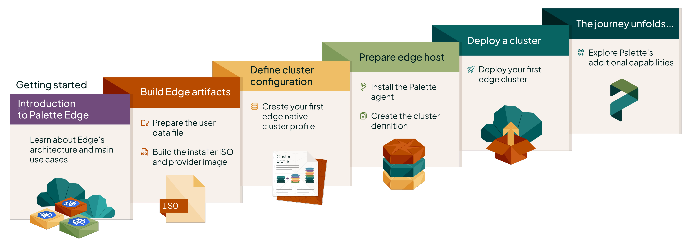

This section gives you an overview of how to get started with locally managed Palette Edge. You will learn how Palette
simplifies the deployment of Kubernetes clusters at the edge, along with all the steps required to deploy your first
Edge cluster, such as building the necessary artifacts and preparing the host. The concepts you learn about in the
Getting Started section are centered around a fictional case study company. This approach gives you a solution focused
approach, while introducing you to locally managed Palette Edge workflows and capabilities.

<!-- vale off -->

## 🧑‍🚀 Spacetastic Journey Continues!

Our fictional example company, Spacetastic Ltd., has seen their platform reach a steady state. Clusters in the cloud
were stable, updates were predictable, and operational overhead had dropped significantly. Everything has been going
great since they first deployed [Palette](../../palette/aws/aws.md).

The company is expanding into over 500 locations in the form of informational kiosks. This expansion means that
applications need to run closer to users, directly into schools, museums, airports and other edge environments.

The team needs a solution the requirements were familiar:

- Consistent deployments across locations while supporting local autonomy
- Strong security posture
- Minimal reliance on on-site expertise
- The ability to roll out updates quickly and safely

Each location effectively becomes a small, self-contained environment. At scale, this introduces the challenge of
managing hundreds of distributed clusters without increasing operational complexity.

> Anya and Wren came into the office, vibrating with excitement. "We've got the funding and the expansion is going
> ahead!", Anya announces.
>
> Wren, Founding Engineer, added, "We've partnered with over 500+ locations... And we can't treat these like cloud
> clusters."
>
> Kai nods knowingly. As a Platform Engineer, they recognize the challenges that comes with rapid growth. "What if we
> treat edge like cloud -- just smaller -- and manage everything locally while still enforcing central standards?"

The requirements of the application haven't changed. Spacetastic still deploys to a single cloud provider, they rely on
Kubernetes for the reliability and scalability of their systems, and must ensure the systems are secure, patched
regularly, scalable, and meet a reliability SLA of at least 99% uptime.

> The whiteboard is filled with sticky notes and diagrams. The discussion has highlighted some of the challenges that
> Spacetastic faces. "We cannot manage these manually," Wren sighs with exhaustion. "Too many locations, too great a
> distance, none of us onsite, and some of these sites have strict requirements not to be connected to the internet."
>
> Meera nodded in agreement, and added, "So... no constant connection to Palette? That is a challenge. We also can't
> forget the need to maintain our security stance. With these being deployed remotely, it makes me nervous that security
> will be more difficult."
>
> "Team, I think Palette might have the answer we need. Let's take a look," says Kai with a determined look.

## Get Started

In this section, you learn how to deploy your first locally managed Edge cluster with Palette. Each tutorial is designed
to guide you step-by-step, building on the concepts introduced in the previous one.

<!-- vale off -->

<SimpleCardGrid
  cards={[
    {
      title: "Introduction to Edge",
      description: "Learn about Spectro Cloud Palette Edge.",
      buttonText: "Learn more",
      url: "/tutorials/getting-started/palette-edge/introduction-edge",
    },
    {
      title: "Prepare User Data",
      description: "Create a user data file for your Edge deployment.",
      buttonText: "Learn more",
      url: "/tutorials/getting-started/palette-edge/local-management/prepare-user-data",
    },
    {
      title: "Build Edge Artifacts",
      description: "Build the artifacts required for your Edge deployment.",
      buttonText: "Learn more",
      url: "/tutorials/getting-started/palette-edge/local-management/build-edge-artifacts",
    },
    {
      title: "Create Edge Cluster Profile",
      description: "Create an Edge native cluster profile to deploy Edge workloads.",
      buttonText: "Learn more",
      url: "/tutorials/getting-started/palette-edge/local-management/edge-cluster-profile",
    },
    {
      title: "Prepare Edge Host",
      description: "Install the Palette agent on your Edge host.",
      buttonText: "Learn more",
      url: "/tutorials/getting-started/palette-edge/local-management/prepare-edge-host",
    },
    {
      title: "Build Cluster Definition",
      description: "Create the cluster definition file and upload it to your Edge host",
      buttonText: "Learn more",
      url: "/tutorials/getting-started/palette-edge/local-management/build-cluster-definition",
    },
    {
      title: "Deploy Edge Cluster",
      description: "Deploy an Edge cluster with Palette.",
      buttonText: "Learn more",
      url: "/tutorials/getting-started/palette-edge/local-management/deploy-edge-cluster",
    },
  ]}
/>
