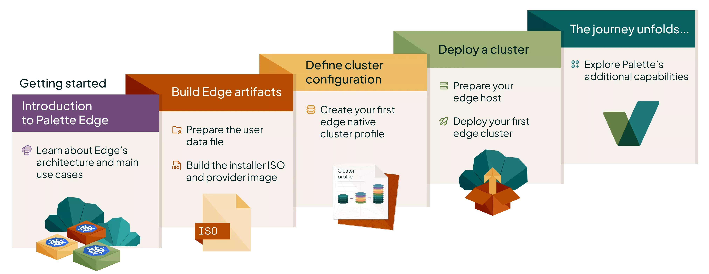

This section gives you an overview of how to get started with locally managed Palette Edge. You will learn how to deploy
your first locally managed Edge cluster, along with all the steps required to deploy your first locally managed Edge
cluster, such as building the necessary artifacts and preparing the host.

Explore the following tutorials to learn how to deploy your first locally managed Edge cluster. Each tutorial is
designed to guide you step-by-step, building on the concepts introduced in the previous one.

<!-- vale off -->

<SimpleCardGrid
  cards={[
    {
      title: "Introduction to Edge",
      description: "Learn about Spectro Cloud Palette Edge.",
      buttonText: "Learn more",
      url: "/tutorials/getting-started/palette-edge/introduction-edge",
    },
    {
      title: "Prepare User Data",
      description: "Create a user data file for your Edge deployment.",
      buttonText: "Learn more",
      url: "/tutorials/getting-started/palette-edge/local-management/prepare-user-data",
    },
    {
      title: "Build Edge Artifacts",
      description: "Build the artifacts required for your Edge deployment.",
      buttonText: "Learn more",
      url: "/tutorials/getting-started/palette-edge/local-management/build-edge-artifacts",
    },
    {
      title: "Create Edge Cluster Profile",
      description: "Create an Edge native cluster profile to deploy Edge workloads.",
      buttonText: "Learn more",
      url: "/tutorials/getting-started/palette-edge/local-management/edge-cluster-profile",
    },
    {
      title: "Prepare Edge Host",
      description: "Install the Palette agent on your Edge host and register the host with Palette.",
      buttonText: "Learn more",
      url: "/tutorials/getting-started/palette-edge/local-management/prepare-edge-host",
    },
    {
      title: "Build Cluster Definition",
      description: "Create the cluster definition file and upload it to your Edge host",
      buttonText: "Learn more",
      url: "/tutorials/getting-started/palette-edge/local-management/build-cluster-definition",
    },
    {
      title: "Deploy Edge Cluster",
      description: "Deploy an Edge cluster with Palette.",
      buttonText: "Learn more",
      url: "/tutorials/getting-started/palette-edge/local-management/deploy-edge-cluster",
    },
  ]}
/>
