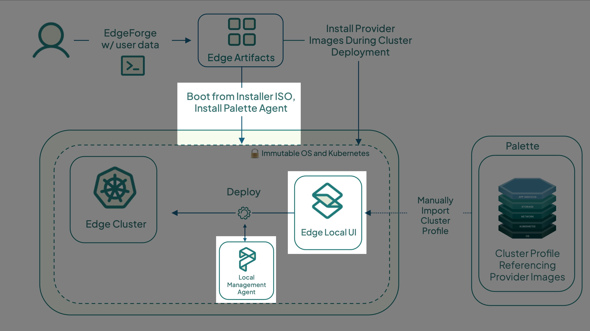
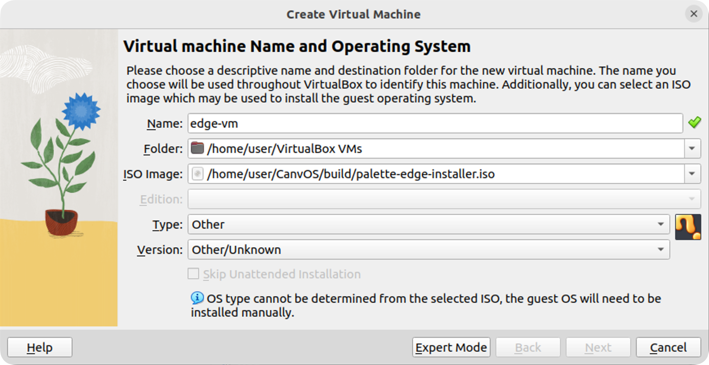
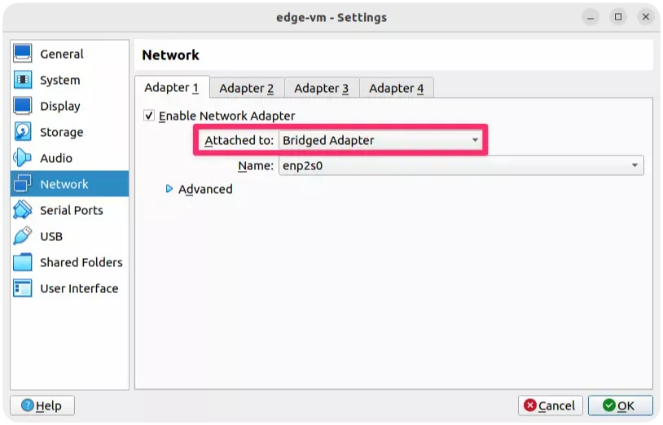
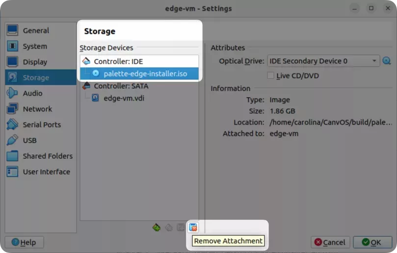
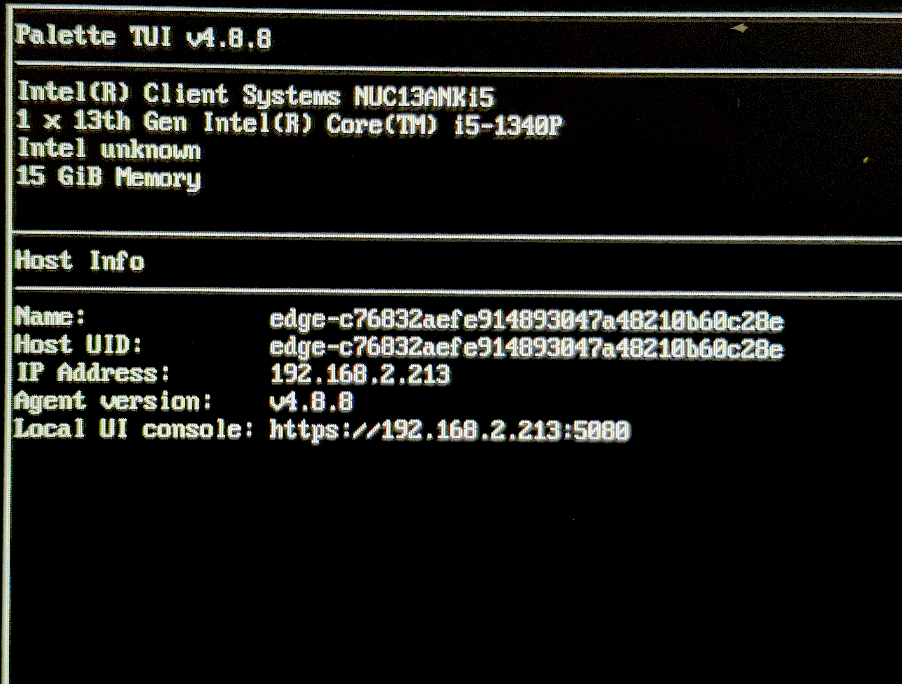
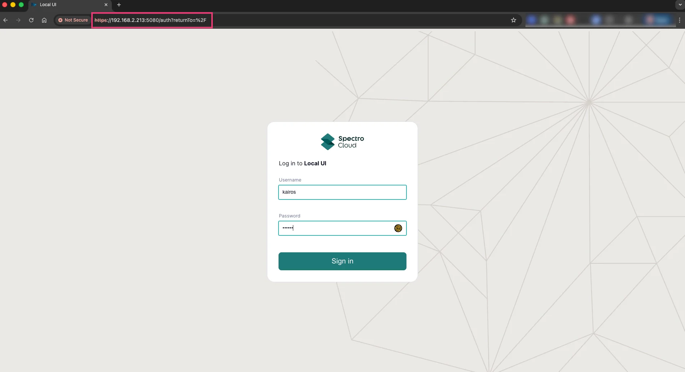

Edge clusters are Kubernetes clusters configured on Edge hosts. These hosts can be either bare metal or virtual machines
and must have the Palette agent installed.

In this tutorial, you will learn how to install the Palette agent on your virtual or physical host. You will boot the
host using the Edge installer ISO created in the [Build Edge Artifacts](./build-edge-artifacts.md) tutorial, and then
let it self-register. Locally managed Edge devices will still need access to any registries, either from the internet or
local network access, to download necessary packs for the cluster.

## Prerequisites

- A bare metal or virtual Linux host with an _AMD64_ processor architecture (also known as _x86_64_) and the following
  minimum hardware specifications.
  - 2 CPUs
  - 8 GB memory
  - 300 GB storage
- If you plan to use a virtual machine as the Edge host, ensure that you have a VMM (Virtual Machine
  Manager) installed. This tutorial uses
  [vSphere](https://www.oracle.com/virtualization/technologies/vm/downloads/virtualbox-downloads.html) version 7.0.3 as
  an example. Additionally, the underlying physical host must allow the creation of a VM that meets the same minimum
  hardware requirements.
- The Edge installer ISO file built in the [Build Edge Artifacts](./build-edge-artifacts.md) tutorial. If you are using
  a physical device as the Edge host, ensure the device has USB ports, the ISO file is flashed to a USB drive, and you
  are able to modify the host's boot order settings to boot from the USB drive.
- A DHCP-enabled network with at least one available IP address for the Edge host.
- A [Palette account](https://www.spectrocloud.com/get-started).
- The host must have access to the internet.

## Set Up Edge Host

<Tabs groupId="host">

<TabItem label="VM Host" value="VM Host">

Once the Edge artifacts and cluster profile have been created, you can proceed with the VirtualBox VM deployment. The VM
will use the Edge installer ISO to bootstrap the Edge installation and serve as the Edge host for your cluster.

Launch the VirtualBox application and click **New** to create a new VM.

Give the machine a name, for example, `edge-vm`.

In the **ISO Image** field, select the Edge installer ISO file you built in the
[Build Edge Artifacts](./build-edge-artifacts.md) tutorial. The ISO file is located in the `CanvOS/build` directory.

Set the machine **Type** as **Linux** and the **Version** as **Ubuntu (64-bit)**, and click **Next**.

Adjust the **Base Memory** to 8000 MB and **Processors** to 2 CPU. Click **Next** to proceed.

Set the **Disk Size** to 150 GB and ensure the option **Pre-Allocate Full Size** is _not_ checked. Click **Next**.

:::info

These are the minimum hardware requirements for an Edge host. In production environments, the required configuration may
vary.

:::

Confirm the VM settings and click **Finish** to create the VM.

Select the VM to adjust its network settings. Click **Settings**, then select **Network**.

Change the **Attached to:** option from **NAT** to **Bridged Adapter**. This allows the VM to receive an IP address from
the same network as the host. Click **OK**.

Select the created VM and click **Start** to turn it on. The Edge installer bootstraps the Palette Edge installation
onto the VM.

Wait for the Edge Installer to complete copying content to the VM. This process may take a few minutes. When the
installation is complete, the VM shuts down automatically. This behavior is configured in the `user-data` file, as
specified in the [Prepare User Data](./prepare-user-data.md) tutorial with the line `poweroff: true`.

After the VM powers off, select it in VirtualBox. Click **Settings**, then select **Storage**.

Select the Edge installer ISO and click **Remove Attachment** to remove it from your VM. Confirm the deletion with
**Remove** and click **OK** to close the settings window. Leaving the installer ISO attached would cause the VM to boot
from it again, restarting the installation process.

</TabItem>

<TabItem label="Bare Metal Host" value="Bare Metal Host">

Once the Edge artifacts and cluster profile have been created, you can proceed with the Palette agent installation. The
bare metal device will use the Edge installer ISO to bootstrap the Edge installation and serve as the Edge host for your
cluster.

Insert the USB drive containing the flashed Edge installer ISO into the powered-off bare metal device.

Power on the device and enter the Basic Input/Output System (BIOS) interface. You can accomplish this by pressing
**F2**, **F1**, or **F10** immediately after powering on the device. The exact key varies by manufacturer. Consult the
manufacturer instructions to learn how to enter the BIOS interface.

In the BIOS interface, navigate to the boot sequence section and locate the boot sequence list.

Find the entry with your USB drive and move it to the top of the list. Save the changes and exit the BIOS interface. The
device then boots from the USB drive and begins installing the Palette agent.

Wait for the Edge Installer to complete copying content to the device. This process may take a few minutes. When the
installation is complete, the device shuts down automatically. This behavior is configured in the `user-data` file, as
specified in the [Prepare User Data](./prepare-user-data.md) tutorial with the line `poweroff: true`.

Once the device powers off, remove the USB drive. Since it was previously selected as the boot volume, leaving it
inserted would cause the system to boot from it again, restarting the installation process.

</TabItem>

</Tabs>

## Register Edge Host

:::tip

You can provide site-specific Edge installer configuration user data if you need to apply new values or override default
values from the Edge installer user data you created during the EdgeForge process. Refer to
[Apply Site User Data](../../../../clusters/edge/site-deployment/site-installation/site-user-data.md) for more
information.

:::

**LOG INTO EDGE UI**

Power on the Edge device. It will automatically boot to **Palette eXtended Kubernetes Edge Registration**, reboot, and generate
an Edge Host UID. Wait until an IP Address is assigned. The following image displays the Edge TUI on an Intel NUC device after it has self-registered, and obtained an IP address.

Login in to the Edge UI (`https://<ip-of-edge:5080`) with the username and password you defined in the
[Prepare User Data](./prepare-user-data.md) tutorial. The following image displays the Edge Local UI log in screen.

Confirm that your Edge host is listed with a **Healthy** and **Ready** status. The **Machine ID** displayed in Palette
should match the ID displayed on the host screen.

## Next Steps

In this tutorial, you learned how to install the Palette agent on your host and register the host with Palette. We
recommend proceeding to the [Deploy Edge Cluster](./deploy-edge-cluster.md) tutorial to learn how to use the registered
Edge host to deploy an Edge cluster in Palette.
