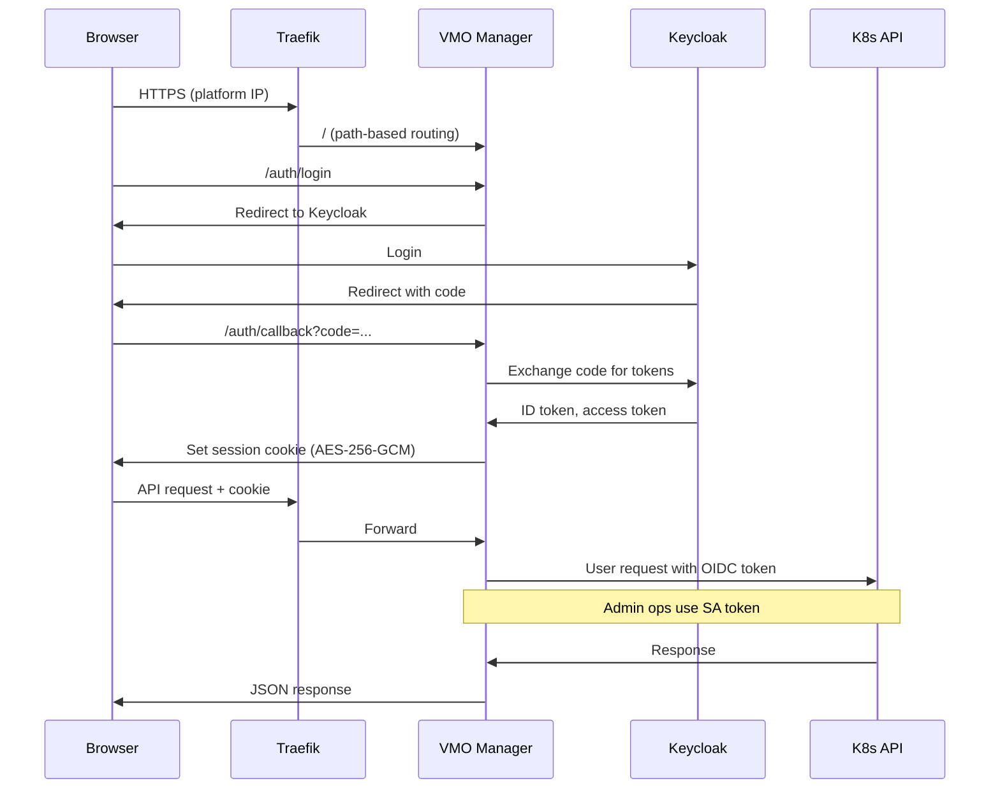

# Authentication

VMO Manager uses OpenID Connect (OIDC) via Keycloak for authentication, with local admin accounts available for Day 0 bootstrap before Keycloak is configured.

## OIDC Authentication Flow

In production, VMO Manager runs as a pod behind Traefik. The browser authenticates with Keycloak, receives a session cookie, and all subsequent API requests use that cookie. VMO Manager forwards the user's OIDC token to the Kubernetes API for user-scoped operations and uses the pod's service account (SA) token for privileged internal operations.

### Key Points

- **Session cookies** are encrypted with AES-256-GCM. The encryption key (`SESSION_KEY`) must be stable across pod restarts to avoid invalidating active sessions.
- **Split RBAC model:** User-facing Kubernetes operations (VMs, namespaces, nodes) use the caller's OIDC token so K8s RBAC applies per-user. Internal operations (config, API keys, audit) use the service account token.
- **Token refresh:** When the access token expires, VMO Manager uses the refresh token to obtain a new one from Keycloak transparently. If the refresh token is also expired, the user is redirected to log in again.

### Back-channel Logout

When Keycloak terminates a user's SSO session externally (an administrator revokes the session, the user logs out from another application, a password reset invalidates tokens), Keycloak notifies VMO Manager directly so the matching local session is invalidated immediately. This implements the [OpenID Connect Back-Channel Logout 1.0](https://openid.net/specs/openid-connect-backchannel-1_0.html) specification.

Without back-channel logout, a user's VMO session could remain active for up to the session TTL (or until the next token refresh failed) after Keycloak revoked the SSO session. With it configured, Keycloak's logout propagates to VMO in near-real time and the user's next request is redirected to `/auth/login`.

**Endpoint:** `POST /auth/backchannel-logout` (public; authenticated by the signed logout token itself)

**Scope:** OIDC sessions only. Local admin sessions (see below) are never affected by back-channel logout.

#### Keycloak Client Configuration

In Keycloak admin, open the VMO Manager client and set the following under **Settings > Logout Settings**:

| Field | Value |
|-------|-------|
| **Backchannel Logout URL** | `<VMO base URL>/auth/backchannel-logout` (for example, `https://vmo.example.com/auth/backchannel-logout`) |
| **Backchannel Logout Session Required** | ON — ensures the `sid` claim is included in the logout token |
| **Backchannel Logout Revoke Offline Sessions** | Operator's choice — controls whether Keycloak also revokes offline tokens alongside the SSO session |

No extra scopes, roles, or audience mappers are needed. VMO Manager verifies the logout token signature against the OIDC provider's already-loaded JWKS and checks the `iss`, `aud`, `events`, and `sid`/`sub` claims. When `sid` is present, VMO matches sessions on `sid`; otherwise it falls back to `sub`. A replay window (10 minutes) protects against reuse of the same `jti`.

#### Network Path

Keycloak must be able to reach VMO Manager's Service. If Keycloak runs in the same cluster, this works without any additional configuration. If Keycloak is external to the cluster, expose `/auth/backchannel-logout` through the platform ingress and ensure Keycloak can reach it. No outbound calls are made from VMO Manager for back-channel logout — verification is offline against the provider's cached JWKS, so the feature is airgap-safe.

#### HA Caveat

In multi-replica deployments, sessions are stored **per pod** (in-memory plus pod-local storage). Keycloak sends the back-channel logout to one replica via the Service endpoint, so only that replica's copy of the session is invalidated immediately. Sessions on other replicas remain valid until either the session TTL expires or the user's next request happens to hit the invalidated replica.

To strengthen guarantees in HA deployments, operators can:

- Reduce the session TTL so stale sessions on other replicas age out more quickly.
- Use sticky sessions at the ingress so a given user consistently hits the same replica.

A future release will centralize session state so back-channel logout fans out to all replicas.

## Local Authentication

Local admin accounts are available before Keycloak is configured, providing Day 0 access for initial platform setup.

- Navigate to `/local-login` and enter the admin credentials
- Passwords are bcrypt-hashed and stored in Kubernetes Secrets
- Local sessions use the pod's service account token for Kubernetes API access (not a user-scoped OIDC token)
- A `must-change-password` flag forces password change on first login

> **Note:** Local auth is intended for initial setup. Configure Keycloak for production use to get per-user identity, group-based access, and SSO. See [Local Auth](../access-management/local-auth) for setup details.

## Session Management

| Property | Value |
|----------|-------|
| **Cookie name** | `vmo-sid` |
| **Encryption** | AES-256-GCM (FIPS-approved) |
| **Storage** | In-memory per replica (HA uses sticky sessions) |
| **TTL** | Enforced server-side; expired sessions are rejected |
| **Consent banner** | Optional STIG consent banner shown before login (see [Branding](../system/branding)) |

## Auth Summary

| Method | User Identity | K8s API Auth | Use Case |
|--------|---------------|--------------|----------|
| **OIDC (Keycloak)** | OIDC subject + groups | User's ID token (per-user RBAC) | Production, all users |
| **Local admin** | Local username | Service account token | Day 0 bootstrap, emergency access |
