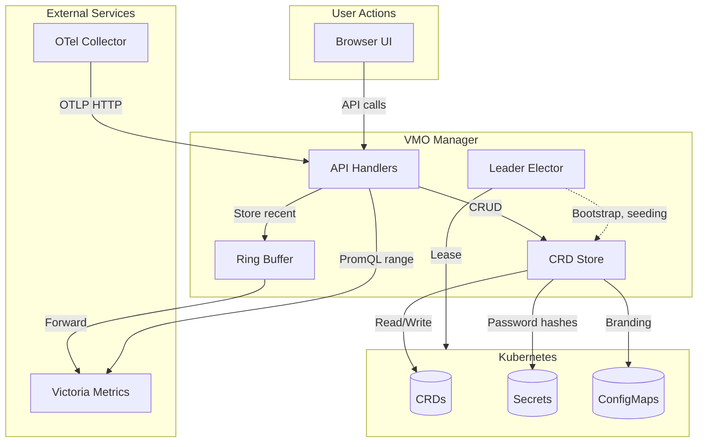

# Data Flow & Persistence

This document describes how data flows through VMO Manager and where it is stored. All persistence uses Kubernetes CRDs; there is no embedded database.

## CRD-Only Persistence

All persistent state is stored in Kubernetes Custom Resource Definitions (CRDs) under the `spectrocloud.com/v1beta1` API group. The CRDs are managed by a dedicated Helm chart (`vmo-manager-crds`) with an independent upgrade lifecycle.

### Managed CRDs

| CRD | Purpose |
|-----|---------|
| **VmoConfig** | Layered configuration overrides |
| **VmoRole** | IAM role definitions and permissions |
| **VmoLocalUser** | Local admin user accounts (Day 0) |
| **VmoDashboardConfig** | Per-user dashboard layout and widget config |
| **VmoDashboardManifest** | Admin-defined dashboard manifest templates |
| **VMOProvisioningTemplate** | Provisioning content (cloud-init, image-prep, autoinstall scripts) injected into VMs |
| **VmoPackage** | Package metadata (DEB, RPM, etc.) |
| **VmoTrustedCert** | Trusted CA certificates |
| **VmoApiKey** | API key metadata (Keycloak offline tokens) |
| **VmoAuditEvent** | Audit log events |
| **VmoAdmissionPolicy** | CPU/memory overcommit admission policies |
| **VmoSnapshotPolicy** | Snapshot policy definitions |
| **VmoSnapshotSchedule** | Snapshot schedule definitions |

### Sensitive Data

Sensitive data is **not** stored in CRDs. Companion Kubernetes Secrets are used:

- **Password hashes** — Local user passwords are bcrypt-hashed and stored in Secrets linked to `VmoLocalUser` CRDs.
- **OIDC client secrets** — Stored in Secrets, referenced by config.
- **Session keys** — Provided via environment variables, not persisted.

### Branding Assets

Logos, favicons, and other branding assets are stored in a **ConfigMap**. They are served via the `/api/v1/branding/assets/` endpoint.

### Ephemeral Data (In-Memory)

The following are held **in-memory per replica** and are not persisted across restarts:

- **Sessions** — OIDC session data (encrypted in cookie, but server-side session state is in-memory).
- **Upload tokens** — CDI upload session tokens.
- **Serve tokens** — Package file serving tokens.

> **Tip:** In HA deployments, Traefik sticky sessions ensure a user's requests hit the same replica, preserving session affinity.

## Data Flow Diagram

## Metrics Pipeline

Metrics flow through the following stages:

1. **OTel Collector** — DaemonSet receives metrics from `vmo-node-agent` (hardware metrics) and Prometheus (cadvisor scrape). Filters to a subset of metrics.
2. **OTLP HTTP** — Collector exports to `http://<vmo-service>.<namespace>.svc.cluster.local:8080/otlp/v1/metrics`.
3. **Ring Buffer** — VMO Manager stores recent data in an in-memory ring buffer. Serves dashboard gauges and short-range charts.
4. **Victoria Metrics** — When `EXTERNAL_METRICS_URL` is configured, the ring buffer forwards data to Victoria Metrics. Long-range PromQL queries are proxied to Victoria Metrics.

> **Note:** The ring buffer provides graceful degradation when no external metrics backend is configured. Dashboard gauges and recent history work; long-range queries require Victoria Metrics.

## Leader Election

In HA deployments, multiple VMO Manager replicas run behind a load balancer. **Leader election** ensures only one replica runs singleton tasks:

- **Mechanism:** Lease-based election using `coordination.k8s.io/v1` Lease objects in the VMO namespace.
- **Singleton tasks:** Bootstrap, CRD seeding, reconciliation, and similar one-time or periodic tasks run only on the leader.
- **All replicas:** Serve API requests and user traffic. Leader election does not affect normal request handling.

When the leader pod terminates, another replica acquires the lease within the configured TTL and takes over singleton tasks.
