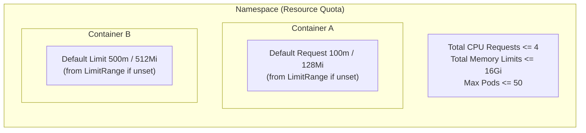

# Namespaces

This document describes how VMO Manager creates, adopts, and edits Kubernetes namespaces, and how to apply Resource Quotas and Limit Ranges.

## Managed Namespaces

A namespace is **managed** when it has the label `app.kubernetes.io/managed-by=vmo-manager`. VMO Manager:

- Lists managed namespaces in dropdowns and filters
- Lets you edit Labels, Annotations, Resource Quotas, and Limit Ranges from a single modal
- Allows quick-create from various pages (e.g. VM creation, networking)

Resource lists default to **All Namespaces**, showing resources across all namespaces you can access. For OIDC users with namespace-scoped RoleBindings (granted via **Settings > Access Management**), only their permitted namespaces appear in dropdowns and filters. Users with cluster-wide access see all managed namespaces. You can filter by a specific namespace using the namespace dropdown.

> **Tip:** When creating VMs or other resources, choose a managed namespace. Namespaces without the VMO label may not appear in dropdowns.

A second label, `vmo-manager.spectrocloud.com/origin=created`, distinguishes namespaces that VMO Manager created (deletable from the UI) from namespaces that were **adopted** (only removable from VMO management; the underlying namespace remains in the cluster).

## Creating Namespaces

### Quick-Create Links

From several pages, you can create a namespace without leaving the page:

- **VM creation** -- the Namespace dropdown offers "Create namespace" when the desired namespace does not exist.
- **Networking** -- when creating a NAD, you can create the target namespace first.
- **Access policies** -- when scoping access to a namespace, you can create it inline.

Quick-create creates the namespace with the `app.kubernetes.io/managed-by=vmo-manager` label so it is immediately managed.

### Create from the Namespaces Page

1. Go to **Infrastructure > Namespaces**.
2. Click **Create Namespace**. A modal opens with three tabs:
   - **General** -- the namespace name, plus optional Labels and Annotations.
   - **Quotas** -- optional namespace-wide Resource Quota caps.
   - **Limit Range** -- optional per-container default requests and limits.
3. On the **General** tab, enter a DNS-1123 compliant name (lowercase letters, digits, and hyphens; max 63 characters; must start and end with an alphanumeric). Validation runs as you type.
4. Optionally add **Labels** and **Annotations**. Each is a key/value pair; you can add multiple. See [Reserved Keys](#reserved-keys) below for keys VMO Manager controls automatically.
5. Optionally fill in **Quotas** and **Limit Range** (see [Resource Quotas vs Limit Range](#resource-quotas-vs-limit-range)). Empty fields are skipped -- the namespace is created without that constraint.
6. Click **Create**.

The namespace is created with VMO labels set, then any provided Quotas and Limit Range are applied as a follow-up step. If those follow-up calls fail, the namespace is still created -- you can retry from **Edit Namespace**.

### Adopting Existing Namespaces

To bring a namespace that already exists in the cluster under VMO management:

1. Go to **Infrastructure > Namespaces**.
2. Click **Add Existing**.
3. Select one or more unmanaged namespaces from the list and click **Adopt**.

Adopted namespaces are labeled `app.kubernetes.io/managed-by=vmo-manager` but **not** marked with `vmo-manager.spectrocloud.com/origin=created`. They can be removed from VMO management (unadopted) but cannot be deleted from the VMO UI -- delete the underlying namespace with `kubectl` or another tool when needed.

## Editing Namespaces

Click the **pencil icon** (Edit) in the row's actions column to open the unified modal in edit mode. You can update:

- **Labels** -- on the General tab. VMO-reserved and Kubernetes system keys are filtered out automatically (see [Reserved Keys](#reserved-keys)).
- **Annotations** -- on the General tab. Kubernetes system annotations are filtered out automatically.
- **Resource Quotas** -- on the Quotas tab. Clear a field to remove that cap.
- **Limit Range** -- on the Limit Range tab. Clear a field to remove that default.

> **Namespace names are immutable.** Kubernetes does not allow renaming a namespace. The name field is shown but disabled in edit mode. To use a different name, create a new namespace, move resources over, and delete the old one.

Edit only writes labels and annotations the user can control; reserved keys (the VMO management labels and Kubernetes-owned keys like `kubernetes.io/metadata.name`) are preserved server-side regardless of what is sent.

## Actions Column and Context Menu

The actions column on the Namespaces table is icon-only and matches the VM list pattern:

| Icon | Action | When shown |
|------|--------|------------|
| **Pencil** | Edit Namespace (opens the unified modal) | Any managed namespace, when the user has `vmo:namespace:update`. |
| **Trash** | Delete Namespace | Only for namespaces VMO Manager created (`origin=created`), when the user has `vmo:namespace:delete`. |

For adopted namespaces, **Remove from VMO** ("unadopt") is available via the right-click context menu on the row. Unadopt strips the VMO management label so the namespace is hidden from VMO dropdowns but leaves the namespace and its resources in the cluster.

> Adopted namespaces show a confirmation dialog listing existing VMs, DataVolumes, snapshots, services, and PVCs in the namespace before unadopting. The resources remain after the namespace is removed from VMO management -- they are simply no longer surfaced in the VMO UI.

## Resource Quotas vs Limit Range

Quotas and Limit Ranges are commonly confused. They control different scopes:

| | Resource Quota | Limit Range |
|--|----------------|-------------|
| **Scope** | The whole namespace | Each individual container |
| **Effect** | Hard cap on the **sum** across all pods | **Default** request/limit for containers that did not specify their own |
| **Applied via** | A `ResourceQuota` object | A `LimitRange` object |
| **What you set** | Total CPU/Memory requests and limits, total Storage, max Pods | Per-container default CPU/Memory request and limit |

Use a **Resource Quota** to keep a noisy namespace from starving other workloads on the cluster. Use a **Limit Range** to give containers sane defaults so that VMs and pods cannot accidentally schedule with no resources reserved.

### Quota Fields

On the **Quotas** tab, all fields are optional:

| Field | What it caps |
|-------|--------------|
| Total CPU Requests | Sum of `requests.cpu` across all pods in the namespace. |
| Total CPU Limits | Sum of `limits.cpu` across all pods. |
| Total Memory Requests | Sum of `requests.memory`. |
| Total Memory Limits | Sum of `limits.memory`. |
| Total Storage | Sum of `requests.storage` across all PVCs in the namespace. |
| Max Pods | Maximum number of pods in the namespace. |

CPU values use Kubernetes CPU units (`1`, `500m`, `1.5`). Memory and storage use binary suffixes (`128Mi`, `4Gi`).

### Limit Range Fields

On the **Limit Range** tab, all fields are optional:

| Field | What it sets |
|-------|--------------|
| Default CPU Request per container | `requests.cpu` for containers that did not specify their own. |
| Default CPU Limit per container | `limits.cpu` for containers that did not specify their own. |
| Default Memory Request per container | `requests.memory` for containers that did not specify their own. |
| Default Memory Limit per container | `limits.memory` for containers that did not specify their own. |

If a workload already declares its own `resources.requests` or `resources.limits`, the LimitRange does not override it -- it only fills in defaults.

## Reserved Keys

A small set of label and annotation keys is owned by either VMO Manager or Kubernetes itself. These are server-controlled: VMO Manager silently strips them from any client-supplied input and preserves the canonical values.

**VMO-controlled labels** (always present on managed namespaces, never user-editable):

- `app.kubernetes.io/managed-by` -- always `vmo-manager`.
- `vmo-manager.spectrocloud.com/origin` -- `created` for namespaces VMO created, absent for adopted namespaces.

**Kubernetes-controlled keys** (any key matching these patterns, in either labels or annotations):

- `kubernetes.io/...` and `*.kubernetes.io/...`
- `k8s.io/...` and `*.k8s.io/...`
- `pod-security.kubernetes.io/...` (pod security admission labels)

The Edit modal hides these keys; if you need to set a `kubernetes.io/` key, use `kubectl edit namespace` directly.

## Default Namespaces

On bootstrap, VMO Manager automatically labels these namespaces as managed:

| Namespace | Purpose |
|-----------|---------|
| `default` | Default Kubernetes namespace. |
| `vm-dashboard` | VMO Manager's own namespace (or the configured value). |
| `vmo-golden-images` | Dedicated namespace for golden image DataVolumes. |

These namespaces are labeled if they exist. If they do not exist, the bootstrap process may create them or they are created by the Helm chart.

> **Note:** The exact namespace names depend on Helm values (`VMO_NAMESPACE`, `VMO_GOLDEN_IMAGES_NAMESPACE`). See the platform configuration for your deployment.

## API Reference

The Namespaces page uses the following endpoints. All require `vmo:namespace:*` permissions.

| Method | Path | Action |
|--------|------|--------|
| GET | `/api/v1/namespaces` | List all namespaces (use `?managed=true` for VMO-managed only). |
| POST | `/api/v1/namespaces` | Create a namespace. Body: `{name, labels?, annotations?}`. |
| PUT | `/api/v1/namespaces` | Update labels and annotations on an existing managed namespace. Body: `{name, labels?, annotations?}`. Returns 404 if missing, 403 if not VMO-managed. |
| PATCH | `/api/v1/namespaces?name=<n>&action=adopt\|unadopt` | Add or remove the VMO management label. |
| DELETE | `/api/v1/namespaces?name=<n>` | Delete a VMO-created namespace. |
| GET / PUT / DELETE | `/api/v1/namespaces/policies?ns=<n>` | Get, set, or remove ResourceQuota and LimitRange for a namespace. |

Reserved label and annotation keys are stripped server-side on POST and PUT.
