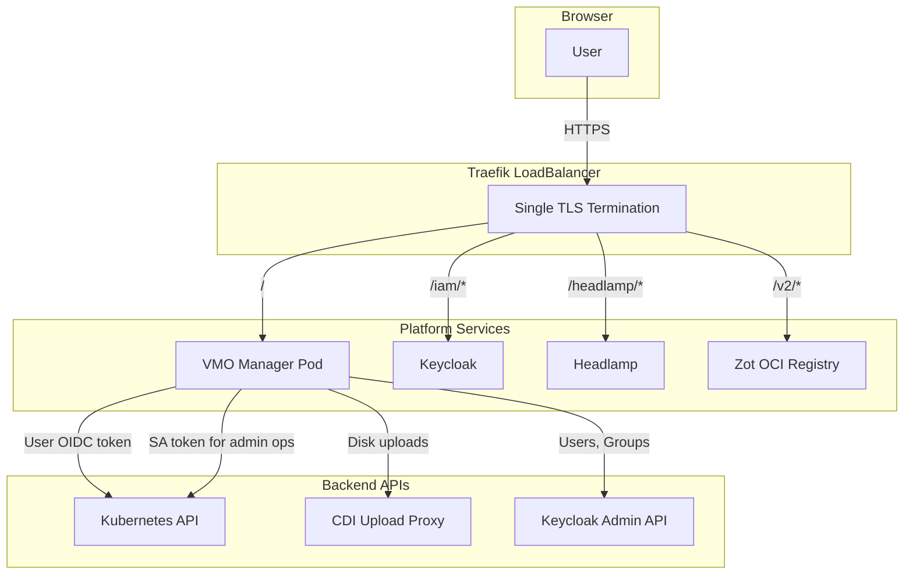

# Platform Overview

This document describes the VMO Manager platform architecture, including all components and how they connect. The platform is designed for air-gapped, FIPS-compliant environments with a single ingress and path-based routing. See also: [Auth & Deployment Modes](auth-modes.md), [Security Model](security.md), and [Data Flow & Persistence](data-flow.md).

## Architecture Diagram

## Path-Based Routing

Traefik routes traffic by path prefix. Longer prefixes take precedence over shorter ones, so specific paths are matched before the catch-all.

| Path | Service | Purpose |
|------|---------|---------|
| `/` | VMO Manager | Catch-all: UI, API, static assets |
| `/iam/*` | Keycloak | OIDC issuer, admin console, token endpoints |
| `/headlamp/*` | Headlamp | Kubernetes cluster explorer UI |
| `/v2/*` | Zot | OCI registry (container images) |
| `/repo/*` | VMO Manager | Package repository serving |

> **Note:** VMO Manager serves at `/` as the default. All other paths are routed to their respective services before the catch-all matches.

## Component Table

| Component | Purpose |
|-----------|---------|
| **VMO Manager** | Primary UI and API gateway. Go backend + React frontend. Manages VMs, templates, golden images, access policies, config, and dashboards. |
| **Keycloak** | OIDC identity provider. Handles login, user/group management, and token issuance. Shared `k8s-oidc` client with K8s API and Headlamp. |
| **Traefik** | Single ingress controller. TLS termination, path-based routing, LoadBalancer IP. |
| **cert-manager** | Issues and renews TLS certificates. Single platform CA for all components. |
| **KubeVirt** | Virtual machine runtime. Manages VirtualMachine, VirtualMachineInstance, and DataVolume resources. |
| **CDI** | Containerized Data Importer. Handles disk image uploads, imports, and clones. |
| **MetalLB** | LoadBalancer implementation for bare-metal. Assigns the platform IP. |
| **Piraeus/LINSTOR** | Storage backend. Provides StorageClass for VM disks (when used). |
| **Cilium** | CNI and network policy. Multus support for VM networking. |
| **OTel Collector** | Metrics pipeline. Receives OTLP from node-agent, forwards to VMO Manager or Victoria Metrics. |
| **Victoria Metrics** | Optional long-term metrics storage. PromQL queries when `EXTERNAL_METRICS_URL` is configured. |
| **Headlamp** | Kubernetes cluster explorer. Alternative UI for raw K8s resources. |
| **Zot** | OCI registry. Stores container images for air-gapped deployments. |

## Data Flow Summary

- **Browser to VMO Manager:** User requests go to Traefik, which forwards to the VMO Manager pod. Static assets are embedded in the binary.
- **VMO Manager to Kubernetes:** API calls use the user's OIDC token (or pod SA token for privileged operations).
- **VMO Manager to Keycloak:** User and group management uses the Keycloak Admin API with a service account.
- **VMO Manager to CDI:** Disk uploads are proxied through the CDI upload proxy.
- **Metrics:** OTel Collector receives metrics from the node-agent, forwards to VMO Manager's OTLP endpoint. VMO Manager stores recent data in an in-memory ring buffer and optionally forwards long-range queries to Victoria Metrics.
