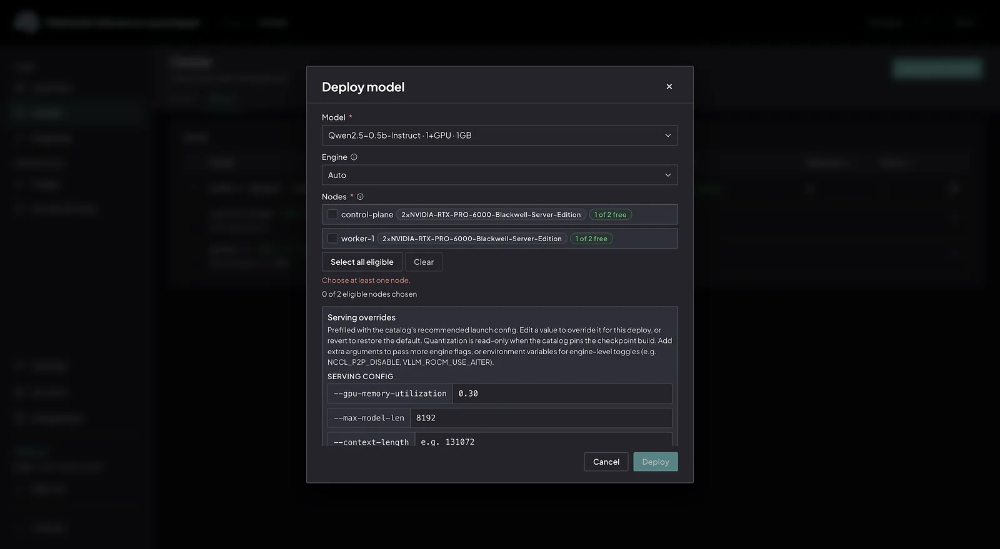
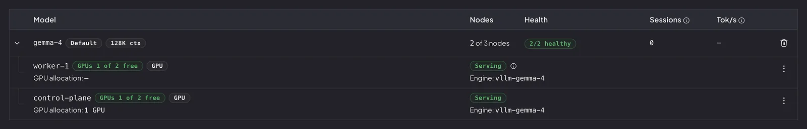
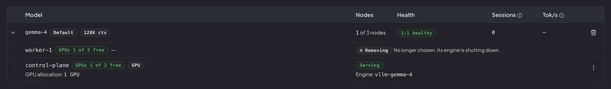

This guide explains how to deploy a model to a running PaletteAI Inference Launchpad appliance, choose which nodes run
it, and verify that the model is serving requests. On a multi-node appliance, you select the target nodes in the deploy
dialog. For why you would pin a model to some nodes and not others, refer to
[Model Placement](../explanation/model-placement.md).

## Prerequisites

- A running PaletteAI Inference Launchpad appliance, with the admin console reachable and operator access.
- At least one node that can host the model you intend to deploy. The deploy dialog lists each node's hardware, free
  GPUs, and whether it can run the model.
- The model present in the appliance catalog and able to fit at least one node's available GPU resources. To confirm
  support, refer to [Certified Models by Hardware](../reference/certified-models-by-hardware.md) and
  [Suggested Hardware](../reference/hardware-requirements.md). To place a model in the appliance catalog, follow
  [Upload a Model](./upload-a-model.md) first.

## Deploy a Model

1. From the left main menu, select **Cluster**. The page opens on the **Nodes** tab.

2. Select the **Models** tab, and then select **Deploy New Model**. The **Deploy model** dialog opens.

3. Open the **Model** drop-down menu and select the model to deploy.

4. _(Optional)_ Open the **Engine** drop-down menu and select an engine. Leave it on **auto** to let the appliance
   choose the engine. For what an engine is and when you would override the automatic choice, refer to
   [Inference Engines](../explanation/inference-engines.md).

5. In **Nodes**, review each node. The list shows the node's name, hardware, free GPUs, and whether it can run the model
   you selected. Select every node that should run the model. A node that cannot run the model is not selectable and
   states why, with a message such as `2 free GPU(s), needs 4`,
   `has NVIDIA-L40S, model requires NVIDIA-RTX-PRO-6000-Blackwell-Server-Edition`, or
   `the model's weights are not staged on this node`. For the full list of reasons, refer to
   [Why a Node Cannot Be Chosen](../explanation/model-placement.md#why-a-node-cannot-be-chosen).

   On a first deploy, no nodes are pre-selected. The dialog reports `N of M eligible nodes chosen` and does not offer
   **Deploy** until you choose at least one node. On a repeat deploy of the same model, nodes that already serve the
   model arrive pre-selected and locked as **Already deployed**, and **Deploy** is available without any further
   selection.

   

6. _(Optional)_ To select every node that can run the model right now, select **Select all eligible**. That choice is a
   snapshot. A node you add to the cluster later does not receive this model until you add it, as described in
   [Add a Model to More Nodes](#add-a-model-to-more-nodes).

7. Select **Deploy**, review the deployment preview, and then select **Confirm & Apply**.

The appliance writes nothing until you confirm. It then brings the model through gate, provision, smoke-test, and ready
stages on each chosen node. For that lifecycle, refer to
[Model Provisioning Lifecycle](../explanation/architecture.md#model-provisioning-lifecycle).

:::info

A deploy from the console always records the nodes you selected. The model runs only on that list. It does not start
automatically on a node you add to the cluster later. To run it on additional nodes, refer to
[Add a Model to More Nodes](#add-a-model-to-more-nodes).

:::

### Verify the Model Is Serving

Confirm the model is serving before you route traffic to it.

1. Locate the model in the **Model** table on the **Cluster** page.

2. Confirm that the **Nodes** column reads `N of M nodes`, where `N` is the number of nodes you chose and `M` is the
   number of nodes in the cluster. The health chip counts serving against the chosen set, so `2/2 healthy` means every
   chosen node is serving.

3. Expand the model row. Only the nodes you chose are listed. A node you did not select is absent, which means it was
   never asked to run this model.

   

4. Confirm that each listed node's state reaches `ready` or `serving`. A state of `deploying` or `smoke-testing` means
   the model is still coming online on that node. A state of `Waiting to start` means the node is chosen and no engine
   has reported yet. A state of `failed` or `verification failed` means the model did not come online on that node.

:::info

While a model is deploying, a node hosting it can briefly report a `Degraded` or `Not serving` state. This is expected
during deployment and clears once the model finishes coming online, at which point the node returns to a healthy state.

:::

For why a model becomes routable only after it passes its smoke test, refer to
[Model Provisioning Lifecycle](../explanation/architecture.md#model-provisioning-lifecycle).

## Add a Model to More Nodes

To run an already deployed model on additional nodes, deploy it again and select the extra nodes. Nodes that already
serve the model stay selected and show **Already deployed**.

1. From the left main menu, select **Cluster**. The page opens on the **Nodes** tab.

2. Select the **Models** tab, and then select **Deploy New Model**.

3. Select the same model. In **Nodes**, already serving nodes are locked with **Already deployed**. Select each
   additional eligible node.

4. Select **Deploy**, review the preview, and then select **Confirm & Apply**.

The appliance creates an engine on each newly chosen node and leaves the existing engines and the model's endpoint
alone. Traffic continues on the nodes that were already serving.

## Remove a Model from a Node

To stop a model on one node and leave it running elsewhere, expand the model row and remove it from that node.

1. From the left main menu, select **Cluster**, and then select the **Models** tab.

2. Expand the model row, open the node's three-dot menu, and select **Remove**.

3. Review the preview, and then select **Confirm & apply**.

The node stays visible while its engine shuts down. It reads **Removing** with the message
`No longer chosen. Its engine is shutting down.` The row disappears once the engine is gone. The model's endpoint and
the remaining chosen nodes keep serving.

To remove the model from every node, use the trash icon on the model's row instead of a per-node **Remove**.

## Resolve a Blocked Deployment

If a deployment cannot proceed, the dialog explains why. **Deploy** is unavailable when you have not chosen a node, and
the dialog shows an `Unable to deploy` notice when the model is already deployed on every node in the cluster. Common
reasons include the following:

- You have not chosen a node. The dialog reads `Choose at least one node.`
- The model is already deployed on every node in the cluster. **Deploy** stays enabled, but the dialog shows an
  `Unable to deploy` notice.
- A node does not have enough free GPUs, for example `2 free GPU(s), needs 4`.
- A node's GPU product does not match the model, for example
  `has NVIDIA-L40S, model requires NVIDIA-RTX-PRO-6000-Blackwell-Server-Edition`.
- The model's weights are not staged on that node, or only the metadata is staged.
- The node's GPU allocation is unknown. Unknown capacity is treated as unusable, not as free.
- The node is `NotReady` or cordoned.

To resolve the reason, free GPUs on a node by removing another model from that node, stage the model's weights on the
node, add capacity to the cluster, or resolve the unknown allocation on the affected nodes. Then deploy the model again.
For the full list of eligibility reasons and how the appliance behaves when a node degrades between selection and
confirmation, refer to [Model Placement](../explanation/model-placement.md).

## Next Steps

To change which model handles requests that do not name a model explicitly, refer to
[Switch the Default Model](./set-the-default-model.md). For why you would pin a model to some nodes and not others,
refer to [Model Placement](../explanation/model-placement.md). To let a text-only model answer questions about images,
refer to [Enable Vision Preprocessing](./enable-vision-preprocessing.md).
