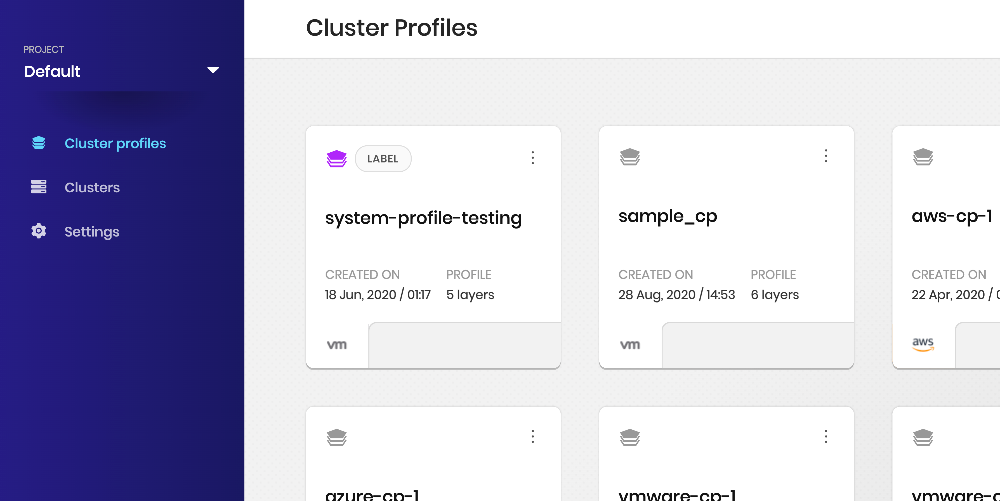
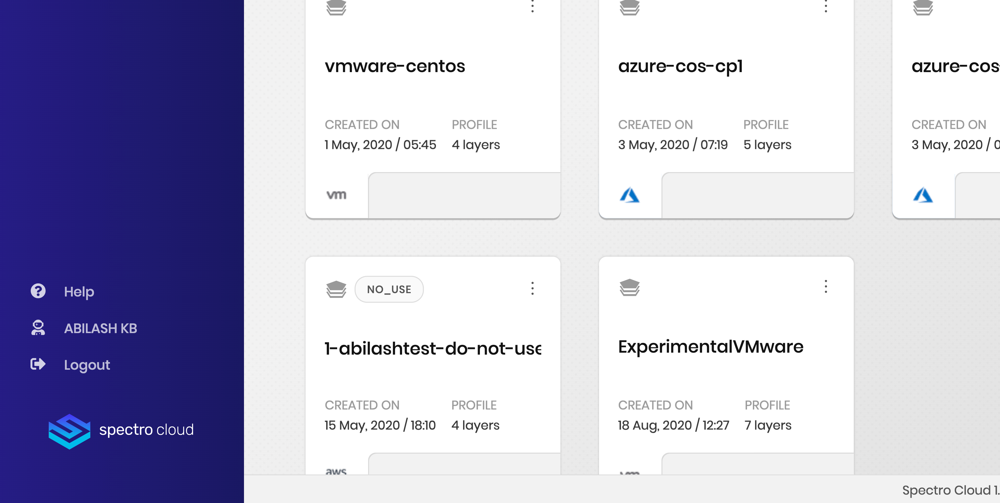
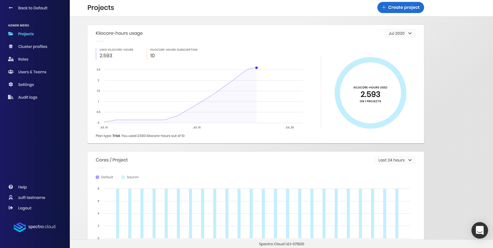

import Tabs from '@librarium/shared/src/components/ui/Tabs';
import WarningBox from '@librarium/shared/src/components/WarningBox';
import InfoBox from '@librarium/shared/src/components/InfoBox';
import PointsOfInterest from '@librarium/shared/src/components/common/PointOfInterest';
import Tooltip from "@librarium/shared/src/components/ui/Tooltip";

# Getting Started

This section is a tour of the two main dashboards of the tenant console. It also helps with the creation of cluster profiles and clusters to enable users to get going. More details on creating clusters are available in the dedicated <Tooltip trigger={<u>clusters</u>}>Kubernetes <a href="/clusters">clusters</a> in Spectro Cloud that are instantiated from cluster profiles.</Tooltip> page.

# Understanding the tenant console

The Spectro Cloud tenant console contains two main dashboards. The first one is mainly for the Kubernetes-related options while the other is for the settings related to operations. There are also differences in the dashboard views for an admin user and a non-admin user.

# Default Dashboard

Upon login, the dashboard shows the views available for a non-admin user. At this time, only the <Tooltip trigger={<u>cluster profiles</u>}><a href="/cluster-profiles">Cluster profiles</a> are instantiated templates that are created with pre-configured layers/components needed for cluster deployments.</Tooltip> (marked as 1) of the default project are shown. <Tooltip trigger={<u>Projects</u>}> A <a href="/projects">project</a> helps to organize the cluster resources in a logical grouping.</Tooltip> (2) help to organize the cluster resources in a logical grouping. The left pane in this dashboard also contains options for <Tooltip trigger={<u>clusters</u>}>Kubernetes <a href="/clusters">clusters</a> in Spectro Cloud that are instantiated from cluster profiles.</Tooltip> (3). The bottom left contains buttons for the user's profile (6) and the Admin dashboard (5). The "Admin" options are visible only for users having the admin role.

The "Settings" section (4) of the default dashboard relates to the cloud account settings. This is an important distinction from the settings under the Admin dashboard. It also allows the user to upload SSH keys for safekeeping. These key/s can be recalled when deploying a cluster.

<PointsOfInterest
  points={[
    {
      x: 220,
      y: 75,
      label: 1,
      description: "Cluster Profiles are listed here.",
      tooltipPlacement: "rightTop",
    },
    {
      x: 80,
      y: 50,
      label: 2,
      description: "This is where Projects are selected.",
    },
    {
      x: 110,
      y: 142,
      label: 3,
      description: "Lists all the clusters accessible to the user under the current project.",
      tooltipPlacement: "rightTop",
    },
    {
      x: 110,
      y: 175,
      label: 4,
      description: "Add or delete Cloud Accounts.",
      tooltipPlacement: "rightTop",
    },
  ]}
>

  

</PointsOfInterest>

<PointsOfInterest
  points={[
    {
      x: 90,
      y: 190,
      label: 5,
      description: "Admin section; available for tenant-admin users only.",
      tooltipPlacement: "rightTop",
    },
    {
      x: 123,
      y: 246,
      label: 6,
      description: "Change the first and last names; and update the login password.",
      tooltipPlacement: "rightTop",
    },
  ]}
>

  

</PointsOfInterest>

# Admin Dashboard

The menu within the Admin dashboard also contains the Projects button. This is different from the Projects menu in the default dashboard. Within the Admin dashboard, the Projects button provides access to modifying a project itself (edit/configure/delete and the overall status), whereas the button in the default dashboard provides access to the cluster profiles inside of the project.

The Cluster Profiles button in the Admin dashboard provides access to all the cluster profiles. These cluster profiles can be used in one or more projects, or they can be left unused. An ideal use-case of this feature is for the admin to create cluster profiles that are standard across the tenant (i.e., these cluster profiles are needed in all projects).

The <Tooltip trigger={<u>Roles</u>}>A <a href="/user-management/rbac#roles">Role</a> is a collection of permissions.</Tooltip> (and <Tooltip trigger={<u>Permissions</u>}><a href="/introduction/concept-overviews#permission">Permissions</a> are associated with specific actions within the platform.</Tooltip>); as well as <Tooltip trigger={<u>Users</u>}><a href="/introduction/concept-overviews#users">Users</a> are members of a tenant who are assigned roles that control their access within the platform.</Tooltip> and <Tooltip trigger={<u>Teams</u>}>A <a href="/introduction/concept-overviews#team">Team</a> is a group of users.</Tooltip> allow the admin to set or restrict these attributes for one or more team members. See the <Tooltip trigger={<u>RBAC</u>}>Spectro Cloud's <a href="/user-management#rbac">RBAC</a> design allows granting granular access to resources and its operations.</Tooltip> section for more details.

Settings under the Admin dashboard provide access to the <Tooltip trigger={<u>pack registries</u>}>A <a href="/registries-and-packs">pack</a> is a collection of files such as manifests, helm charts, ansible roles, configuration files, etc.</Tooltip>; <Tooltip trigger={<u>private cloud gateways</u>}>A <a href="/introduction/concept-overviews#privatecloudgateway">Private Cloud Gateway</a> is a Spectro Cloud component that enables the communication between Spectro Cloud's management console and a VMware based private data center.</Tooltip> and [SAML SSO](/user-management/saml-sso) configurations.

Finally, <Tooltip trigger={<u>audit logs</u>}>The Spectro Cloud management platform application captures <a href="/audit-logs">audit logs</a> to track the user interaction with the application resources along with the timeline.</Tooltip> in the admin dashboard allow the admin to track the user interaction with the application resources along with the timeline for all projects and users. For admin users, the "audit log" button is visible for each project as well. Here, the admin can view the logs of the resources specific to the project.

# Deploying your first cluster

Deploying your first [cluster](https://kubernetes.io/docs/setup/best-practices/cluster-large/#setup) should be a walk in the park. As an overview, Spectro Cloud mandates the creation of a cluster profile before a cluster can be created. This is because the <Tooltip trigger={<u>cluster profiles</u>}><a href="/cluster-profiles">Cluster profiles</a> are instantiated templates that are created with pre-configured layers/components needed for cluster deployments.</Tooltip> contains the configurations needed for your cluster. The cluster profile helps you prepare a readymade configuration of - the OS, the Kubernetes layer, the network layer, and the storage layers. These four are the mandatory layers without which a cluster profile cannot be created. There are a host of other layers and components available to add in the cluster profile (load balancers, authentication, monitoring, and logging, etc.) which are detailed in the cluster profile section.

The major steps towards the deployment and management of your workload clusters are:

* Creation of the cluster Profile
* Creation of Cloud Account and Cluster Deployment
* Cluster Management Operations (Day 2 Management)

<Tabs identifier="getting_started">

<Tabs.TabPane tab="Create Cluster Profile" key="cluster-profile">

## Cluster Profile

A quick overview of cluster profile creation is as guided below. Please refer [Cluster Profile Creation](/cluster-profiles/task-define-profile/#creatingclusterprofiles) for detailed outlook in to the same.

* Navigate to the Default Project (select back to the Default project if you’re in the Admin view).
* Switch to the *Cluster Profiles* page from the left navigation bar.
* Click on the *Add Cluster Profile* button.
* Specify a custom name, description (optional), tag (optional) and **type** (Full, Infrastructure or Add-on) of cluster profile to be created and click *Next*.
* Select **Cloud Environment** to run your cluster.
* Click on Edit Layers and make choices of registries and packs for each layer. Attach Manifest if required.
* Please designate the following selections for each layer,

    * OS
    * Kubernetes
    * Network
    * Storage
    * Additional layers as required (only for add-on and full cluster profiles)
       

* Click *Finish* to close the Layer dialogue.
* Click *Next* and review the Cluster Profile.
* Click *Finish* to create the Cluster Profile.

</Tabs.TabPane>

<Tabs.TabPane tab="Cluster Deployment" key="cluster-creation">

Cluster deployment is all about deploying a workload cluster. The stages of cluster provisioning includes:
 
* Cloud Gateway Creation (Not applicable to all clouds) 
* Cloud Account Creation
* Cluster Creation

For detailed instructions on the deployment of clusters in different cloud environments please visit [Create Cluster](/clusters/new-clusters/#creatingclusters).

<InfoBox>
The creation of a private cloud gateway is highly environment dependant. All the cloud infrastructures does not requires a gateway. Users can create a gateway for only those clouds which mandates it, like MaaS, VMWare and OpenStack.
</InfoBox>

</Tabs.TabPane>

<Tabs.TabPane tab="Cluster Management" key="day2">

Cluster management operations involves the scaling, monitoring, maintenance, and troubleshooting of tenant clusters that keeps them up and running.
Please refer to [cluster management](/clusters/cluster-updates/#manageclusters) for detailed instructions and procedures.
</Tabs.TabPane>

</Tabs>

