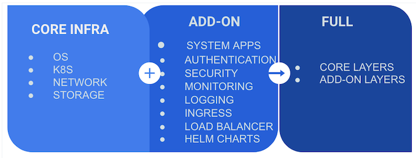

import WarningBox from '@librarium/shared/src/components/WarningBox';

# Cluster Profiles

Cluster profiles are like templates that are created with pre-configured layers/components needed for cluster deployments. A user can create as many profiles as needed.  Cluster deployments are based off these cluster profiles. A cluster profile contains the details of the configurations needed for a particular type of deployment. Cluster profiles can be created to be of the type Core Infra, Add-on or Full.

A Core Infra cluster profile is constructed using the four core infrastructure layers: the OS, Kubernetes, the networking, and the storage layers.

An Add-on cluster profile consists of various integrations and can be constructed using layers such as:
- System apps.
- Authentication.
- Security.
- Monitoring.
- Logging.
- Ingress.
- Load balancer.
- Helm Charts.

A Full cluster profile consists of the core infrastructure layers and as many additional add-on layers as required.

Cluster creation requires an Infra or a Full cluster profile to be selected, and optionally, one or more add-on profiles.  The same add-on layer category may exist in more than one of the add-on profiles. The profile would then read, for example: OS, Kubernetes, Networking, Storage, Monitoring, Ingress.

Cluster Profile Layers are built using content packages which contain integration specific templates, charts and manifest. These content packages can either be of two types:

 * Spectro Packs  - Content packages built using Spectro Cloud’s proprietary content format. Spectro Cloud maintains a public registry of Spectro Packs that are available to all tenants.

 * Helm Charts - Collection of Kubernetes resource files capable of deploying services ranging in varying complexities. Spectro Cloud provides a few stable public helm registries out of the box. Tenants can also additionally add any public or private helm registries to leverage charts from those registries.

The next sections detail the process of creating and saving a profile.
