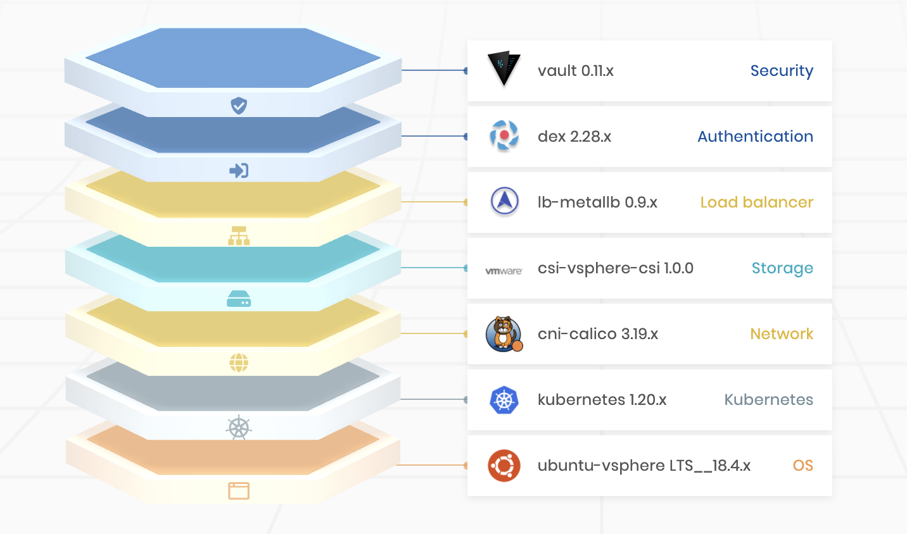

import WarningBox from '@librarium/shared/src/components/WarningBox';

# Overview
Cluster profiles are like templates that are created with pre-configured layers/components that are required for 
workload cluster deployments. Cluster profiles provide a way for driving consistency across workload cluster 
deployments. You can create as many profiles as required. Cluster profile can contain environment specific 
configuration and can be created to meet specific types of workload cluster deployment needs. As an example, you may 
create a Dev cluster profile with very basic configuration or a Prod cluster profile with additional security, monitoring 
and logging layers. You may also build special purpose profiles to deploy workload clusters for use cases such as AI/ML, HPC etc.  Cluster profiles can be created to be of the type Core Infra, Add-on or Full.

Cluster creation requires an Infra or Full cluster profile to be selected, and optionally, one or more add-on profiles.  The same add-on layer category may exist in more than one of the add-on profiles. The profile would then read, for example: OS, Kubernetes, Networking, Storage, Monitoring, Ingress.

# Layers
Cluster Profile Layers are built using content packages which contain integration specific templates, charts and manifest. These content packages can either be of two types:

 * Spectro Packs  - Content packages built using Spectro Cloud’s proprietary content format. Spectro Cloud maintains a public registry of Spectro Packs that are available to all tenants.

 * Helm Charts - Collection of Kubernetes resource files capable of deploying services ranging in varying complexities. Spectro Cloud provides a few stable public helm registries out of the box. Tenants can also additionally add any public or private helm registries to leverage charts from those registries.

# Core Infra Cluster Profile
A Core Infra cluster profile is constructed using the four core infrastructure layers: the OS, Kubernetes, the networking, and the storage layers. These profiles are environment specific and are constructed using cloud specific layers.

# Add-On Cluster Profile
An Add-on cluster profile consists of various integrations and can be constructed using layers such as:

- System apps
- Authentication
- Security
- Monitoring
- Logging
- Ingress
- Load balancer
- Helm Charts

# Full Cluster Profile
A Full cluster profile consists of the core infrastructure layers and as many additional add-on layers as required. The core infra layers are cloud specific.

The next sections provide the details of creating and managing cluster profiles.
