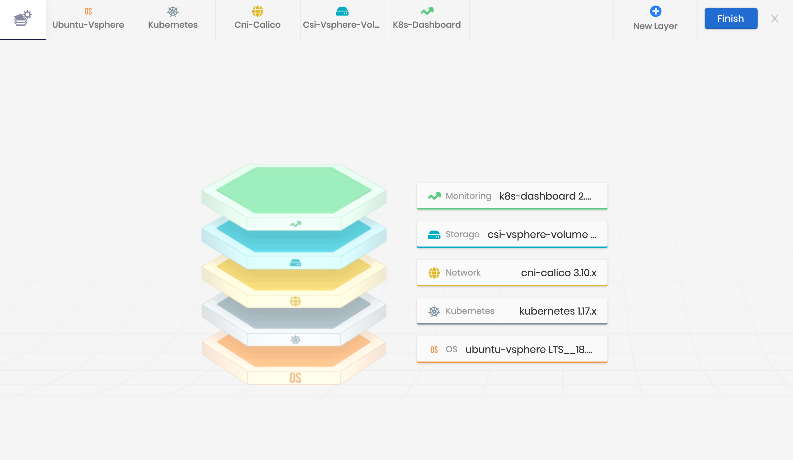
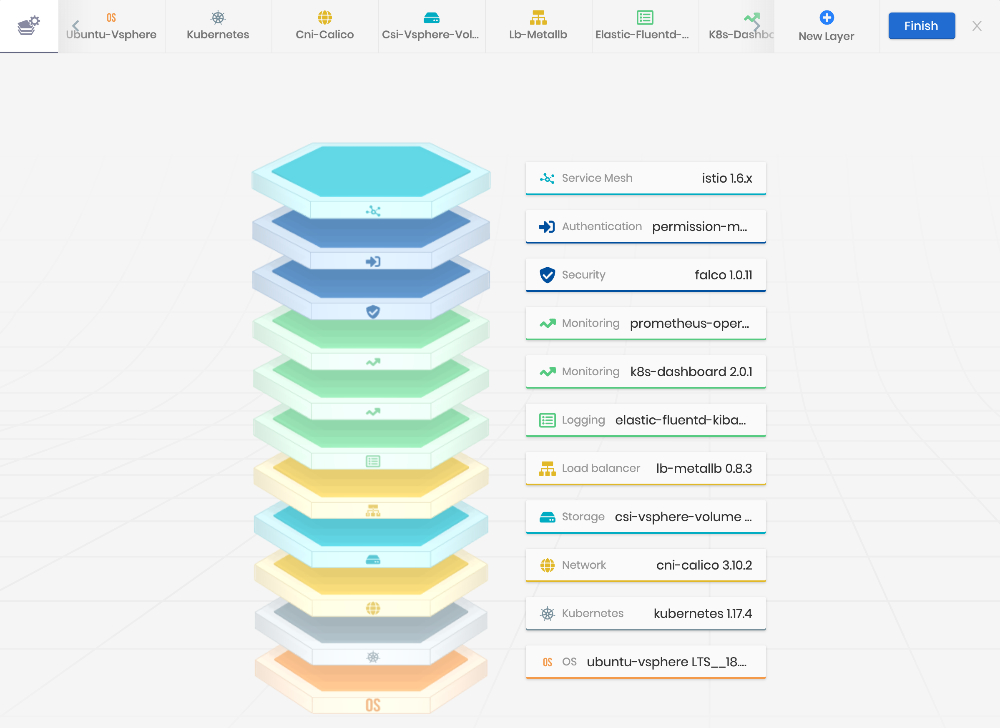

# Examples

Cluster profiles can be built to launch clusters for specific use cases. Clusters launched for development purposes are typically minimal and do no require advanced integrations. Production clusters on the other hand tend be mode comprehensive with many more integrations. Following are examples of cluster profiles built for development and production purposes:

## Development Cluster Profile

* All layers are built with smart tags to enable automatic upgrades of clusters to newest releases.
* Kubernetes dashboard is the only integration enabled

## Production Cluster Profile

* All layers are pinned to specific versions. Automatic upgrades are disabled
* Centralized logging enabled - Elastic Search, Fluentd, Kibana
* Centralized monitoring enabled - Prometheus, Grafana
* Runtime security enabled - Sysdig Falco
* Service observability enabled -  Istio
* Role based access control enabled - Permissions Manager
* Load balancer to expose services externally - MetalLB 
