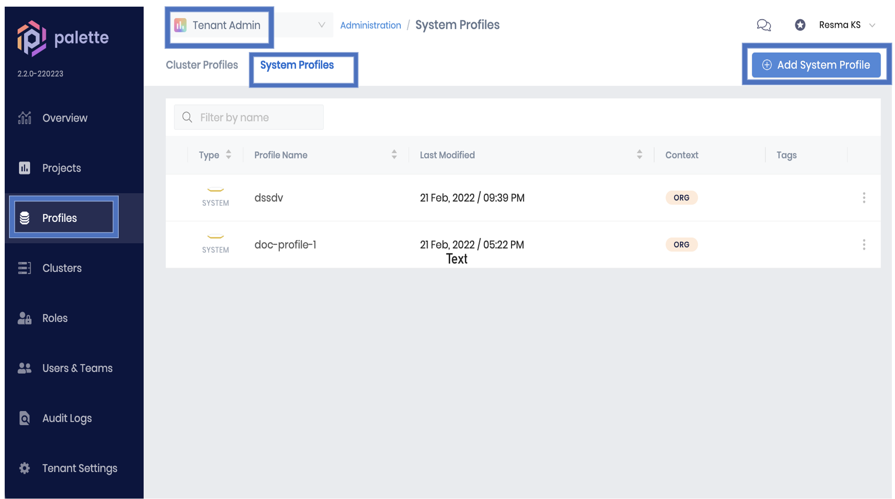
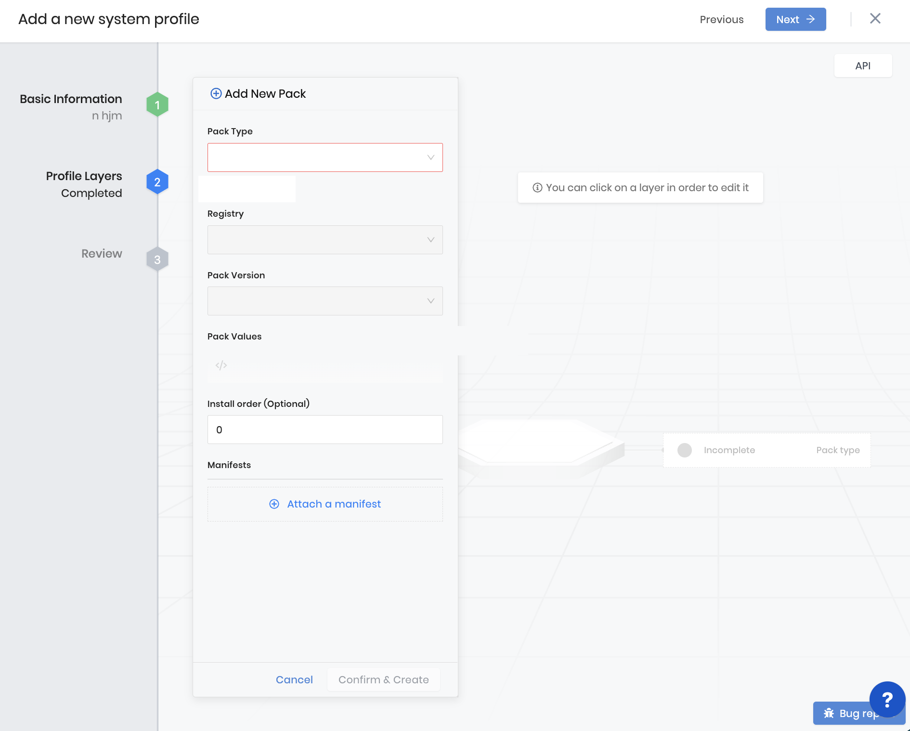
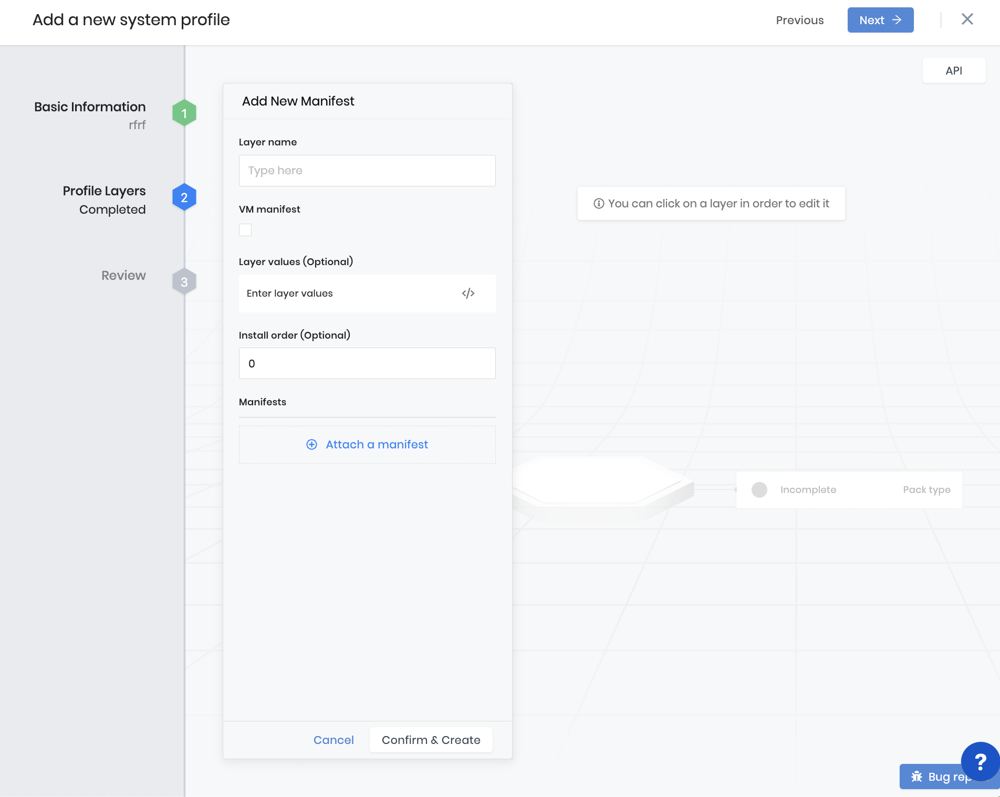
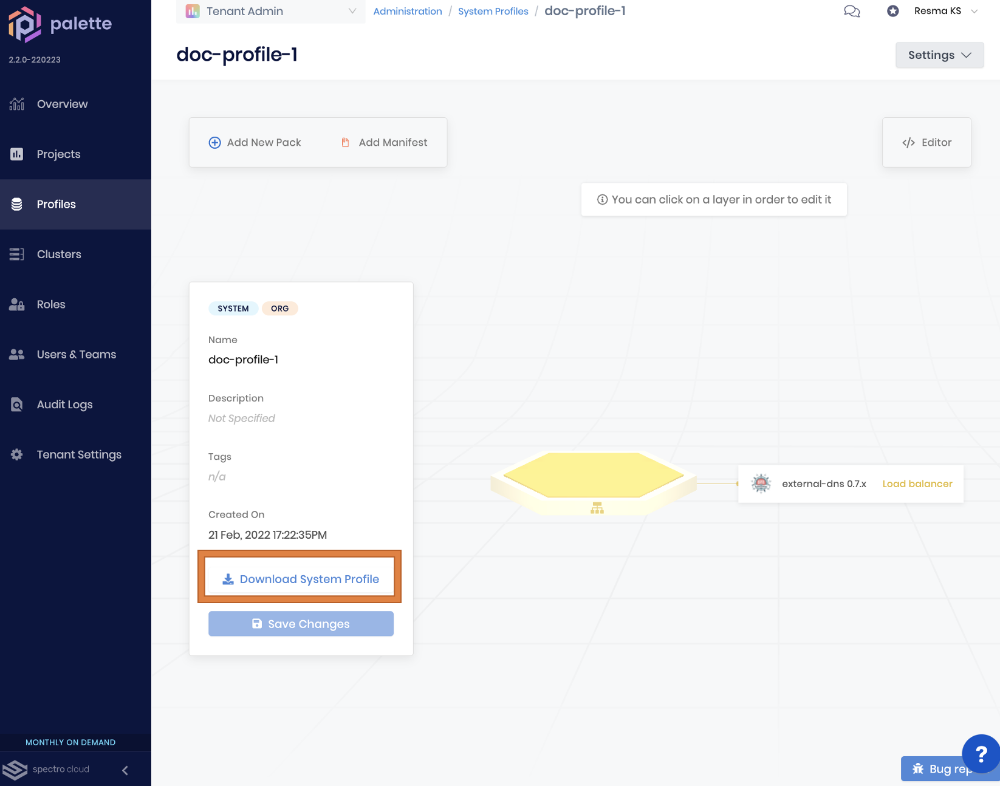

import WarningBox from '@librarium/shared/src/components/WarningBox';

# Overview

System profiles can bootstrap a system with an initial set of virtual and containerized applications. Similar to [cluster profiles](/cluster-profiles), system profiles are templates created with pre-configured layers and components; however they are different in that system profiles are meant for deploying virtualized edge devices. System profiles can be modeled depending on the configurations of virtualized edge devices and edge-specific workload management.

## Create a System Profile

Here are the steps to create a system profile:

* Login to Palette management console.
* Go to `Profiles`, open the `System Profile` tab and click `Add System Profiles`.
* Provide profile information such as system profile name, description (optional), and tags (optional). Tags on a cluster profile are propagated to the VMs deployed on the edge device when clusters are created from the system profile.
* Additional layers such as Monitoring, Security, Load Balancers, etc. may be added and configured as desired. These add-on layers can be added in one of the following ways:
  * **Add New Pack** - Add a Palette Pack from a pack registry or a [Helm Chart](/registries-and-packs/helm-charts/) from a chart registry. The public Spectro Cloud Pack registry and a few popular helm chart repositories are already available out of the box. Additional pack registries or public/private chart registries can be added to Palette.
  * **Add Manifest** - Layers can be constructed using raw manifests to provision Kubernetes resources that are not available via Palette or Charts. Pack Manifests provide a pass-through mechanism wherein additional Kubernetes resources can be orchestrated onto a cluster along with the rest of the stack. 
  * Finish the wizard with :
    * Layer name - A custom name for the manifest
    * Enable **VM manifest** for VM configuration for [virtualized edge](/clusters/new-clusters/edge/virtualized/) devices (not required for [containerised edge](clusters/new-clusters/edge/containerized/) devices).
    * Input optional layer value and install order. 
    * Users can also avail themselves of the option to attach a manifest.
* Click `Confirm and Create` button to save the configuration.
* Click the `Next` button to review the information and `Finish` to create and save the system profile.

<InfoBox>
Users can add other containerized or virtualized applications as layers to your system profile as desired. You can also make changes to the profile after deployment to update the system at a later point.
</InfoBox>

## Download System Profile 

* Login to Palette management console.
* Go to ‘Profiles’ and open the ‘System Profile’.
* Open an existing system profile. 
* Click the `Download System Profile` button at the bottom of the panel to download the profile definition as an archive (with extension `tgz`). 

<InfoBox>
The downloaded system profile can be used with edge devices for environment deployment. 
</InfoBox>

## Sample Snapshots
### System Profile dashboard

### Add a new pack while creating the system profile

### Add a new manifest while creating the system profile

### Download system profile

