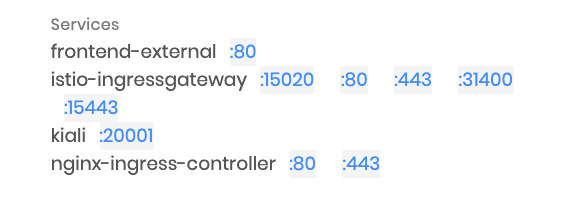
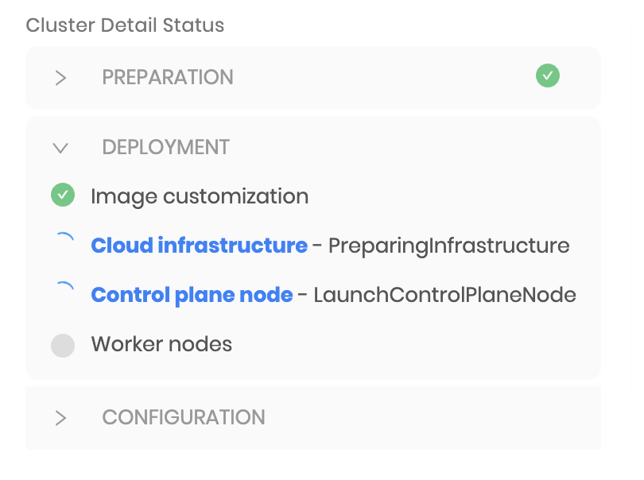

import Tabs from '@librarium/shared/src/components/ui/Tabs';
import WarningBox from '@librarium/shared/src/components/WarningBox';
import InfoBox from '@librarium/shared/src/components/InfoBox';
import PointsOfInterest from '@librarium/shared/src/components/common/PointOfInterest';

# Overview

Kubernetes clusters in Palette are instantiated from cluster profiles. A cluster definition in Palette consists of a reference to a cluster profile, cloud configuration, as well as the cluster size and placement configuration. The following high-level tasks are performed as part of the cluster creation:

* Orchestration of computing, network, and storage resources on the cloud environments along with the required placement infrastructure.
* Installation and configuration of various Kubernetes components like Kubelet, API servers, etcd, scheduler, etc.
* Installation and configuration of the cloud-specific network (CNI) and storage (CSI) plugins.
* Securing of the cluster infrastructure and configuration in accordance with the relevant OS, Kubernetes, and cloud security best practices.
* Deployment of additional add-ons such as Prometheus, Permissions Manager, Vault, etc., as specified in the cluster profile.

# Images

Palette provides VM images for cluster computing infrastructure out of the box for the most recent versions of operating systems such as Ubuntu, CentOS, etc. These images are security-hardened based on the respective CIS Benchmarks. Kubernetes components such as kubelet, kubeadm, etc. are pre-installed in these images. The specific image for a cluster is derived from the Operating System and Kubernetes packs configured in the cluster profile.

The out of the box images are hosted either in the public cloud (AWS - AMI, Azure - VHD) or Palette's storage repository (vSphere - OVA). During provisioning, the image is copied (if missing) to the desired cloud region or downloaded onto a private datacenter.

## Customization
Palette provides various forms of customization options for VM images. All these customization options require a private pack registry to be set up with customized OS packs.

### Customize Out of the Box Images

Palette's out of the box images are security-hardened and have Kubernetes components pre-installed. Additional components can be installed on the images at runtime by defining one or more Ansible roles in the customized OS pack. Palette’s orchestration engine creates a new image by instantiating a VM instance from the out of box image and executing the specified Ansible roles on the instance. This custom image is used for cluster provisioning. The customized image is tagged with a unique signature generated from the pack definition so that it can be reused for future cluster provisioning requests.

### Bring your own Image

Users can bring their own OS image by building custom OS packs and providing a reference to the desired image in pack annotations. These images can be:

* Pre-configured with all desired OS packages and Kubernetes components for the desired version installed. No Ansible roles are specified in the OS pack. The “skip k8s installation” option in the OS pack is set to true. (`"skipK8sInstall": "true"`)

* Base images with none of the desired packages or Kubernetes components installed. Ansible roles are specified in the OS pack to install additional packages. The “skip K8s installation” option in the OS pack is set to false. (`"skipK8sInstall": "false"`)

* A combination of the two options above.

Palette’s orchestration engine examines the OS pack configuration and determines if customization is required. If customization is required, a VM instance is launched from the image reference provided in the pack. Installation of Kubernetes components and/or execution of additional Ansible roles is performed on this VM instance. A VM image is then created from this instance and used for cluster provisioning. The customized image is tagged with a unique signature generated from the pack definition so that it can be reused for future cluster provisioning requests.

# Security

Palette secures the Kubernetes clusters provisioned by following security best practices at the Operating System, Kubernetes, and Cloud Infrastructure level.

## Operating System

’s out of the box VM images are hardened in accordance with the relevant OS CIS benchmark. Additionally, the images are scanned for vulnerabilities regularly and fixes are applied to these images when available from the provider. The upgraded images are released in the form of updated OS packs in Palette’s pack registry and are available to the users to apply to their existing clusters at the time convenient to them.

## Kubernetes

Kubernetes components and configuration are hardened in accordance with the Kubernetes CIS Benchmark. Palette executes Kubebench, a CIS Benchmark scanner by Aqua Security, for every Kubernetes  pack to ensure the master and worker nodes are configured securely.

## Cloud Infrastructure

Palette follows security best practices recommended by the various cloud providers when provisioning and configuring the computing, network, and storage infrastructure for the Kubernetes clusters. These include practices such as isolating master and worker nodes in dedicated network domains, limiting access through use constructs like security groups. etc.

<InfoBox>
  The security measures mentioned above are implemented for Palette’s out of the box OS and
  Kubernetes packs. For customized OS Kubernetes packs, users are responsible for taking the
  relevant measures to secure their clusters.
</InfoBox>

# Day-2 Management

Palette provides several options to manage Kubernetes clusters on an ongoing basis. These include options to scale up/down the cluster by adding/reducing the number of nodes in a node pool, add additional worker pools, resize nodes in a node pool by modifying the instance type, and add additional fault domains such as availability zones to a node pool.

<InfoBox>
  Cluster management operations result in the update of cluster definitions in Palette’s database. The updated definition is retrieved by the management agent running in the cluster. A rolling upgrade is then performed to bring associated clusters to their desired state.
</InfoBox>

# Tenants Admin Cluster Details View

The tenant admin login to Palette management console can have a read only view of the Palette clusters across all the projects under that tenant. 
* Login to Palette management console as Tenant Admin.
* Go to the clusters option from the left-most ribbon side bar to list all the clusters belonging to all the users under that tenant admin. 
* This is a read-only dashboard to know a variety of cluster-related information. Available updates to Clusters can be viewed, verified, and applied through this dashboard.
Users can do cluster operations like applying available updates if they have admin permissions on that project. 

# Cluster Health

Palette monitors cluster infrastructure on a regular basis and reports health on the management console.
Overall health is computed based on the following factors:

* Heartbeat - Palette's management agent, which runs inside the cluster periodically sends a heartbeat to the management console. Missing heartbeats are typically indicative of a problem such as a cluster infrastructure going down, lack of network connectivity, etc. Failure to detect heartbeat over a period of time results in an unhealthy status for the cluster.
* Node Conditions - Kubernetes maintains status for each cluster node in the form of conditions such as DiskPressure, MemoryPressure, NetworkUnavailable, etc. Palette monitors these conditions and reports back to the management console. Any node condition indicating a problem with the node results in an unhealthy status for the cluster.
* Metrics - Palette collects usage metrics such as CPU, Disk, Memory, etc. The cluster is marked as unhealthy if the usage metrics cross specific thresholds over a period of time.

# Usage Monitoring

Palette continuously monitors cluster resources and reports the usage for the cluster as well as individual nodes. The following metrics are reported on the cluster overview page of the management console. By default the metrics are only displayed for the worker nodes in the cluster:

* Cores Used - A cluster-wide break down of the number of cores used.
* CPU Usage - Current CPUs used across all cluster nodes. Additionally, usage over a period of time is presented as a chart.
* Memory Usage - Current memory used across all cluster nodes. Additionally, usage over a period of time is presented as a chart.
* CPU Requests - Total CPUs requested across all pods.
* Memory Requests - Total memory requested across all pods.

Additionally, usage metrics for individual nodes as well as node conditions are accessible from the node details page.

# Application Services

Palette enables quick access to the application services installed on the Kubernetes clusters by providing a link to those on the management console. These include not only the applications and services deployed through Palette but also the ones deployed through any other means. Services are monitored on an ongoing basis and all services of the type LoadBalancer or NodePort are displayed on the management console.

# Troubleshooting

Typically when a cluster lifecycle action such as provisioning, upgrade, or deletion runs into a failure, it does not result in an outright error on the cluster. The Palette orchestration engine follows the reconciliation pattern wherein the system repeatedly tries to perform various orchestration tasks to bring the cluster to its desired state until it succeeds. Initial cluster provisioning or subsequent updates can run into a variety of issues related to cloud infrastructure availability, lack of resources, networking issues, etc.

## Cluster Conditions

Palette maintains specific milestones in a lifecycle and presents them as “conditions”. Examples include: Creating Infrastructure, Adding Control Plane Node, Customizing Image, etc. The active condition indicates what task Palette’s orchestration system is trying to perform. If a task results in failures, the condition is marked as failed, with relevant error messages. Reconciliation however continues behind the scenes and continuous attempts are made to perform the task. Failed conditions are a great source of troubleshooting provisioning issues.

For example, failure to create a virtual machine in AWS due to the vCPU limit being exceeded would cause this error is shown to the end-users. They could choose to bring down some workloads in the AWS cloud to free up space. The next time a VM creation task is attempted, it would succeed and the condition would be marked as a success.

## Event Stream

Palette maintains an event stream with low-level details of the various orchestration tasks being performed. This event stream is a good source for identifying issues in the event an operation does not complete for a long time.

<InfoBox>

* Cluster events are retained for the last 1000 events.

* Due to Palette’s reconciliation logic, intermittent errors show up in the event stream. As an example, after launching a node, errors might show up in the event stream regarding being unable to reach the node. However, the errors clear up once the node comes up.

  Error messages that persist over a long time or errors indicating issues with underlying infrastructure are an indication of a real problem.

</InfoBox>

## Download Cluster Logs

At times it might be required to work with the Palette support team to troubleshoot an issue. Palette provides the ability to aggregate logs from the clusters it manages. Problems that occur during the orchestration lifecycle may require access to the various containers, nodes, and Kube system logs. Palette automates this log collection process and provides an easy download option from the Palette UI console. Hence reduces the burden on the operator to login into various cluster nodes individually and fetch these logs.

### To Collect the Logs:

* Select the running cluster
* Go to settings and, select download logs.
* Choose the desired log from the below options:
    * Kube-System Logs
        -  Logs of all the Kubernetes components.
    *  Logs
        -  Spectro namespace logs for the last one hour.
    * Node Logs
        -  Contains the Spectro log, system log, and the cloud-init log information collected for the last ten thousand lines of code.
* Click Download Logs.
* The message “The request was sent successfully. The download will be available soon.”  gets displayed on the UI.
* Have an average wait time of 5 minutes.
* At the end of this short log fetching interval, the message “The logs archive for {Cluster-name} was created successfully will be displayed on the UI.
* Click [Download "cluster-name" logs] to download the logs folder to your local machine.
* UnZip and rename the logs folder as per customer choice.

<InfoBox>

* In addition to the log contents briefed above, the folder will also contain a Manifest.yaml file describing the CRDs, Deployments, Pods, ConfigMap, Events, and Nodes details of the cluster.

* Palette recommends its users attach these logs along with the Support Request for accelerated troubleshooting.

* Expect an average log fetching time of 5 minutes for the ready-to-download message to appear on the UI, once the download log is clicked.

* The downloaded Zip file will be by default named as spectro_logs.zip, the users can unzip and choose a name of convenience.

</InfoBox>

# Proxy Whitelists

This table lists the proxy requirements for enabling the Palette management console.

| Top-level Domain | Port | Description |
| --- | --- | --- |
| spectrocloud.com | 443 | For the Palette SaaS. |
| s3.amazonaws.com | 443 | To access the Palette VMware OVA files. |
| gcr.io | 443 | To access the Palette image files. |
| docker.io | 443 | To access the Palette Pack Registries. |
| googleapis.com | 443 | For pulling Palette images. |
| docker.com | 443 | To access the Palette docker images. |
| raw.githubusercontent.com | 443 | |
| projectcalico.org | 443 | For egress management. |
| quay.io | 443 | Container image registry access. |
| grafana.com | 443 | To provide access to the dashboard metrics. |
| github.com | 443 | |
