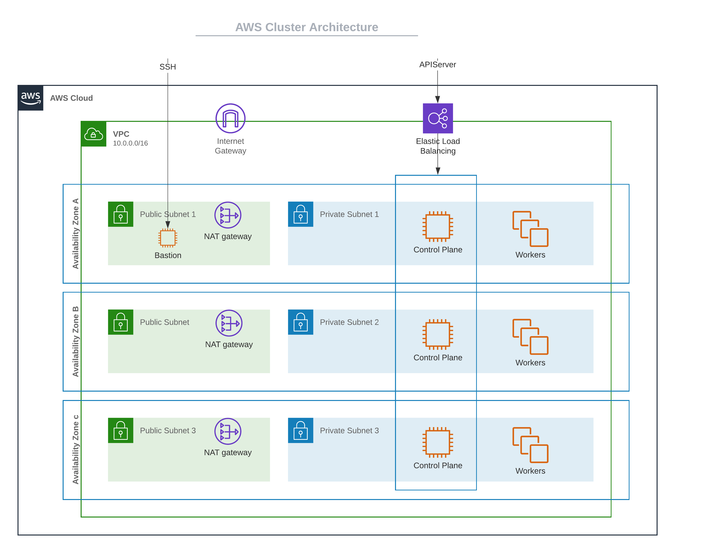

import WarningBox from '@librarium/shared/src/components/WarningBox';

# Overview

The following is the deployment architecture for an AWS cluster.

The Kubernetes nodes are distributed across multiple AZs to achieve high availability. For each of the AZ that you choose, a public subnet and a private subnet is created.

All the control plane nodes and worker nodes are created within the private subnets so there is no direct public access available.

A NAT gateway is created in the public subnet of each AZ, to allow nodes in the private subnet be able to go out to the internet or call other AWS services.

An Internet gateway is created for each VPC, to allow SSH access to the bastion node for debugging purposes. SSH into Kubernetes nodes is only available through the Bastion node.

The APIServer endpoint is accessible through an ELB, which load balancing across all the control plane nodes.



# Prerequisites

Spectro Cloud creates compute, network and storage resources on AWS during provisioning of Kubernetes clusters. The following pre-requisites should be met for successful creation of clusters.

## Resource Capacity

A sufficient capacity in the desired AWS region should exist for the creation of the following resources:

* vCpu
* VPC
* Elastic IP
* Internet Gateway
* Elastic Load Balancers
* NAT Gateway

## AWS Cloud Account Permissions

Spectro Cloud provisions cluster infrastructure and cluster resources using your *Cloud Accounts* stored in the system. For proper functioning, please ensure that the *Cloud Accounts* registered with Spectro Cloud as well as the IAM users or the ROOT users have the minimum set of permissions needed to create the infrastructure and resources.

Ensure that the IAM user or the ROOT user has the following minimum permissions:

<WarningBox>
The policy below cannot be used as an inline policy, as it exceeds the 2048 non-whitespaced character limit by AWS.
</WarningBox>

```
{
    "Version": "2012-10-17",
    "Statement": [
        {
            "Effect": "Allow",
            "Action": [
                "autoscaling:DescribeAutoScalingGroups",
                "autoscaling:DescribeLaunchConfigurations",
                "autoscaling:DescribeTags",
                "cloudformation:CreateStack",
                "cloudformation:DescribeStacks",
                "cloudformation:UpdateStack",
                "ec2:AllocateAddress",
                "ec2:AssociateRouteTable",
                "ec2:AttachInternetGateway",
                "ec2:AttachVolume",
                "ec2:AuthorizeSecurityGroupIngress",
                "ec2:CreateInternetGateway",
                "ec2:CreateNatGateway",
                "ec2:CreateRoute",
                "ec2:CreateRouteTable",
                "ec2:CreateSecurityGroup",
                "ec2:CreateSubnet",
                "ec2:CreateTags",
                "ec2:CreateVolume",
                "ec2:CreateVpc",
                "ec2:DeleteInternetGateway",
                "ec2:DeleteNatGateway",
                "ec2:DeleteRoute",
                "ec2:DeleteRouteTable",
                "ec2:DeleteSecurityGroup",
                "ec2:DeleteSubnet",
                "ec2:DeleteTags",
                "ec2:DeleteVolume",
                "ec2:DeleteVpc",
                "ec2:DescribeAccountAttributes",
                "ec2:DescribeAddresses",
                "ec2:DescribeAvailabilityZones",
                "ec2:DescribeImages",
                "ec2:DescribeInstances",
                "ec2:DescribeInternetGateways",
                "ec2:DescribeKeyPairs",
                "ec2:DescribeNatGateways",
                "ec2:DescribeNetworkInterfaceAttribute",
                "ec2:DescribeNetworkInterfaces",
                "ec2:DescribeRegions",
                "ec2:DescribeRouteTables",
                "ec2:DescribeSecurityGroups",
                "ec2:DescribeSubnets",
                "ec2:DescribeVolumes",
                "ec2:DescribeVpcAttribute",
                "ec2:DescribeVpcs",
                "ec2:DetachInternetGateway",
                "ec2:DetachVolume",
                "ec2:DisassociateAddress",
                "ec2:DisassociateRouteTable",
                "ec2:ModifyInstanceAttribute",
                "ec2:ModifyNetworkInterfaceAttribute",
                "ec2:ModifySubnetAttribute",
                "ec2:ModifyVolume",
                "ec2:ModifyVpcAttribute",
                "ec2:ReleaseAddress",
                "ec2:RevokeSecurityGroupIngress",
                "ec2:RunInstances",
                "ec2:TerminateInstances",
                "ecr:BatchCheckLayerAvailability",
                "ecr:BatchGetImage",
                "ecr:DescribeRepositories",
                "ecr:GetAuthorizationToken",
                "ecr:GetDownloadUrlForLayer",
                "ecr:GetRepositoryPolicy",
                "ecr:ListImages",
                "elasticloadbalancing:AddTags",
                "elasticloadbalancing:ApplySecurityGroupsToLoadBalancer",
                "elasticloadbalancing:AttachLoadBalancerToSubnets",
                "elasticloadbalancing:ConfigureHealthCheck",
                "elasticloadbalancing:CreateListener",
                "elasticloadbalancing:CreateLoadBalancer",
                "elasticloadbalancing:CreateLoadBalancerListeners",
                "elasticloadbalancing:CreateLoadBalancerPolicy",
                "elasticloadbalancing:CreateTargetGroup",
                "elasticloadbalancing:DeleteListener",
                "elasticloadbalancing:DeleteLoadBalancer",
                "elasticloadbalancing:DeleteLoadBalancerListeners",
                "elasticloadbalancing:DeleteTargetGroup",
                "elasticloadbalancing:DeregisterInstancesFromLoadBalancer",
                "elasticloadbalancing:DescribeListeners",
                "elasticloadbalancing:DescribeLoadBalancerAttributes",
                "elasticloadbalancing:DescribeLoadBalancerPolicies",
                "elasticloadbalancing:DescribeLoadBalancers",
                "elasticloadbalancing:DescribeTags",
                "elasticloadbalancing:DescribeTargetGroups",
                "elasticloadbalancing:DescribeTargetHealth",
                "elasticloadbalancing:DetachLoadBalancerFromSubnets",
                "elasticloadbalancing:ModifyListener",
                "elasticloadbalancing:ModifyLoadBalancerAttributes",
                "elasticloadbalancing:ModifyTargetGroup",
                "elasticloadbalancing:RegisterInstancesWithLoadBalancer",
                "elasticloadbalancing:RegisterTargets",
                "elasticloadbalancing:RemoveTags",
                "elasticloadbalancing:SetLoadBalancerPoliciesForBackendServer",
                "elasticloadbalancing:SetLoadBalancerPoliciesOfListener",
                "iam:AddRoleToInstanceProfile",
                "iam:AddUserToGroup",
                "iam:AttachGroupPolicy",
                "iam:AttachRolePolicy",
                "iam:CreateGroup",
                "iam:CreateInstanceProfile",
                "iam:CreatePolicy",
                "iam:CreateRole",
                "iam:CreateServiceLinkedRole",
                "iam:CreateUser",
                "iam:DeleteGroup",
                "iam:DeleteInstanceProfile",
                "iam:DeletePolicy",
                "iam:DeleteRole",
                "iam:DetachGroupPolicy",
                "iam:DetachRolePolicy",
                "iam:GetGroup",
                "iam:GetInstanceProfile",
                "iam:GetPolicy",
                "iam:GetRole",
                "iam:GetUser",
                "iam:PassRole",
                "iam:RemoveRoleFromInstanceProfile",
                "iam:RemoveUserFromGroup",
                "kms:DescribeKey",
                "pricing:GetProducts",
                "tag:GetResources"
            ],
            "Resource": [
                "*"
            ]
        },
        {
            "Effect": "Allow",
            "Action": [
                "secretsmanager:CreateSecret",
                "secretsmanager:DeleteSecret",
                "secretsmanager:TagResource"
            ],
            "Resource": [
                "arn:aws:secretsmanager:*:*:secret:aws.cluster.x-k8s.io/*"
            ]
        }
    ]
}
```

> **Support for “Access Key”-less provisioning using AWS [STS](https://docs.aws.amazon.com/STS/latest/APIReference/Welcome.html) is coming soon! Please do let us know if you have any unique security requirements with AWS credentials.**

<WarningBox>
The following warning on this policy is expected:
This policy defines some actions, resources, or conditions that do not provide permissions. To grant access, policies must have an action that has an applicable resource or condition.
</WarningBox>

# Create an AWS Cluster

The following steps need to be performed to provision a new AWS cluster:

* Provide basic cluster information like name, description and tags. Tags on a cluster are propagated to the VMs deployed on the cloud / data center environments.
* Select a cluster profile created for AWS cloud. The profile definition will be used as the cluster construction template.
* Review and override pack parameters as desired. By default, parameters for all packs are set with values defined in the cluster profile.
* Provide AWS Cloud account and placement information.
    * Cloud Account - Select the desired cloud account. AWS cloud accounts with AWS credentials need to be pre-configured in project settings.
    * Region - Choose the desired AWS region where you would like cluster be be provisioned.
    * SSH Key Pair Name - Choose the desired SSH Key pair. SSH key pairs need to be pre-configured on AWS for the desired regions. The selected key is inserted into the VMs provisioned.
    * Static Placement - By default Spectro Cloud uses dynamic placement wherein a new VPC with a public and private subnet is created to place cluster resources for every cluster. These resources are fully managed by Spectro Cloud and deleted when the corresponding cluster is deleted. Turn on the Static Placement option if its desired to place resources into preexisting VPCs and subnets.
* Configure master and worker node pools. A master and a worker node pool is configured by default.
    * Name - a descriptive name for the node pool.
    * Size - Number of VMs to be provisioned for the node pool. For master pool, this number can be 1, 3 or 5.
    * Allow worker capability (master pool) - Select this option for allowing workloads to be provisioned on master nodes.
    * Instance type - Select the AWS instance type to be used for all nodes in the node pool.
    * Availability Zones - Choose one or more availability zones. Spectro Cloud provides fault tolerance to guard against failures like hardware failures, network failures etc. by provisioning nodes across availability zones if multiple zones are selected.
* Review settings and deploy the cluster. Provisioning status with details of ongoing provisioning tasks is available to track progress.

<WarningBox>
New worker pools may be added if its desired to customize certain worker nodes to run specialized workloads. As an example, the default worker pool may be configured with the ‘m3.large’ instance types for general purpose workloads and another worker pool with instance type ‘g2.2xlarge’ can be configured to run GPU workloads.
</WarningBox>

# Scaling an AWS Cluster

Scaling a cluster up or down involves changing the size of node pools. The following steps need to be performed to scale up/down an AWS cluster.

* Access the ‘nodes’ view for the cluster
* For the desired node pool change the size directly from the nodes panel or by editing node pool settings.
* After the node pool configuration is updated, the scale up/down operation is initiated in a few minutes.
* Provisioning status is updated with ongoing progress of the scale operation.

<WarningBox>
Master node pool may be scaled from 1 to 3 or 3 to 5 nodes. Scale down operation is not supported for master nodes.
</WarningBox>

# Add an AWS worker pool

The following steps need to be performed to add a new worker node pool to a cluster:-

* Invoke the option to ‘Add Node Pool’ from the cluster’s node information page.

* Provide node pool settings as follows:
    * A descriptive name for the node pool.
    * Number of nodes in the node pool.
    * One or more availability zones.  Nodes are distributed across availability zones when multiple zones are selected.
    * Instance type to be used for all the nodes lunched in the node pool.
    * Save node pool settings. New worker pool settings are updated and cluster updates begin within a few minutes. Provisioning status is updated with ongoing progress of tasks related to addition of new nodes.

# Remove an AWS worker pool

The following steps need to be performed to remove a worker pool from the cluster:-

* Access the 'Nodes' view for the cluster.
* Delete the desired worker pool and confirm deletion.
* Upon confirmation, the worker node deletion begins in a few minutes.

# Reconfigure AWS nodes

The following steps need to be performed to reconfigure worker pool nodes:-

* Access the nodes view for the the cluster.
* Edit settings of the desired node pool.
* Change the instance type to the desired instance type.
* Save node pool settings. After node pool settings are updated node pool reconfiguration begins within a few minutes. The older nodes in the node pool are deleted one by one and replaced by new nodes launched with new instance type configured.
* Provisioning status is updated with ongoing progress of nodes being deleted and added.
