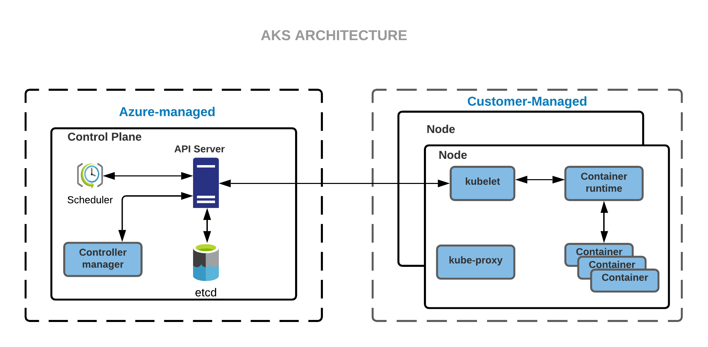

import Tabs from '@librarium/shared/src/components/ui/Tabs';
import WarningBox from '@librarium/shared/src/components/WarningBox';
import InfoBox from '@librarium/shared/src/components/InfoBox';
import PointsOfInterest from '@librarium/shared/src/components/common/PointOfInterest';

# AKS Cluster

Spectro Cloud enables the effortless deployment and management of containerized applications with fully-managed Azure Kubernetes Service (AKS). It provides the users with server-less Kubernetes, an integrated continuous integration and continuous delivery (CI/CD) experience, and enterprise-grade security and governance. Thus uniting the development and operations to a single platform achieving faster build, delivery, and scaling of applications with credences. The infrastructure has an event-driven autoscaling and triggers, that enable Elastic provisioning for this self-managed infrastructure. Extensive authentication and authorization capabilities using Azure Active Directory and dynamic rules enforcement across multiple clusters with Azure Policy.

## Prerequisites
Azure Active Directory integration for the AKS cluster provisioning may optionally require the following:
* User has to provide the Tenant Name as part of the cloud account.
* For the Azure client mentioned in the cloud account the following API permission has to be provided
   *  Microsoft Graph: Group.Read.All (Application Type)
   *  Microsoft Graph: Directory.Read.All (Application Type)
These permissions can be configured from the Azure cloud console under App registrations > API permissions for the specified App

## Creating an Azure cloud account
To create an Azure cloud account, we need:
* Client ID
* Tenant ID
* Client secret

For this, we first need to create an Azure Active Directory (AAD) Application which can be used with role-based access control. Follow the steps to get the required details:

* To create an AAD Application from the Azure portal, follow the [Create a new AAD Application](https://docs.microsoft.com/en-us/azure/active-directory/develop/howto-create-service-principal-portal#create-an-azure-active-directory-application) link. With this, the ClientID and TenantID are created and can be noted down.
* On creating the application, a minimum required [ContributorRole](https://docs.microsoft.com/en-us/azure/role-based-access-control/built-in-roles#contributor) needs to be assigned. To assign any kind of role, the user must have a minimum role of [UserAccessAdministrator](https://docs.microsoft.com/en-us/azure/role-based-access-control/built-in-roles#user-access-administrator). The role can be assigned by following the [Assign Role To Application](https://docs.microsoft.com/en-us/azure/active-directory/develop/howto-create-service-principal-portal#assign-a-role-to-the-application) link.
* To create the client secret, [Create an Application Secret](https://docs.microsoft.com/en-us/azure/active-directory/develop/howto-create-service-principal-portal#create-a-new-application-secret). Store the Client Secret safely as it will not be available in plaintext later.

## Creating an AKS Cluster
The following steps need to be performed to provision a new AKS cluster:
* Provide the basic cluster information like name, description, and tags.
* Select a cluster profile created for the AKS Cluster. The profile definition will be used as the cluster construction template.
* Review and override pack parameters as desired. By default, parameters for all packs are set with values defined in the cluster profile.
* Provide the Azure Cloud account and placement information.
    * Cloud Account - Select the desired cloud account. Azure cloud accounts with credentials need to be pre-configured in project settings.
    * Subscription - Select the subscription which is to be used to access Azure Services.
    * Region - Select a region in Azure in which the cluster should be deployed.
    * Resource Group - Select the resource group in which the cluster should be deployed.
    * SSH Key - Public key to configure remote SSH access to the nodes.
    * Placement - If the choice of placement is Static then select
        * Virtual Network
        * Control Plane Subnet
        * Worker Subnet
* Configure the worker node pools. A worker node pool is configured by default.
   * Name - A descriptive name for the node pool.
   * Size - Number of nodes to be provisioned for the node pool.
   * Instance Type - Select the Azure instance type to be used for all the nodes in the pool.
   * Managed Disk - Select the managed disk type to be used.
   * Disk Size - Storage disk size in GB to be attached to the node.
   * Optionally select the system node pool.
   * Availability Zones (if any) - Choose one or more availability zones. Spectro Cloud provides fault tolerance to guard against failures like hardware failures, network failures, etc. by provisioning nodes across availability zones if multiple zones are selected. Zones are supported only for worker pools.

<InfoBox>
Every AKS cluster must contain at least one system node pool with at least one node.

If you run a single system node pool for your AKS cluster in a production environment, it is recommended to use at least three nodes for the node pool.
</InfoBox>

<InfoBox>
A minimum allocation of '2' CPU cores is required across all worker nodes.

A minimum allocation of '4Gi' of memory is required across all worker nodes.
</InfoBox>

* Set schedules of OS Patching, Scans, or backup and recovery as per user choice.
* Review the settings and deploy the cluster. Provisioning status with details of ongoing provisioning tasks is available to track progress.

New worker pools may be added if it desired to customize certain worker nodes to run specialized workloads. As an example, the default worker pool may be configured with the ‘Standard_D2_v2’ instance types for general-purpose workloads and another worker pool with instance type ‘Standard_NC12s_v3’ can be configured to run GPU workloads.
