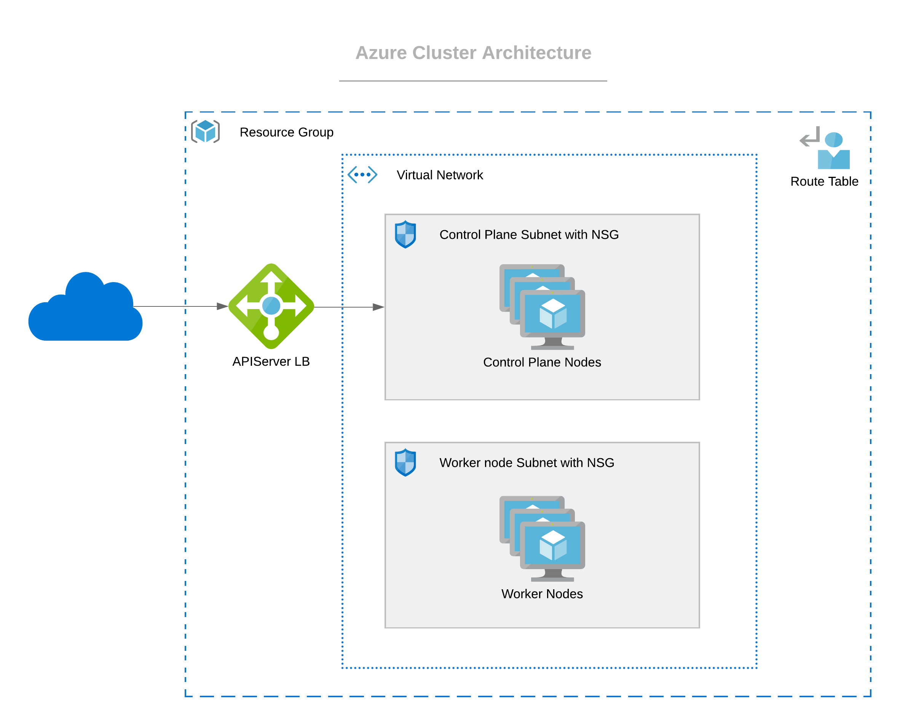

import Tabs from '@librarium/shared/src/components/ui/Tabs';
import WarningBox from '@librarium/shared/src/components/WarningBox';
import InfoBox from '@librarium/shared/src/components/InfoBox';
import PointsOfInterest from '@librarium/shared/src/components/common/PointOfInterest';

# Azure Cluster

Azure cluster resources are placed within an existing Resource Group, and nodes will be provisioned within a Virtual Network that is either auto-created or preexisting, with one subnet for control plane nodes and one for worker nodes. These two subnets are secured with separate Network Security Groups. Both subnets can span across multiple AZs.  Worker nodes will be distributed across multiple AZs.

None of the control plane nodes and worker nodes have public IPs attached. The APIServer endpoint is accessed through a public LB.

## Creating an Azure cloud account

To create an Azure cloud account, we need:

* Client ID
* Tenant ID
* Client secret

For this, we first need to create an Azure Active Directory (AAD) Application which can be used with role-based access control. Follow the steps to get the required details:

* To create an AAD Application from the Azure portal, follow the [Create a new AAD Application](https://docs.microsoft.com/en-us/azure/active-directory/develop/howto-create-service-principal-portal#create-an-azure-active-directory-application) link. With this, the ClientID and TenantID are created and can be noted down.
* On creating the application, a minimum required [ContributorRole](https://docs.microsoft.com/en-us/azure/role-based-access-control/built-in-roles#contributor) needs to be assigned. To assign any kind of role, the user must have a minimum role of [UserAccessAdministrator](https://docs.microsoft.com/en-us/azure/role-based-access-control/built-in-roles#user-access-administrator). The role can be assigned by following the [Assign Role To Application](https://docs.microsoft.com/en-us/azure/active-directory/develop/howto-create-service-principal-portal#assign-a-role-to-the-application) link.
* To create the client secret, [Create an Application Secret](https://docs.microsoft.com/en-us/azure/active-directory/develop/howto-create-service-principal-portal#create-a-new-application-secret). Store the Client Secret safely as it will not be available in plaintext later.

## Creating an Azure Cluster

The following steps need to be performed to provision a new Azure cluster:

* Provide the basic cluster information like name, description, and tags.
* Select a cluster profile created for the Azure environment. The profile definition will be used as the cluster construction template.
* Review and override pack parameters as desired. By default, parameters for all packs are set with values defined in the cluster profile.
* Provide the Azure Cloud account and placement information.
    - Cloud Account - Select the desired cloud account. Azure cloud accounts with credentials need to be pre-configured in project settings.
    - Subscription - Select the subscription which is to be used to access Azure Services.
    - Region - Select a region in Azure in which the cluster should be deployed.
    - Resource Group - Select the resource group in which the cluster should be deployed.
    - SSH Key - Public key to configure remote SSH access to the nodes.
* Configure the master and worker node pools. A master and a worker node pool are configured by default.
    - Name - A descriptive name for the node pool.
    - Size - Number of nodes to be provisioned for the node pool. For the master pool, this number can be 1, 3, or 5.
    - Allow worker capability (master pool) - To allow workloads to be provisioned on master nodes.
    - Instance Type - Select the Azure instance type to be used for all the nodes in the pool.
    - Managed Disk - Select the managed disk type to be used.
    - Disk Size - Storage disk size in GB to be attached to the node.
    - Availability Zones - Choose one or more availability zones. Spectro Cloud provides fault tolerance to guard against failures like hardware failures, network failures, etc. by provisioning nodes across availability zones if multiple zones are selected. Zones are supported only for worker pools.

* Review the settings and deploy the cluster. Provisioning status with details of ongoing provisioning tasks is available to track progress.

<InfoBox>
New worker pools may be added if its desired to customize certain worker nodes to run specialised workloads. As an example, the default worker pool may be configured with the ‘Standard_D2_v2’ instance types for general-purpose workloads and another worker pool with instance type ‘Standard_NC12s_v3’ can be configured to run GPU workloads.
</InfoBox>
