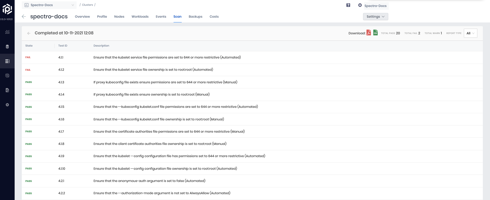
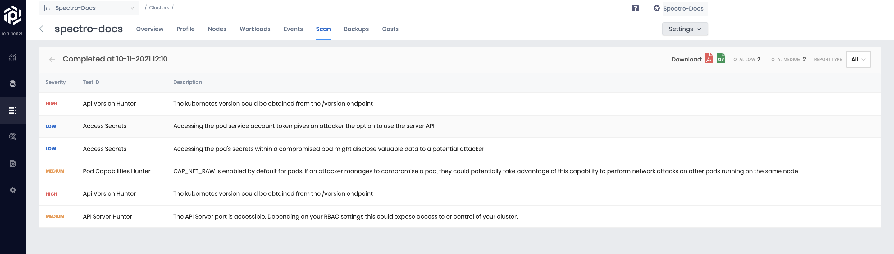
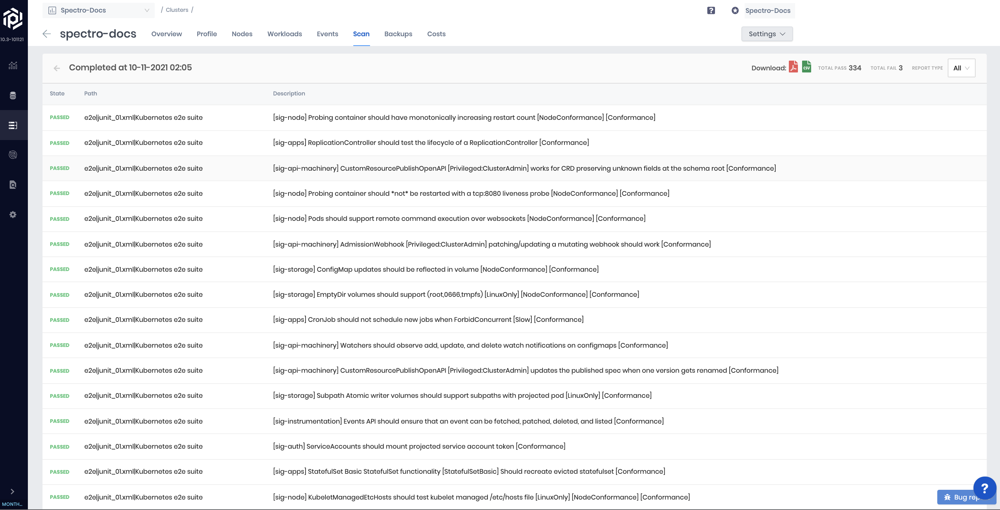

import Tabs from '@librarium/shared/src/components/ui/Tabs';
import WarningBox from '@librarium/shared/src/components/WarningBox';
import InfoBox from '@librarium/shared/src/components/InfoBox';
import PointsOfInterest from '@librarium/shared/src/components/common/PointOfInterest';

 # Overview

Palette provides a way to run compliance, security, and conformance scan on tenant clusters. These scans ensure cluster adherence to specific compliance and security standards. It also detects potential vulnerabilities by performing penetration tests. Palette supports three types of scans. Each scan generates reports with details specific to the type of scan. Multiple scans of each type can be run over time. In addition, SPalette keeps a history of previous scans for comparison purposes. The following types of scans are supported:

# Configuration Security

This scan examines the compliance of deployed Kubernetes security features against the CIS Kubernetes Benchmarks. CIS Kubernetes Benchmarks are consensus-driven security guidelines for the Kubernetes. Different releases of the CIS benchmark cover different releases of Kubernetes. By default, Kubernetes configuration security will determine the test set based on the Kubernetes version running on the cluster under scan. Internally, Palette leverages an open-source tool called Kube Bench from Aqua Security to perform this scan. Scans are run against master and worker nodes of the Kubernetes cluster, and a combined report is made available on the UI. Users can filter the report to view only the master or worker results if required. 

All the tests in the report are marked as Scored or Not Scored. The ones marked Not Scored cannot be automatically run, and it is suggested to be tested manually. 

# Penetration Testing

Kubernetes penetration testing scans Kubernetes-related open-ports for any configuration issues that can leave the tenant clusters exposed to attackers. It hunts for security issues in your Kubernetes clusters and increases awareness and visibility of the security controls in Kubernetes environments. The scan gives a full report on the cluster security concerns. Internally Palette leverages an open-source tool called Kube Hunter from Aqua Security to perform this scan. Scans are run in 2 modes, Internal and External. In the internal mode, tests are run against the internal endpoint of the API server, whereas, in external mode, the external public-facing endpoint is used for testing. A combined report of vulnerabilities found in both modes is shown on the SPalette UI. Users can filter the report to view just the internal or external report if required. 

# Conformance Testing

Kubernetes conformance testing is about validating your Kubernetes configuration to ensure that they are conformant to the CNCF specifications. Palette leverages an open-source tool called Sonobuoy to perform this scan.  Automatically select a subset of relevant tests for execution based on the type of cloud (public, private) and the type of deployment infrastructure (IaaS, managed cloud service). Each test can take up to 2 hours to complete. If a cluster has a single worker node, a few tests may fail due to resources. For accurate assessment of conformance for distribution of Kubernetes, set up a cluster with at least two worker nodes. These tests are not destructive. However, they do launch several workloads in test namespaces as part of the tests. As a result, the consumption of cluster resources during the test run duration increases and may impact other workloads running on the cluster. 

The scan summary of total passed and failed tests are displayed while the test is in progress. In addition, a complete overview of the tests that were run is displayed after the completion of the report. 

# Scan Options

Following options are available for running cluster scans:
   
## On Demand 

Cluster scan of any type can be started by navigating to the scans tab of a cluster on the UI. The scan shows up as 'initiated' and transitions to 'Completed' when the scan is complete.

|__On Demand Scan__|
|------------------|
|Select the cluster to scan -> Scan(top panel) -> Run Scan|

## Scheduled

A schedule can be set for each type of scan at the time of deploying the cluster initially. The schedule can also be (re)set at a later point.

|__During Cluster Deployment__|
|-----------------------------|
|Add New Cluster -> Cluster Policies -> Scan Policies -> Enable and schedule desired scans|

|__Running Cluster__|
|----------------------|
|Select the cluster to scan -> Settings -> Cluster Settings -> Scan Policies -> Enable and schedule scans of your choice|

### Schedule Options Available

* Custom your compliance scan for an exact month, day, hour, and minute of user choice
* Every week on Sunday at midnight
* Every two weeks at midnight
* Every month on the 1st at midnight
* Every two months on the 1st at midnight

<InfoBox>
    This operation can be performed on all cluster types across all clouds
</InfoBox>