import WarningBox from '@librarium/shared/src/components/WarningBox';

# Avi AKO

The Avi Kubernetes Operator (AKO) is an agent application that integrates cluster nodes with Avi Vantage, via Service Engine (SE) appliances. Avi provides load balancer ingress services to Kubernetes by handling associated routing for the Services layer. The following illustration outlines the components of the Avi Kubernetes integration.

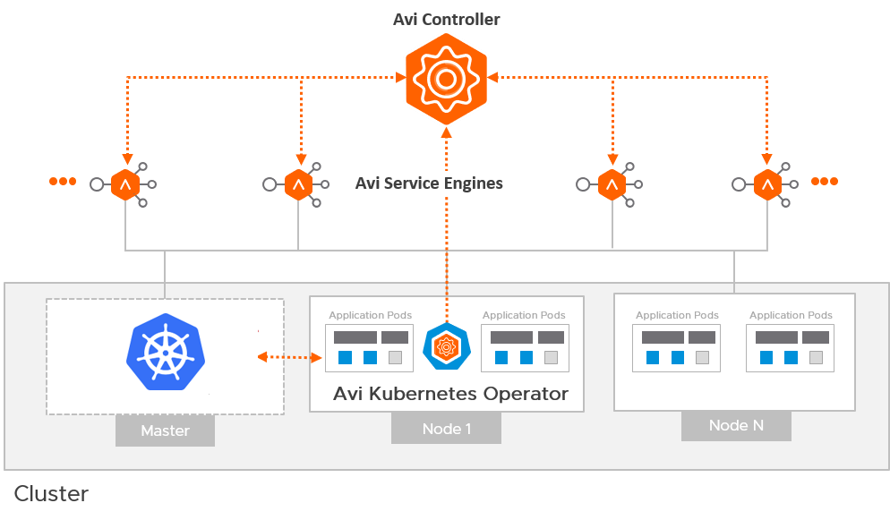

### Supported Versions:
* Kubernetes

   * v1.20.x
   * v1.21.x

* AKO

   * v1.4.3

## Components

The Avi Kubernetes Operator (AKO) is, at its core, a Kubernetes Deployment installed via Helm Chart.

* Avi Controller (Avi Vantage)
* Avi Service Engines
* Avi Kubernetes Operator 

### Avi Controller (Avi Vantage)

The Avi Controller provides the central control, management, and observability functions in the Avi architecture. It manages the lifecycle of the Service Engines, their configurations, and provides centralized analytics and observability.

### Avi Service Engines

The Avi Service Engines are the data-plane engines that implement the virtual services for Kubernetes ingresses. These SEs handle all the data plane responsibilities in the platform.

### Avi Kubernetes Operator (AKO)

AKO is an operator which works as an ingress controller and performs Avi-specific functions in an OpenShift/Kubernetes environment with the Avi Controller. It runs as a pod in the cluster and translates the required OpenShift/Kubernetes objects to Avi objects and automates the implementation of ingresses/routes/services on the Service Engines (SE) via the Avi Controller.


## Load Balancer Service Type

AKO creates a Layer 4 virtual service object in Avi corresponding to a service of type LoadBalancer in Kubernetes.  
   
AKO creates a dedicated virtual service for the Kubernetes service object and reserves a virtual IP for it. The layer 4 virtual service creates a pool based on the pod endpoints that subscribe to the Kubernetes service object. The Avi virtual service listens on the **port** value specified for the service and forwards traffic to the **targetPort** on the pod. 

An example of such a service object in Kubernetes is as follows:   

```bash
apiVersion: v1
kind: Service
metadata:
  name: avisvc-lb
  namespace: red
spec:
  type: LoadBalancer
  ports:
    - port: 80
      targetPort: 8080
      name: eighty
  selector:
    app: avi-server
```

Kubernetes service objects allow for LoadBalancer service types to be created with a specified IP using the **loadBalancerIP** value under the **spec** section.
Once the service is created, this value cannot be updated and the service needs to be recreated for the IP to be allocated. Avi/AKO will error if the IP is not available to be assigned.


## Ingress 

Ingress exposes HTTP and HTTPS routes from outside the cluster to services within the cluster. Traffic routing is controlled by rules defined on the Ingress resource.
Ingress may provide load balancing, SSL termination and name-based virtual hosting.

### Insecure Ingress

For insecure host/path combinations, AKO uses sharded virtual service logic. Based on the ingress namespace or the hostname value, a pool object is created on a shared virtual service in Avi. Shared virtual services typically apply across multiple ingresses. Example below:

```bash
apiVersion: networking.k8s.io/v1beta1
kind: Ingress
metadata:
  name: my-ingress
spec:
rules:
  - host: myinsecurehost.avi.internal
    http:
      paths:
      - path: /foo
        backend:
          serviceName: service1
          servicePort: 80
```

### Secure Ingress

Consider the following example of a secure Ingress object:

```bash
kind: Ingress
metadata:
  name: my-ingress
spec:
  tls:
  - hosts:
      - myhost.avi.internal
    secretName: testsecret-tls
  rules:
  - host: myhost.avi.internal
    http:
      paths:
      - path: /foo
        backend:
          serviceName: service1
          servicePort: 80
```

**SNI Virtual Service per Secure Hostname**  
AKO creates an SNI child virtual service to a parent shared virtual service for the secure hostname. The SNI virtual service is used to bind the hostname to an sslkeycert object. The sslkeycert object is used to terminate the secure traffic on Avi’s service engine. In the above example the secretName field denotes the secret asssociated with the hostname myhost.avi.internal. AKO parses the attached secret object and appropriately creates the sslkeycert object in Avi. The SNI virtual service does not get created if the secret object does not exist in Kubernetes corresponding to the reference specified in the Ingress object.  

**Traffic Routing Post SSL Termination**
On the SNI virtual service, AKO creates httppolicyset rules to route the terminated (insecure) traffic to the appropriate pool object using the host/path specified in the rules section of this Ingress object.  

**Redirect Secure Hosts from HTTP to HTTPS**
Additionally, for these hostnames, AKO creates a redirect policy on the shared virtual service (parent to the SNI child) for this specific secure hostname. This allows the client to automatically redirect the HTTP requests to HTTPS if they are accessed on the insecure port (80).


## vCenter LoadBalancer Lab Example

In this example demo we will deploy the Avi Vantage Controller in a lab environment and deploy AKO into its own routing dmain (VRF).

### Demo Lab Configuration
- Management network:  
  - vCenter Network **EPG12**, using subnet **10.22.12.0/24** and gateway **10.22.12.1**  
  - Pool **10.22.12.50 - 10.22.12.60**
  - IP **10.22.12.18** for Avi Vantage Controller virtual appliance
- Kubernetes cluster network:
  - vCenter Network **EPG13**, using subnet **10.22.13.0/24** and gateway **10.22.13.1**
  - Pool **10.22.13.61-10.22.13.70** for VIP services in Avi
  - Pool **10.22.13.50-10.22.13.60** for Kubernetes cluster
- DNS **10.22.0.25**
- Search domain: labs.local
- Avi Vantage Controller OVA **v20.1.5**

Throughout the example demo, substitute your own lab values for the above.

### Deploy Avi Vantage controller
The installation of the control plane on vCenter is simply deploying the OVA supplied by Avi. Supply the IP address, subnet mask and gateway as template customization parameters. Once the appliance has fully started, the login screen will appear on https://10.22.12.18. Upon login, supply the passphrase, DNS and domain values, leaving the rest as default.

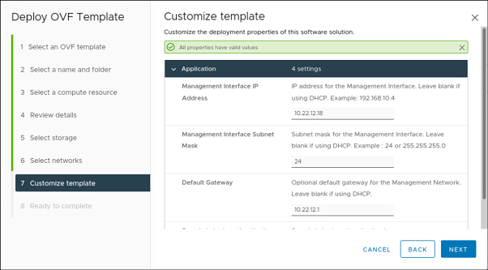

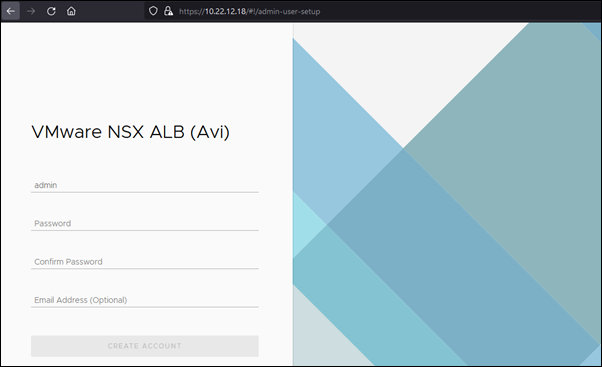

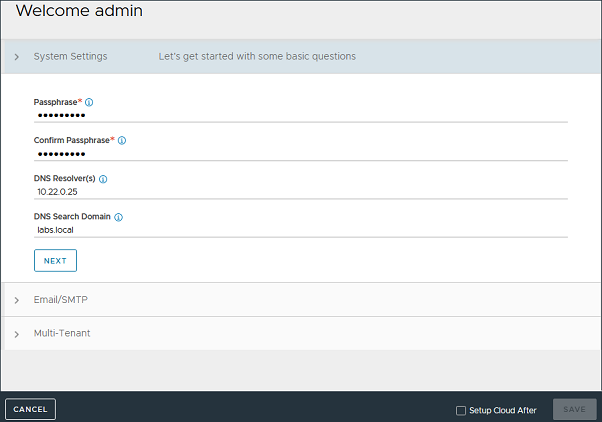

### Initial Cloud Setup
Navigate to **Infrastructure** > **Clouds** and edit **Default-Cloud** by clicking the pencil icon.

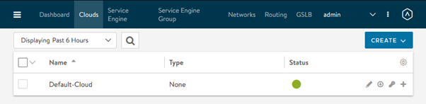

Under the **Select Cloud** tab, choose **vmware** and click **Next**.

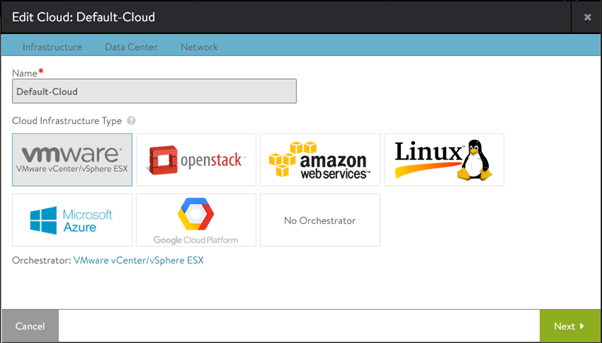

Under the **Infrastructure** tab, provide **user**, **password** and **IP address** for vCenter.

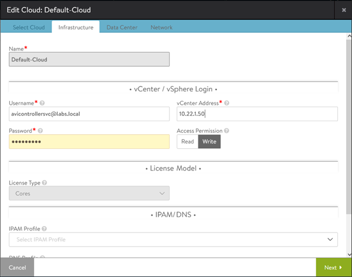

Next we will specify an IP Pool for the Management Network. This is used for services like IPAM and DNS.  
Under the **Network** tab, specify the **Management Network**, the **IP Subnet**, **Static Address Pool** and **Default Gateway**. Choose **Default-Group** for **Template Service Engine Group**, then **Save**.

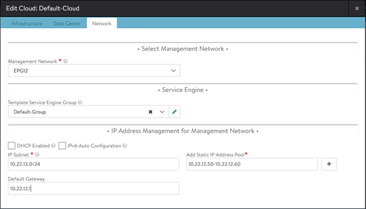

Clicking the **Default-Cloud** under **Infrastructure** > **Clouds** should show a green status as shown below:

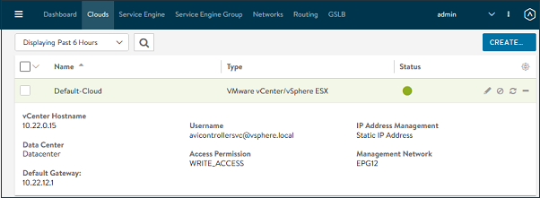

### Target Kubernetes Cluster Network

Here we will configure the network where AKO will be deployed onto existing clusters.  
First, we will isolate the data plane by creating a VRF Context under **Infrastructure** > **Routing** > **VRF Context**, **CREATE**. Supply **Name** and **Save**.

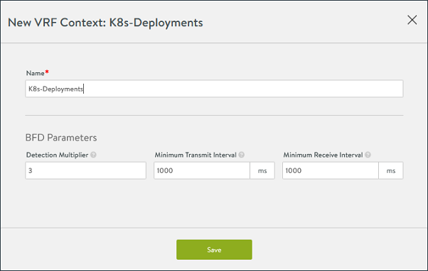

Under **Infrastructure** > **Networks**, edit (pencil icon) your chosen network and click **Add Subnet** (or you may edit the subnet if it was detected automatically).
Choose the VRF Context created in the previous step under **Routing Context**. 
Click **Add Static IP Address Pool** and tick **Use static IP Addresses for VIPs and SE**. Supply the pool range and click **Save**, then **Save**.

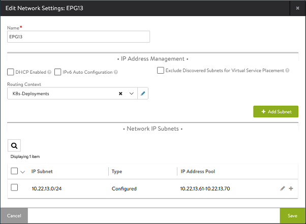

### IPAM and DNS Services

To setup DNS for AKO, navigate to **Templates** > **Profiles** > **IPAM/DNS Profiles** > **CREATE** > **DNS Profile**. Supply the **Name** of **DNS_Default**, populate **Domain Name** under **Add DNS Service Domain** and **Save**.

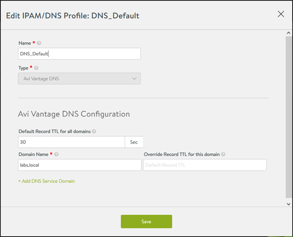

To setup IPAM for AKO, navigate to **Templates** > **Profiles** > **IPAM/DNS Profiles** > **CREATE** > **IPAM Profile**. Supply the **Name** of **IPAM_Default**, tick **Allocate IP in VRF** and select your Kubernetes cluster network under **Add Usable Network**. **Save**.

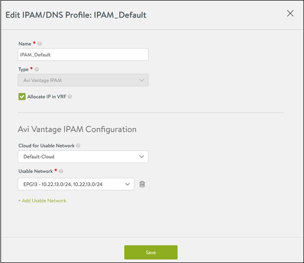

Associate your IPAM and DNS services to the **Default-Cloud** under **Infrastructure** > **Clouds** and edit (pencil icon) **Default Cloud**. Under the **Infrastructure** tab, set the values of **IPAM Profile** and **DNS Profile** at the bottom of the page as created in the previous step. **Save**.

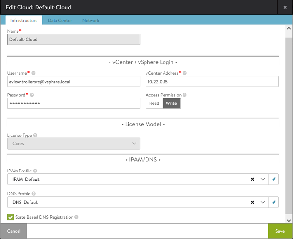

### Service Engine Groups

We will create 2 Service Engine Groups in this exercise. One will be used for DNS and the other for our Kubernetes cluster.  
Navigate to **Infrastructure** > **Service Engine Group**, click **CREATE**. Supply **DNS-SE-Group** under **Service Engine Groupe Name**, tick **Real-Time Metrics** with an **Update Frequency** of 0.  
Under the **Advanced** tab, set a **Service Engine Name Prefix** of **avi_dns**. Set **Buffer Service Engines** to 0. **Save**.

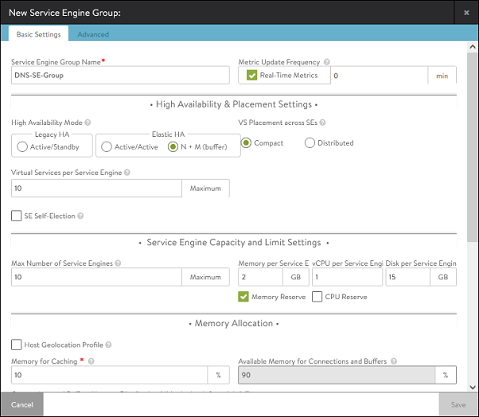

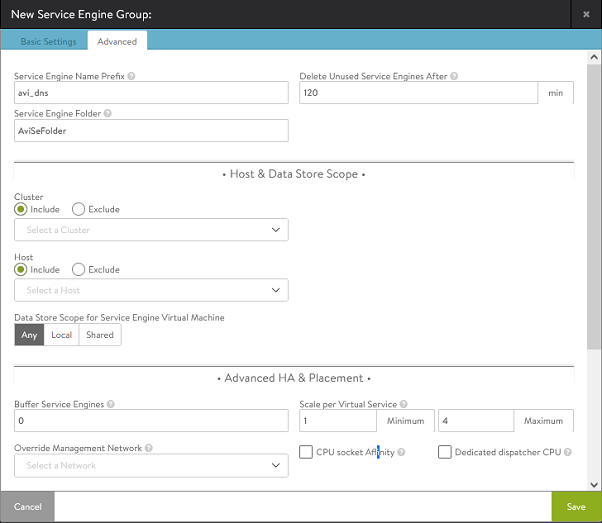

Navigate to **Infrastructure** > **Service Engine Group**, click **CREATE**. Supply **K8s-SE-Group** under **Service Engine Groupe Name**, tick **Real-Time Metrics** with an **Update Frequency** of 0.  
Under the **Advanced** tab, set a **Service Engine Name Prefix** of **avi_k8s**. Set **Buffer Service Engines** to 0. **Save**.

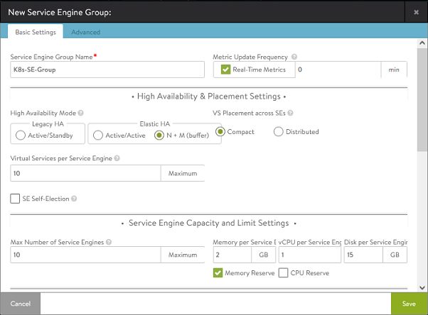

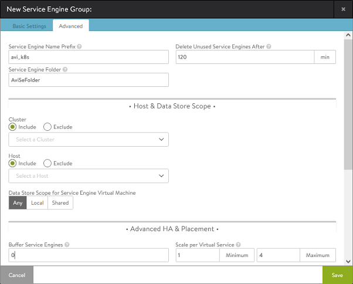

### Virtual Service for DNS

We will create the DNS service in the kubernetes VRF. Navigate to **Applications** > **Dashboard** > **CREATE VIRTUAL SERVICE** > **Advanced Setup**. Select **K8s-Deployments** on the first dialog and click **Next**. Supply **Avi-DNS-Service** as the **Name**.  
Select your Kubernetes target network and subnet under **Network for VIP Address Allocation**. Select **System-DNS** under **Application Profile**.  
Click **Next** up to **step 4: Advanced**, ignoring the "You may want to select a pool" message.  
Choose **DNS-SE-Group** under **SE Group**. **Next**, **Save**.

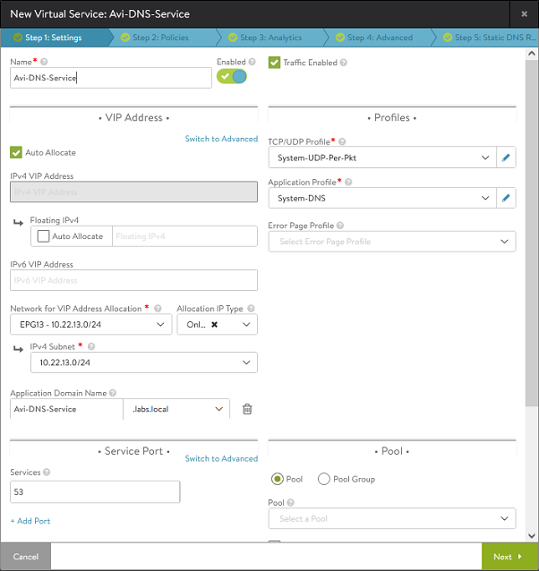

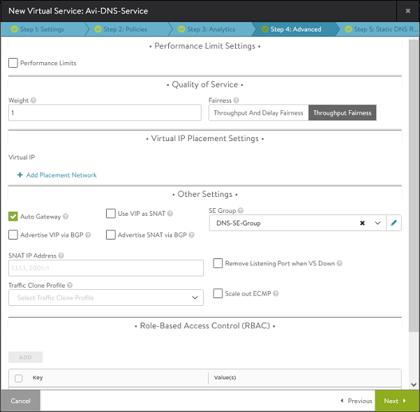

It will take several minutes for the Service engine to be deployed and to start up, after which you should see the following:  

Under **Infrastructure** > **Service Engine**:

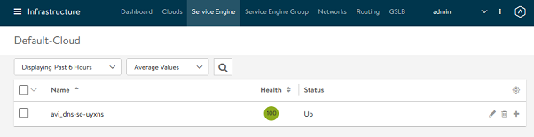

Under **Applications** > **Virtual Services**:

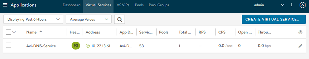


### Deploy basic Kubernetes cluster

for this exercise, we will deploy a basic infrastructure Cluster Profile to our target Kubernetes network (EPG13 in this demo). The number of nodes will be irrelevant so 1 matser and 1 worker will suffice.


### Create AKO Cluster Profile

Here we will create the **Add-on** cluster profile that will deploy Avi AKO to the existing cluster created above.

When creating the cluster profile, add the **AVI Kubernetes Operator** under the **Load Balancer** Pack Type. Edit the **Pack Values** by clicking the **</\>** symbol.  
There are a few critical fields that need to be supplied either here, or when deploying the Add-on to the cluster:
- **AKOSettings.clusterName** will uniquely identify object created under this cluster within Avi
- **NetworkSettings.subnetIP** for the target network we have deployed the above cluster to (10.22.13.0)
- **NetworkSettings.subnetPrefix** for the above network (24)
- **NetworkSettings.vipNetworkList** should contain the network above (- networkName: EPG13)
- **ControllerSettings.serviceEngineGroupName** (K8s-SE-Group)
- **ControllerSettings.controllerVersion** (20.1.5)
- **ControllerSettings.controllerHost** is your Avi Vantage Controller's IP Address 
- **avicredentials.username**
- **avicredentials.password**


### Deploy AKO to Cluster
To deploy AKO onto our cluster, we navigate to the **Profile** tab within the cluster and click the **+** symbol next to **ADDON LAYERS**. Ensure that the above values are all populated correctly before clicking **Save**.

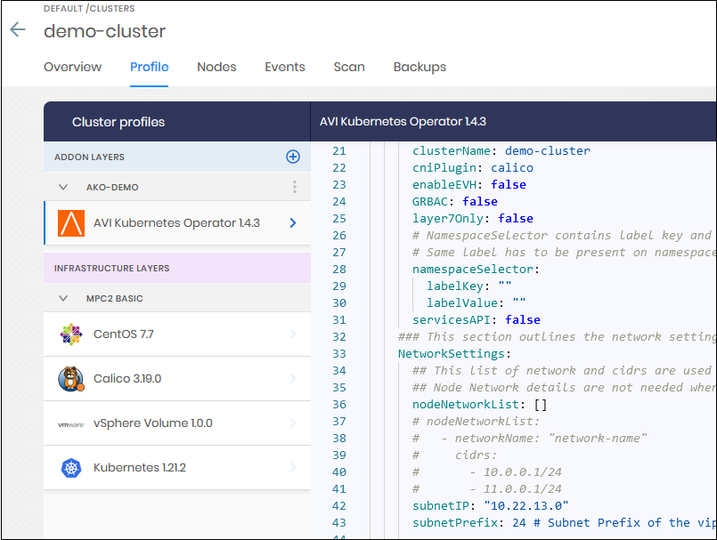

Once successfully deployed, the pod should be running normally. Use *kubectl logs ako-0* to troubleshoot.

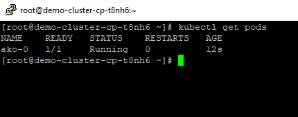

### Create Simple LoadBalancer Service

To just achieve simple load balancing to test VIP creation, we will deploy nginx and expose it on port 8000.  

- create deployments:
```bash
kubectl create deployment nginx --image=nginx --replicas=3
```

- create LoadBalancer Service:
```bash
kubectl expose deployment nginx --target-port=80 --port=8000 --type=LoadBalancer
```

Note the VIP address that was supplied from the target network pool defined earlier.


In the Avi Vantage Controller, navigate to **Applications** > **Virtual Services** to see the created Service.

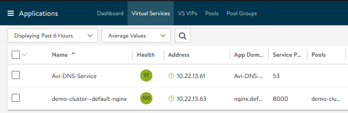

Finally, the Virtual Service can be browsed under the created VIP and service port 8000.

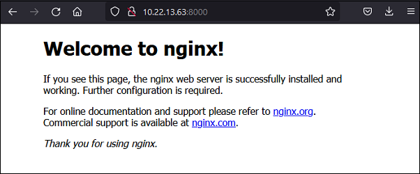  


&nbsp;  
&nbsp;  
## References

* Avi AKO - https://avinetworks.com/docs/ako/1.4/avi-kubernetes-operator/
* AKO Release Notes - https://avinetworks.com/docs/ako/1.4/ako-release-notes/
* Installation Guide - https://avinetworks.com/docs/ako/1.4/ako-installation/
* Desgin Guide - https://avinetworks.com/docs/ako/1.4/ako-design-and-deployment/
* Compatibility Guide - https://avinetworks.com/docs/ako/1.4/ako-compatibility-guide/
* Setting up Routing Rules using CRDs - https://avinetworks.com/docs/ako/1.4/custom-resource-definitions/
* AviInfraSetting CRD - https://avinetworks.com/docs/ako/1.4/custom-resource-definitions/#avi-infra-setting
* AKO in GCP - https://avinetworks.com/docs/ako/1.4/ako-in-gcp/
* AKO in Azure - https://avinetworks.com/docs/ako/1.4/ako-in-azure/
* Tenancy in AKO - https://avinetworks.com/docs/ako/1.4/ako-tenancy/
* Default Secret for TLS Routes - https://avinetworks.com/docs/ako/1.4/default-secret-for-tls-routes/
* Default Secret for TLS Ingresses - https://avinetworks.com/docs/ako/1.4/default-secret-for-tls-ingresses/
* Namespace Sync in AKO - https://avinetworks.com/docs/ako/1.4/namespace-sync-in-ako/
* AKO Deployment in GKE, AKS, and EKS - https://avinetworks.com/docs/ako/1.4/ako-in-gke-aks-eks/
* Networking/v1 Ingress Support - https://avinetworks.com/docs/ako/1.4/networking-v1-ingress/
* Enhanced Virtual Hosting in AKO - https://avinetworks.com/docs/ako/1.4/enhanced-virtual-hosting/
* Gateway and Gateway Class - https://avinetworks.com/docs/ako/1.4/gateway/
* Handling of Kubernetes/ OpenShift and Avi Objects - https://avinetworks.com/docs/ako/1.4/handling-objects/
* Frequently Asked Questions - https://avinetworks.com/docs/ako/1.4/ako-faq/
* Troubleshooting Guide - https://avinetworks.com/docs/ako/1.4/ako-troubleshooting/

