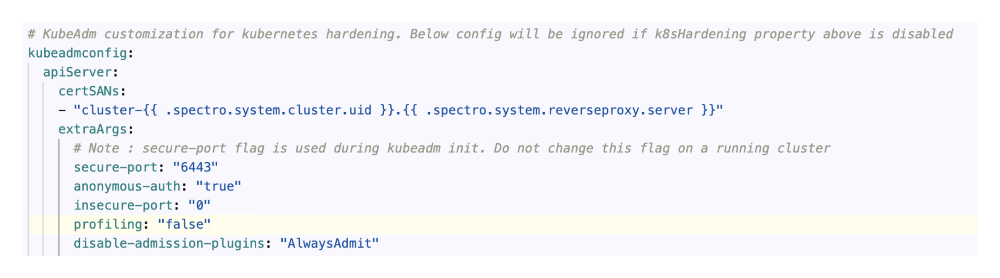

import Tabs from '@librarium/shared/src/components/ui/Tabs';
import WarningBox from '@librarium/shared/src/components/WarningBox';
import InfoBox from '@librarium/shared/src/components/InfoBox';
import PointsOfInterest from '@librarium/shared/src/components/common/PointOfInterest';
import Tooltip from "@librarium/shared/src/components/ui/Tooltip";

# Spectro Proxy
Spectro Proxy is a fast and straightforward reverse proxy that lets you forward a port of your local server behind a NAT or firewall to a public server. The proxy server pack is available as an add on pack for authentication. Users can attach this layer to the cluster profile while profile creation. This installs the FRP client in the workload clusters and configures it with a FRP server. Spectro Cloud provides hosts FRP server and by default the pack is configrued to connect to this server. Spectro Cloud detects the presence of this pack in the cluster and automatically updates the Kubeconfig file to use the FRP server as the endpoint. 

<InfoBox>
 
Port 443 needs to be Open for Outbound Communication. <br />
Do not change any values which are available by default, as it is required by our backend system to set the correct configurations.

</InfoBox>

## Versions Supported
<Tabs>

<Tabs.TabPane tab="1.0.x" key="1.0.x">

**1.0.x**

</Tabs.TabPane>
</Tabs>

**Important Note:**

If the user goes for clusters other than EKS, add the following extra cert SAN values to the Kubernetes pack under apiServer while creating the cluster. 

```json
 certSANs:
    - "cluster-{{ .spectro.system.cluster.uid }}.{{ .spectro.system.reverseproxy.server }}"
```
Example:



