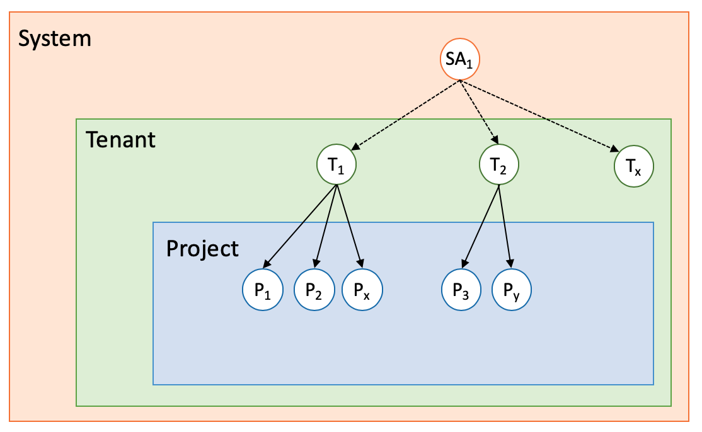
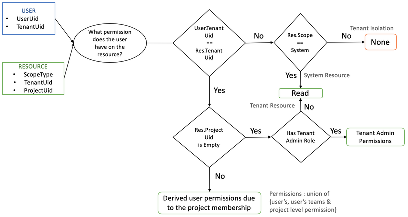
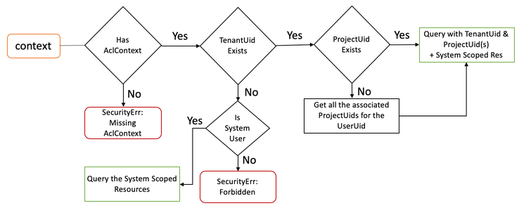

# RBAC

This page captures the Hubble (Spectro Cloud's Engine) RBAC's design on how to grant granular access to resources and its operations. This is achieved using Roles and Resources Access Control List. Role-based access control primarily focuses on assigning permission to roles instead of individual users and multiple roles can be assigned to a user which defines the permitted actions on the resource.

* **Permissions** determine what operations are allowed on a resource
* A **Role** is a collection of permissions
* A **Member** can be a user, team/user-group, or project

## Design

The design is based on the [GCP IAM](https://cloud.google.com/iam/docs/overview).

### Scopes

* Scopes control the visibility of the resource
  * There are 3 scopes: System, Tenant and Project
* Resources created in the higher scope will be visible in the lower scope as read-only
  * Profile created by a tenant will be available in all the tenant's created projects
* Resource Isolation: Resources within the same scope will be restricted to the respective scope entity
  * Profiles created in project-1 will not be available in project-2 of the same tenant
* Resources with the same name can co-exist across scopes and will be distinguished with a scope prefix (icon)
  * A profile with the same name can be created in the tenant scope as well as the project scope. This resource will have the scope information which helps to distinguish between the two.

### Permissions

* The granularity of Permissions will be mapped to API operations.
* Permissions can be defined in the format `component.operation` like `spectrocluster.create`, `spectrocluster.edit`, `spectrocluster.activate`, etc.
* Permissions will have a *scope* defined. Based on the scope type, the permissions will be limited during the role creation.
 * If a tenant creates a role, only then will the permissions with tenant and project scope be shown.
For a resource, the permissions spectrum fall into five categories - *Create, Read, Edit, Delete, Admin.* Any other permissions on thet resource will be under the *Edit* and the *Admin* spectrum.
 * For example, if user-A has the `bundle.publish` permission then user-A can publish the bundle. However, if user-A does not have `bundle.publish` but has the `bundle.edit` permission, then user-A can still publish the bundle.

### Roles

 * A *role* is a collection of permissions.
 * The role will have a *type* and a *scope*. The type signifies the creator's scope and the scope signifies the role visibility.
   * A SuperAdmin (the tenant admin) can create a role with the scope as *tenant* and this role type will be *system*. This role will be visible in the tenant namespace alone. Based on the role's scope, the permissions will be restricted to the permission's scope list.
   So the SuperAdmin can create a role like *ProfileEditor* of the scope *project* and the *type* will be *system*. The *ProfileEditor* will be visible under tenant and the project scopes cannot be modified by the tenant or the project admin.

### SuperAdmin, Tenant, Project and User

* Everyone is a user. A user with the *SuperAdmin* role will become a *SuperAdmin* as well as a tenant.

* A project acts as a namespace for the resource management.

### Access Control

* The *SuperAdmin*, *Tenant*, *Project* and *User* will have roles. Every operation requires a set of permissions to operate on. The access control will be derived from the resource and user context.

* The access control will be the union of the permissions from the roles and the inherited roles from a membership.
  * Consider a user-A belonging to a team *team-A* where *team-A* has the role permission `spectrocluster.creator`. Now even if the user-A has only the `spectrocluster.viewer` then user-A still gets the role permissions of `spectrocluster.creator` because of the team membership. The same applies to project memberships.

### ACL Meta & Operations

* For each resource, the Access Control List (ACL) is captured. The ACL meta contains the following information:
  * TenantUid: Under which tenant the resource is created
  * ProjectUid: Under which project the resource is created
  * OwnerUid: ID of the user that created the resource.
  * Type: The creator's scope, like *System*, *Tenant* or *Project*.

* Using the ACL Meta, the access control can be derived for a user's operation.

* Access control operations:
  * Viewing a resource will be based on membership.
    * If a user is a part of a project then the user can view the Systems, its tenants and the project's cluster profiles.
  * Resource creation and modification operations will be based on members and membership roles
    * If a user is a part of a project-1 with the membership role `ClusterProfileAdmin` and also a part of another project project-2 with the membership role `ClusterProfileViewer`, then the user can create and modify cluster profiles from project-1 but can only view the profiles in the project-2.
    * If the same user has a role `ClusterProfileAdmin` associated with them, then the user can create and modify the cluster profile in project-2.
  * Resource modification operations will be applicable within the same scope
    * A resource created at the tenant level cannot be modified at the project level.
  
  * Resource listings are based on the scope context. At the project scope level, the system and tenant scope resources are inherited with a read-only permmission.
  

### Resource Scope Matrix

|                  	| System 	                                      | Tenant 	                                      | Project 	                                    |
|------------------	|:---------------------------------------------:|:---------------------------------------------:|:---------------------------------------------:|
| Roles            	|       	|       	|        	|
| Cloud Accounts   	|        	                                      |       	|        	|
| Pack Registries  	|       	|       	|         	                                    |
| Git Registries   	|       	|       	|         	                                    |
| Users/Team       	|         	                                    |       	|         	                                    |
| SAML             	|         	                                    |       	|         	                                    |
| Tenant           	|       	|         	                                    |         	                                    |
| Projects         	|         	                                    |       	|         	                                    |
| Cluster Profiles 	|       	|       	|        	|
| SpectroCluster   	|         	                                    |         	                                    |        	|

## Scenarios

### Scenario - ClusterProfile Access Control

The SuperAdmin creates the cluster profile CP1 and the tenant T1 creates the cluster profile CP2 and the project admin creates profiles CP4 and CP5 in the respective projects under the tenant T1. The user U1 has the role of `ClusterProfileEditor` and the is a part of the team T1. This user is also associated with the project P1 as a `ClusterProfileAdmin`. The team T1 is associated with the project P2 as `ClusterProfileViewer`.

|   |   |   |
|---|---|---|
| Projects listed for User U1  | P1 and P2 | U1 is associated only with P1 and P2  |
|   |   |   |
| Cluster profiles that can be viewed by U1           | Under Project P1 - CP1, CP2, CP4   Under Project P2 - CP1, CP2, CP5   Under Project P3 - None    | CP1 and CP2 are inherited as read-only from the system and tenant scopes   Under P2, U1 gets access due to the team membership   U1 is not associated with P3 in any way   |
|   |   |   |
| Cluster profiles that can be edited by U1      | Under Project P1 - CP4   Under Project P2 - CP5   | CP1 and CP2 are not in the same scope and cannot be edited   CP5 can be edited because although the team T1 has only a viewer role, the user U1 has the editor role   |
|   |   |   |
| Cluster profiles that can be deleted by U1    | Under Project P1 - CP4    | Under P1, U1 has the cluster profile admin role    |
|   |   |   |
| Cluster profiles that are not visible to U1 | CP3 and CP6 | CP3 belongs to a different tenant and CP6 belongs to a project where U1 is not associated |

## Implementation

* Every request's JWT token contains the user context. The user context contains the user uid and the tenant uid.
* Every resource has the AclMeta information associated with it.
* The access control will be derived using the user context and the resource's AclMeta.
* TenantUid will be created when a SuperAdmin creates a tenant. Tenant us a user with the role TenantAdmin.
* The tenant can create users. Every user will be assigned a user uid and will be associated with the tenant uid.
* The tenant uid and user uid will be set in the JWT when the user is successfully authenticated.
