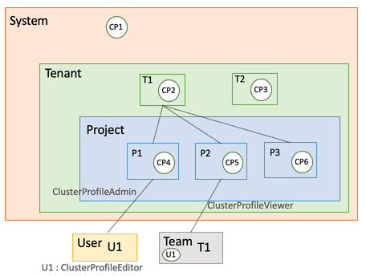

# RBAC

RBAC stands for Role-Based Access Control. This is a method that allows for the same user to have a different type of access control based on the resource being accessed. In other words, whereas a user logged in to a computer as an admin can access all parts and data of the system, a guest user cannot. RBAC is an expansion as well as a modification of this scenario. RBAC allows the admin to grant full and unrestricted access to some parts of the system and withhold it in some others. A few files can be made read-only for the guest. The alternative would be to make the guest either an admin or to make all types of access partially restricted. Both cases are undesirable and that is where RBAC is helpful.

Spectro Cloud's RBAC design allows granting granular access to resources and its operations. This is achieved using Roles and Permissions. Role-based access control primarily focuses on assigning permission to roles instead of individual users and multiple roles can be assigned to a user which defines the permitted actions on the resource.

These settings can be accessed by the tenant admin in the Spectro Cloud console: **Admin** -> **Roles**. This page lists all the roles available along with the scope and status.

## Scope

A scope defines the resources on which the role has a coverage. The scope will be either tenant or project. For example, a role with the scope "project" can operate on only the projects. A combination of the user and the roles given to a user indicates the totality of the accesses made available to this user. The [Scenarios](/user-management/rbac#scenarios) section of the page clarifies this with an example.

# Creating roles

Clicking on a role will show the permissions available under this role. Default roles (built-in into the Spectro Cloud system) cannot be edited or deleted. A new role can be created either under the tenant scope or the project scope but not both. Note that roles must have unique names. The names are case insensitive (JOHN_DOE is the same as john_doe.) After entering the role name, use the checkboxes to select the permissions. The checkbox list can be expanded to fine tune the required permissions.

* **Permissions** determine what operations are allowed on a resource.
* A **Role** is a collection of permissions.

## Permissions

Permissions can be defined in the format `component.operation` like `cluster.create`, `cluster.edit`, `cluster.activate`, etc.

## Roles

A *role* is a collection of permissions. The role will have a *type* and a *scope*. The type signifies the creator's scope and the scope signifies the role visibility. Based on the role's scope, the permissions will be restricted to the permission's scope list. The *ProfileEditor* will be visible under tenant and the project scopes cannot be modified by the tenant or the project admin.

## Scenarios

### Scenario - ClusterProfile Access Control

The SuperAdmin creates the cluster profile CP1 and the tenant T1 creates the cluster profile CP2 and the project admin creates profiles CP4 and CP5 in the respective projects under the tenant T1. The user U1 has the role of `ClusterProfileEditor` and the is a part of the team T1. This user is also associated with the project P1 as a `ClusterProfileAdmin`. The team T1 is associated with the project P2 as `ClusterProfileViewer`.

|   |   |   |
|---|---|---|
| Projects listed for User U1 | P1 and P2| U1 is associated only with P1 and P2 |
|   |   |   |
| Cluster profiles that can be viewed by U1           | Under Project P1 - CP1, CP2, CP4   Under Project P2 - CP1, CP2, CP5   Under Project P3 - None    | CP1 and CP2 are inherited as read-only from the system and tenant scopes   Under P2, U1 gets access due to the team membership   U1 is not associated with P3 in any way   |
|   |   |   |
| Cluster profiles that can be edited by U1      | Under Project P1 - CP4   Under Project P2 - CP5   | CP1 and CP2 are not in the same scope and cannot be edited   CP5 can be edited because although the team T1 has only a viewer role, the user U1 has the editor role   |
|   |   |   |
| Cluster profiles that can be deleted by U1    | Under Project P1 - CP4    | Under P1, U1 has the cluster profile admin role    |
|   |   |   |
| Cluster profiles that are not visible to U1 | CP3 and CP6 | CP3 belongs to a different tenant and CP6 belongs to a project where U1 is not associated |
