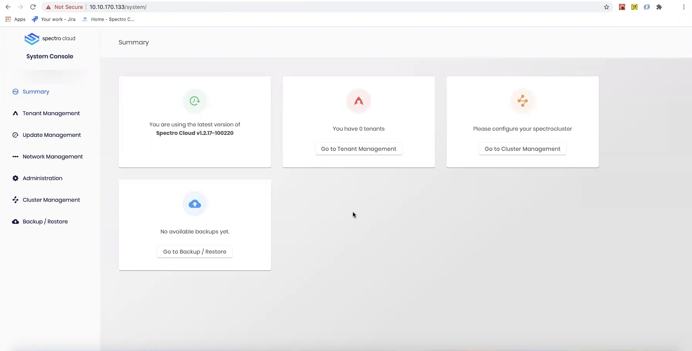

import InfoBox from '@librarium/shared/src/components/InfoBox';
import WarningBox from '@librarium/shared/src/components/WarningBox';
import PointsOfInterest from '@librarium/shared/src/components/common/PointOfInterest';
import Tooltip from "@librarium/shared/src/components/ui/Tooltip";

# Deploying an Enterprise cluster

Once a Quick Start variant is [deployed](/enterprise-version/deploying-the-platform-installer/#deployingthequickstartvariant), the super admin has access to the system console. This is brought up on port 3000 of the deployed VM.

The `Cluster Management` section allows the super admin to deploy and manage enterprise clusters.

# Enterprise Cluster Management

1. The first step is the cloud account configuration. Enter a descriptive name for the cluster being deployed. Provide the vCenter server, username, and password. Check the `Use self-signed certificates` if applicable. Click on `Next` to proceed to IP Pool Configuration.
2. Provide a name for the IP Pool. Choose if the IPs are to be allocated as a `Range` or using a `Subnet`. Spectro cloud supports DHCP as well as Static IP based <Tooltip trigger={<u>allocation strategies</u>}>Clusters created using a private cloud gateway can select from the <a href="/clusters/?clusterType=vmware_cluster#ipaddressmanagement">IP pools</a> linked to the corresponding private cloud gateway.</Tooltip> for the VMs that are launched during cluster creation. Provide the details of the `Gateway` and the `Nameserver addresses`. Any search suffixes being used can be entered in the `Nameserver search suffix` box.
3. Click on `Next` to proceed to Cloud Settings.
4. Select the datacenter and the same folder into which the OVA was imported and installed. Provide details of the Compute Cluster, Resource Pool, Datastore, and the Network. Add any SSH keys and/or NTP servers as applicable and click `Next` to deploy the cluster. ***(Need verification.)***
