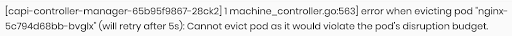
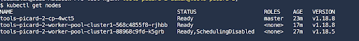
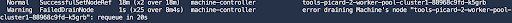
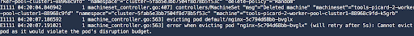

import Tabs from '@librarium/shared/src/components/ui/Tabs';
import WarningBox from '@librarium/shared/src/components/WarningBox';
import InfoBox from '@librarium/shared/src/components/InfoBox';
import PointsOfInterest from '@librarium/shared/src/components/common/PointOfInterest';
import Tooltip from "@librarium/shared/src/components/ui/Tooltip";

# Spectro Guides

Spectro Cloud provisions standard, upstream Kubernetes clusters using `kubeadm` and `cluster-api`. All of the upstream documentation relating to support and troubleshooting can be used as guides. The <Tooltip trigger={<u>guide</u>}>This <a href="https://kubernetes.io/docs/tasks/debug-application-cluster/debug-cluster">official guide</a> is about cluster troubleshooting; we assume you have already ruled out your application as the root cause of the problem you are experiencing.</Tooltip> on the official Kubernetes website provides a high-level overview of the components and log file locations.

<InfoBox>
Note that Ubuntu is <i>systemd</i> based.
</InfoBox>

## Short codes for quick reference

**SSH**: No hardcoded username/password, but using `cloud-init` injects the user-defined SSH key(s) into the clusters. Login using `ssh -i <key> spectro@<host>`
**Kubelet logs**: `journalctl -u kubelet`
**Container logs**: `kubectl logs` OR `/var/log/containers` and `/var/log/pods`

# Recreating a bug using PDB as an example

As a troubleshooting example, we’ll imitate a PodDistruptionBudget (PDB) preventing a cluster upgrade from proceeding. We will create a 2-node cluster of Kubernetes v1.18.5 along with an nginx pod. Attempting to upgrade these pods to 1.18.8 will result in the pod refusing to delete preventing the upgrade.

## Scenario Prerequisites

* [Provision](/clusters/#creatingclusters) a 2-node cluster (1 control-plane nodes/1 worker nodes) on version 1.18.5.
* Run a simple [nginx](/integrations/nginx/) pod.
* Add the following nginx PDB:
`kubectl create pdb nginx --selector app=nginx --min-available 1`

## Procedure

* In the Cluster Profile [upgrade](/cluster-profiles/task-update-profile) Kubernetes to 1.18.8.
* Trigger the upgrade for the cluster. This will result in a rolling upgrade of the Kubernetes cluster. It will begin with the control-plane nodes, where a new control-plane VM with Kubernetes version 1.18.8 will get provisioned, and once it joins the cluster, one of the older control-plane nodes will get decommissioned. A similar process will occur for the other control-plane and worker nodes.
* The rolling upgrade will continue until the node with the nginx pod is asked to drain. This error message should be shown in the UIs:



* At this point, the error messages in the UI are clear - the issue with the upgrade is related to PDB. The orchestration engine will indefinitely wait for the PDB to be removed or updated before powering off the node. It will then try continuing with the upgrade of the remaining nodes.

There are other ways of troubleshooting and identifying why the nodes are not deleting.

## Troubleshooting with Kubectl

With the `kubeconfig` exported, try the following commands:

* See current list of nodes: `kubectl get nodes -o wide`

*Notice one of the nodes is cordoned*

* Describe the machines: `kubectl describe machines -A`

Each node in Cluster-API is represented by a “machine” type. Notice how the cluster-api machine-controller is attempting to drain the Machine’s node, but is unable to.

* View the cluster-api logs: `kubectl logs -n cluster-5fab5e3bb7504f8d78b5f53c capi-controller-manager-65b95f9867-28ck2 manager`

The same error message which is captured and shown in the UI is displayed here as well.

* Delete the PDB: `kubectl delete pdb nginx`
* During the next cluster-api reconciliation (which will take about two minutes), the node will be successfully drained and the cluster will continue upgrading.

## SSH into the node

The user must have the SSH keys for the clusters. Use the SSH key and log in to any node control-plane and the worker via:

```bash
$ ssh -i <key> spectro@<node-ip>
$ sudo -i (to login as root)
```
<InfoBox>
The SSH user will always be <i>spectro</i>, independent of whether the distribution is Ubuntu, CentOS, etc.
</InfoBox>

Inside the node, review the standard system services and log files:

* Containerd:

```bash
# systemctl status containerd
# journalctl -u containerd
```

* Kubelet:

```bash
# systemctl status containerd
# journalctl -u kubelet
```

* Container logs:

`/var/log/containers`

On the control-plane nodes, review the Kubernetes configuration:

`/etc/kubernetes/admin.conf` : the cluster-admin root kubeconfig.
`/etc/kubernetes/pki` : Stores all the public-key-infrastructure for master components and etcd.
`/etc/kubernetes/manifests` : On the control-plane nodes, all the master components run as static pods.
