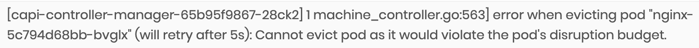
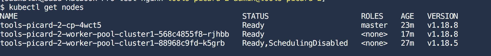
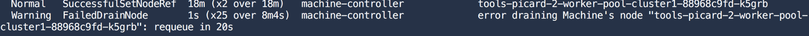

import Tabs from '@librarium/shared/src/components/ui/Tabs';
import WarningBox from '@librarium/shared/src/components/WarningBox';
import InfoBox from '@librarium/shared/src/components/InfoBox';
import PointsOfInterest from '@librarium/shared/src/components/common/PointOfInterest';
import Tooltip from "@librarium/shared/src/components/ui/Tooltip";

# Troubleshooting

Typically when a cluster life cycle action such as provisioning, upgrade, or deletion runs into a failure, it does not result in an outright error on the cluster. The Spectro Cloud orchestration engine follows the reconciliation pattern wherein the system repeatedly tries to perform various orchestration tasks to bring the cluster to its desired state until it succeeds. Initial cluster provisioning or subsequent updates can run into a variety of issues related to cloud infrastructure availability, lack of resources, networking issues, etc.

## Cluster conditions

Spectro Cloud maintains specific milestones in a life cycle and presents them as “conditions”. Examples include: Creating Infrastructure, Adding Control Plane Node, Customizing Image, etc. The active condition indicates what task Spectro Cloud’s orchestration system is trying to perform. If a task results in failures, the condition is marked as failed, with relevant error messages. Reconciliation however continues behind the scenes and continuous attempts are made to perform the task. Failed conditions are a great source of troubleshooting provisioning issues.

For example, failure to create a virtual machine in AWS due to the vCPU limit being exceeded would cause this error is shown to the end-users. They could choose to bring down some workloads in the AWS cloud to free up space. The next time a VM creation task is attempted, it would succeed and the condition would be marked as a success.

## Download Cluster Logs
At times it might be required to work with the Spectro Cloud support team to troubleshoot an issue. Spectro Cloud provides the ability to aggregate logs from the clusters it manages. Problems that occur during the orchestration life cycle may require access to the various containers, nodes, and Kube system logs. Spectro Cloud automates this log collection process and provides an easy download option from the Spectro Cloud UI console. Hence reduces the burden on the operator to login into various cluster nodes individually and fetch these logs.

Follow the link for more details: [Download Cluster Logs](/clusters/#downloadclusterlogs)

## Event Stream

Spectro Cloud maintains an event stream with low-level details of the various orchestration tasks being performed. This event stream is a good source for identifying issues in the event an operation does not complete for a long time.

<InfoBox>

  Due to Spectro Cloud’s reconciliation logic, intermittent errors show up in the event stream. As an example, after launching a node, errors might show up in the event stream regarding being unable to reach the node. However, the errors clear up once the node comes up.<p></p>
  Error messages that persist over a long time or errors indicating issues with underlying infrastructure are an indication of a real problem.

</InfoBox>


# Spectro Guides

Spectro Cloud provisions standard, upstream Kubernetes clusters using `kubeadm` and `cluster-api`. All of the upstream documentation relating to support and troubleshooting can be used as guides. The <Tooltip trigger={<u>guide</u>}>This <a href="https://kubernetes.io/docs/tasks/debug-application-cluster/debug-cluster">official guide</a> is about cluster troubleshooting; we assume you have already ruled out your application as the root cause of the problem you are experiencing.</Tooltip> on the official Kubernetes website provides a high-level overview of the components and log file locations.

<InfoBox>

Note that Ubuntu is `systemd` based.

</InfoBox>

## Short-codes for quick reference

**SSH**: No hardcoded username/password, but using `cloud-init` injects the user-defined SSH key(s) into the clusters. Login using `ssh -i <key> spectro@<host>`.  
**Kubelet logs**: `journalctl -u kubelet`.  
**Container logs**: `kubectl logs` OR `/var/log/containers` and `/var/log/pods`.  

# Recreating a bug using PDB as an example

As a troubleshooting example, we’ll imitate a PodDistruptionBudget (PDB) preventing a cluster upgrade from proceeding. We will create a 2-node cluster of Kubernetes v1.18.5 along with an nginx pod. Attempting to upgrade these pods to 1.18.8 will result in the pod refusing to delete preventing the upgrade.

## Scenario Prerequisites

* [Provision](/clusters/#creatingclusters) a 2-node cluster (1 control-plane nodes/1 worker nodes) on version 1.18.5.
* Run a simple [nginx](/integrations/nginx/) pod.
* Add the following nginx PDB:
`kubectl create pdb nginx --selector app=nginx --min-available 1`

## Procedure

* In the Cluster Profile [upgrade](/cluster-profiles/task-update-profile) Kubernetes to 1.18.8.
* Trigger the upgrade for the cluster. This will result in a rolling upgrade of the Kubernetes cluster. It will begin with the control-plane nodes, where a new control-plane VM with Kubernetes version 1.18.8 will get provisioned, and once it joins the cluster, one of the older control-plane nodes will get decommissioned. A similar process will occur for the other control-plane and worker nodes.
* The rolling upgrade will continue until the node with the nginx pod is asked to drain. This error message should be shown in the UIs:



* At this point, the error messages in the UI are clear - the issue with the upgrade is related to PDB. The orchestration engine will indefinitely wait for the PDB to be removed or updated before powering off the node. It will then try continuing with the upgrade of the remaining nodes.

There are other ways of troubleshooting and identifying why the nodes are not deleting.

## Troubleshooting with Kubectl

With the `kubeconfig` exported, try the following commands:

* See current list of nodes: `kubectl get nodes -o wide`

*Notice one of the nodes is cordoned*

* Describe the machines: `kubectl describe machines -A`

Each node in Cluster-API is represented by a “machine” type. Notice how the cluster-api machine-controller is attempting to drain the Machine’s node, but is unable to.

* View the cluster-api logs: `kubectl logs -n cluster-5fab5e3bb7504f8d78b5f53c capi-controller-manager-65b95f9867-28ck2 manager`

The same error message which is captured and shown in the UI is displayed here as well.

* Delete the PDB: `kubectl delete pdb nginx`
* During the next cluster-api reconciliation (which will take about two minutes), the node will be successfully drained and the cluster will continue upgrading.

## SSH into the node

The user must have the SSH keys for the clusters. Use the SSH key and log in to any node control-plane and the worker via:

```bash
$ ssh -i <key> spectro@<node-ip>
$ sudo -i (to login as root)
```

<InfoBox>

The SSH user will always be `spectro`, independent of whether the distribution is Ubuntu, CentOS, etc.

</InfoBox>

Inside the node, review the standard system services and log files:

* Containerd:

```bash
# systemctl status containerd
# journalctl -u containerd
```

* Kubelet:

```bash
# systemctl status containerd
# journalctl -u kubelet
```

* Container logs:

`/var/log/containers`

On the control-plane nodes, review the Kubernetes configuration:

`/etc/kubernetes/admin.conf` : the cluster-admin root kubeconfig.  
`/etc/kubernetes/pki` : Stores all the public-key-infrastructure for master components and etcd.  
`/etc/kubernetes/manifests` : On the control-plane nodes, all the master components run as static pods.  

# Troubleshooting VMware Cluster Deployment Failures

## Gateway installer - Unable to register with the tenant portal

The installer VM, when powered on, goes through a bootstrap process and registers itself with the tenant portal. This process typically takes 5 to 10 minutes. Failure of the installer to  register with the tenant portal within this duration might be indicative of a bootstrapping error. SSH into the installer virtual machine using the key provided during OVA import and inspect the log file located at *'/var/log/cloud-init-output.log'*. This log file will contain error messages in the event there are failures with connecting to the Spectro Cloud management platform portal, authenticating, or downloading installation artifacts. A common cause for these errors is that the Spectro Cloud management platform console endpoint or the pairing code is typed incorrectly. Ensure that the tenant portal console endpoint does not have a trailing slash. If these properties were incorrectly specified, power down and delete the installer VM and re-launch with the correct values.

Another potential issue is a lack of outgoing connectivity from the VM. The installer VM needs to have outbound connectivity directly or via a proxy. Adjust proxy settings (if applicable) to fix the connectivity or power down and delete the installer VM and relaunch in a network that enables outgoing connections.

If the above steps do not resolve your issues, copy the following script to the installer VM and execute to generate a logs archive. Open a support ticket and attach the logs archive to the ticket to allow the Spectro Cloud Support team to troubleshoot and provide further guidance:

```bash
#!/bin/bash

DESTDIR="/tmp/"

CONTAINER_LOGS_DIR="/var/log/containers/"
CLOUD_INIT_OUTPUT_LOG="/var/log/cloud-init-output.log"
CLOUD_INIT_LOG="/var/log/cloud-init.log"
KERN_LOG="/var/log/kern.log"
KUBELET_LOG="/tmp/kubelet.log"
SYSLOGS="/var/log/syslog*"

FILENAME=spectro-logs-$(date +%-Y%-m%-d)-$(date +%-HH%-MM%-SS).tgz


journalctl -u kubelet > $KUBELET_LOG

tar --create --gzip -h --file=$DESTDIR$FILENAME $CONTAINER_LOGS_DIR $CLOUD_INIT_LOG $CLOUD_INIT_OUTPUT_LOG $KERN_LOG $KUBELET_LOG $SYSLOGS

retVal=$?
if [ $retVal -eq 1 ]; then
    echo "Error creating spectro logs package"
else
	echo "Successfully extracted spectro cloud logs: $DESTDIR$FILENAME"
fi
```

### Gateway Cluster - Provisioning stalled/failure

Installation of the gateway cluster may run into errors or might get stuck in the provisioning state for a variety of reasons like lack of infrastructure resources, IP addresses not being available, unable to perform NTP sync, etc. While these are most common, some of the other issues might be related to the underlying VMware environment. The Cluster Details page, which can be accessed by clicking anywhere on the gateway widget, contains details of every orchestration step including an indication of the current task being executed. Any intermittent errors will be displayed on this page next to the relevant orchestration task. The events tab on this page also provides a useful resource to look at lower-level operations being performed for the various orchestration steps. If you think that the orchestration is stuck or failed due to an invalid selection of infrastructure resources or an intermittent problem with the infrastructure, you may reset the gateway by clicking on the 'Reset' button on the gateway widget. This will reset the gateway state to 'Pending' allowing you to reconfigure the gateway and start provisioning of a new gateway cluster. If the problem persists, please contact Spectro support via the Service Desk.

# Troubleshooting Pack Integrations

* [Nginx](/integrations/nginx/#troubleshooting)
* ExternalDNS
    * Make sure Ingress resource gets created for the Applications deployed and a LoadBalancer hostname / IP address is set on the Ingress resource.
    * Check the `external-dns` pod for any issues with ExternalDNS not inserting records. If required, change `logLevel` to debug to see additional info on the logs.
* [Calico](/integrations/calico/#troubleshooting)
* [Kubernetes Dashboard](/integrations/kubernetes-dashboard/#troubleshooting)
* [CSI](/integrations/csi/#troubleshooting)

# Troubleshooting vSphere cluster with ARP Table
We have observed that certain vSphere clusters run into issues where non-VIP nodes could not contact VIP node because their ARP entries became stale.

To minimize this situation, vSphere clusters deployed from Palette now comes with a daemonset that cleans the ARP entry cache every 5 minutes. This will force the nodes to re-request ARP entry of VIP node periodically. This is done automatically without any user action.

Users can verify by running the following command on non-VIP nodes and observe that ARP cache is never older than 300 seconds:

```
watch ip -statistics neighbour
```

# Understanding why nodes are repaved

Palette will perform a rolling upgrade on the nodes for any changes in KubeadmConfig. Below are some of the actions that will cause KubeadmConfig change and will result in nodes getting upgraded:
* OS layer changes
* Kubernetes layer changes
* Kubernetes version upgrade
* Kubernetes control plane upsize
* Machine pool updates for disk size
* Changes in availability zones
* Changes in instance types
* Certificate renewal and many more...

for detailed information [Click](/clusters/#clusterupgradedetails)

For both cases logs are provided in Palette for traceability. However these logs may be lost when the pods get relaunched. To ensure that these reasons are persisted across repaving, a new field `upgrades` has been added to the status section of [SpectroCluster object](https://docs.spectrocloud.com/api/v1/clusters/). This new field is represented in the Palette UI so that users can understand why and when repaving happened.
