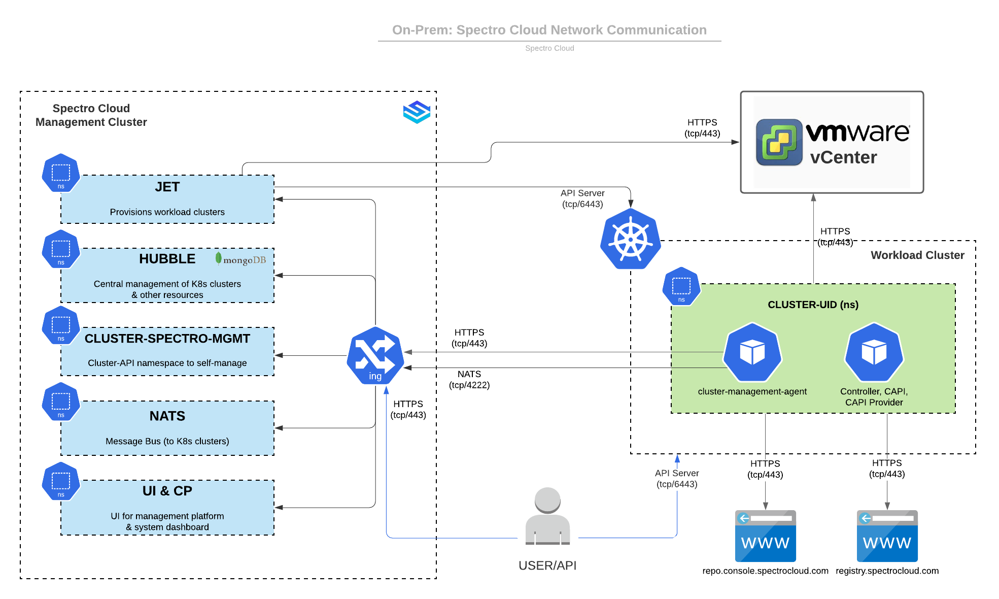

 
import Tabs from '@librarium/shared/src/components/ui/Tabs';
import WarningBox from '@librarium/shared/src/components/WarningBox';
import InfoBox from '@librarium/shared/src/components/InfoBox';
import PointsOfInterest from '@librarium/shared/src/components/common/PointOfInterest';

# Network Communications and Ports

## Management Platform

|Port            |Direction|Purpose                   |    
|:---------------|:---------|:-----------------------|
|HTTPS (tcp/443) |IN        |Browser/API access to Management Platform|
|SSH (tcp/22)    |IN        |Troubleshooting via SSH (optional) |
|NATS (tcp/4222) |IN        |Message Bus for workload clusters|
|HTTPS (tcp/443) |OUT       |VSphere vCenter API,  Registry (packs, integrations), Pack containers, app updates.|
|HTTPS (tcp/6443)|OUT       |Workload K8s cluster API Server|

## Workload Cluster

|Port |Direction | Purpose|
|:---------------|:---------|:--------------|
|HTTPS (tcp/6443)|IN        |Kubernetes API Server|
|SSH (tcp/22)    |IN        |Troubleshooting via SSH (optional) |
|NATS (tcp/4222) |OUT       |Agent communication via Message Bus |
|HTTPS (tcp/443) |OUT       |VSphere vCenter API, Registry (packs, integrations), Pack containers, Application updates.
