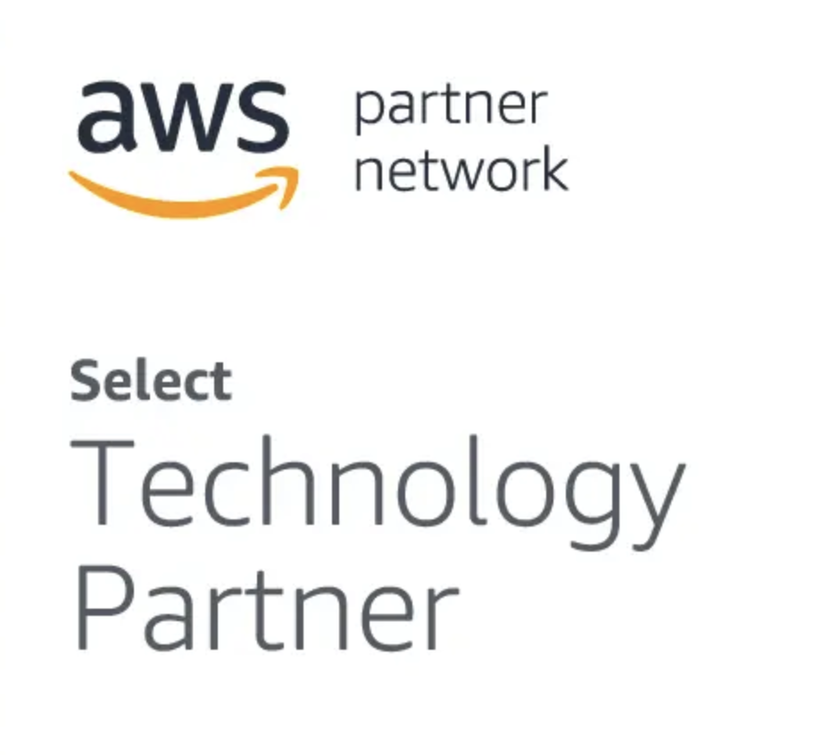
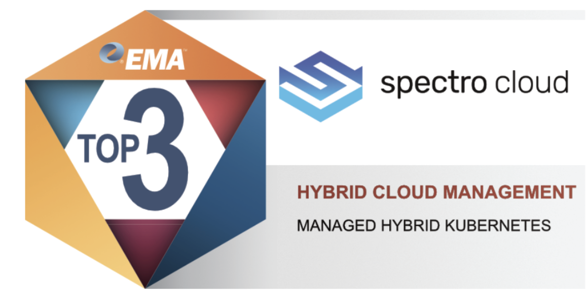
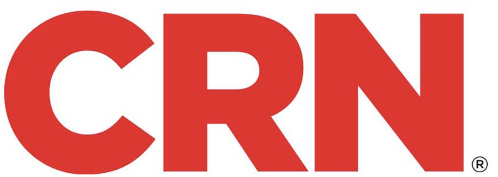
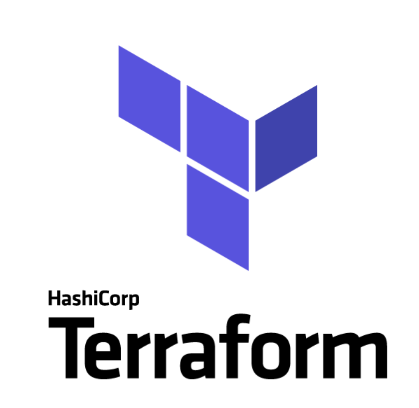
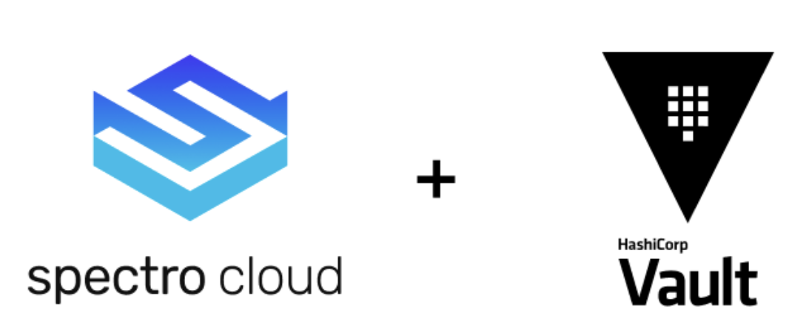

import Tabs from '@librarium/shared/src/components/ui/Tabs';
import WarningBox from '@librarium/shared/src/components/WarningBox';
import InfoBox from '@librarium/shared/src/components/InfoBox';
import PointsOfInterest from '@librarium/shared/src/components/common/PointOfInterest';
import Tooltip from "@librarium/shared/src/components/ui/Tooltip";

# COMPLIANCE

Spectro Cloud is certified against compliance standards of SOC2. 
* Spectro Cloud SOC 2 audit report assures our organization’s   
   * Security
   * Availability
   * Processing integrity
   * Confidentiality
   * Privacy 

compliance with the AICPA’s (American Institute of Certified Public Accountants) TSC (Trust Services Criteria). 
* SOC 2 audits are an important component in regulatory oversight, vendor management programs, internal governance, and risk management.
* These reports help the users and their auditors to understand the Spectro Cloud controls established to support operations and compliance. 
* The annual certification of SOC2 is 3rd Party Independent
* Spectro Cloud SOC 2 report is available on request.

Spectro Cloud is now Payment Card Industry – Data Security Standard (PCI DSS) compliant.
We enhance and encourage cardholder data security and facilitate the broad adoption of consistent data security measures globally. 

* Spectro Cloud satisfies the 12 requirements of PCI DSS set as 6 control objectives as below:
	* Build and maintain a secure network.
	* Protect cardholder data.
	* Vulnerability management.
	* Implement strong access control measures.
	* Regular monitoring and testing of the network.
	* Maintained information security policy.
* Spectro Cloud is supported by Stripe as a PCI advocate to maintain compliance standards.

# Services and Partners

The innovative services and comprehensive solutions for our valued customers with the right marketing and sales approach and partnership-building commitment have made us an AWS “Select” Technology Partner!! 

This is the outcome of our investment towards technical resource development with efficient AWS cloud usage. Our impressive customer reference base, positive customer feedback, and potential for future mutual growth are other qualifying facts for this achievement.

[read more](https://partners.amazonaws.com/partners/0010h00001hgLHxAAM/Spectro%20Cloud)...

Spectro Cloud was awarded a Top 3 ranking by Enterprise Management Associates (EMA) in the Hybrid Cloud Management – Managed Hybrid Kubernetes category of the “EMA Top 3 Enterprise Decision Guide 2020” and was named an Emerging Vendor by CRN for driving innovation and growth.

 [read more](https://www.globenewswire.com/news-release/2020/06/24/2052806/0/en/Spectro-Cloud-Named-a-Top-Managed-Hybrid-Cloud-Kubernetes-Solution-by-Enterprise-Management-Associates.html)...

We are listed as one of the 20 Coolest Cloud Monitoring and Management Companies of 2021 by CRN 

[read more](https://www.crn.com/slide-shows/cloud/the-20-coolest-cloud-monitoring-and-management-companies-of-the-2021-cloud-100/20) ...

We are one of the top downloaded and verified container orchestration Terraform providers

[read more]( https://registry.terraform.io/browse/providers?category=container-orchestration&tier=partner)

Spectro Cloud as an enterprise cloud-native infrastructure company is Vault Business System Technology Partner with Hashicorp. 

[read more](https://www.hashicorp.com/integrations/spectro-cloud/vault)...

