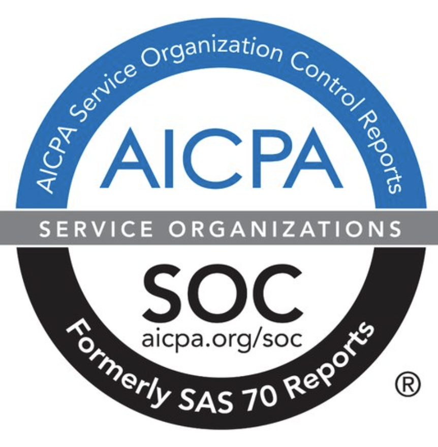
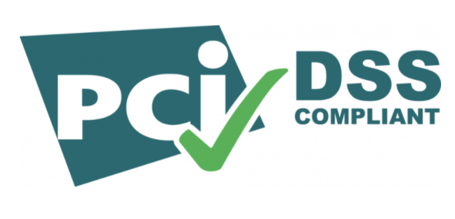

import Tabs from '@librarium/shared/src/components/ui/Tabs';
import WarningBox from '@librarium/shared/src/components/WarningBox';
import InfoBox from '@librarium/shared/src/components/InfoBox';
import PointsOfInterest from '@librarium/shared/src/components/common/PointOfInterest';
import Tooltip from "@librarium/shared/src/components/ui/Tooltip";

# COMPLIANCE

Spectro Cloud is certified against compliance standards of SOC2. 
* Spectro Cloud SOC 2 audit report assures our organization’s   
   * Security
   * Availability
   * Processing integrity
   * Confidentiality
   * Privacy 

compliance with the AICPA’s (American Institute of Certified Public Accountants) TSC (Trust Services Criteria). 
* SOC 2 audits are an important component in regulatory oversight, vendor management programs, internal governance, and risk management.
* These reports help the users and their auditors to understand the Spectro Cloud controls established to support operations and compliance. 
* The annual certification of SOC2 is 3rd Party Independent
* Spectro Cloud SOC 2 report is available on request.

Spectro Cloud is now Payment Card Industry – Data Security Standard (PCI DSS) compliant.
We enhance and encourage cardholder data security and facilitate the broad adoption of consistent data security measures globally. 

* Spectro Cloud satisfies the 12 requirements of PCI DSS set as 6 control objectives as below:
	* Build and maintain a secure network.
	* Protect cardholder data.
	* Vulnerability management.
	* Implement strong access control measures.
	* Regular monitoring and testing of the network.
	* Maintained information security policy.
* Spectro Cloud is supported by Stripe as a PCI advocate to maintain compliance standards.

